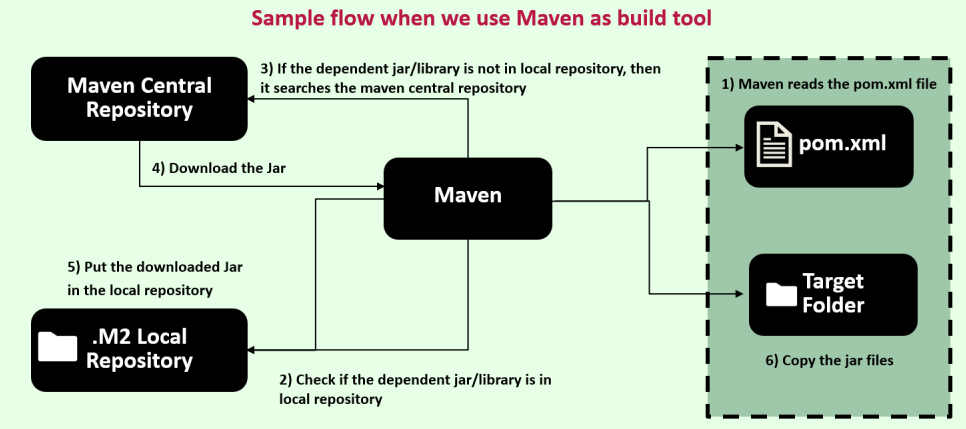

# Cloud Native App & 15-Factor Methodology

## **1. Introduction to Cloud Native Applications**

Welcome to this new section! This is a **theory-focused** discussion on **Cloud Native Applications**, their characteristics, and the **12-Factor & 15-Factor Methodologies**—key standards for microservice development.

### **What is a Cloud Native Application?**

You may often hear this term in projects, blogs, podcasts, or videos. Let’s break it down in **simple terms** and then look at the **official definition**.

#### **Layman’s Definition:**

Cloud Native Applications are **software applications designed specifically for cloud environments**, leveraging cloud features like **scalability, elasticity, and flexibility**. They are optimized to run on any cloud provider (AWS, Azure, GCP) and fully utilize cloud-native technologies and services.

#### **Official Definition (Cloud Native Computing Foundation - CNCF):**

_"Cloud-native technologies empower organizations to build and run scalable applications in modern dynamic environments such as public, private, and hybrid clouds."_

Cloud Native Applications **are not tied to a specific cloud provider**. They utilize:  
✅ **Containers**  
✅ **Service Meshes**  
✅ **Microservices**  
✅ **Immutable Infrastructure**  
✅ **Declarative APIs**

These technologies ensure that applications are:

- **Resilient** (handle failures efficiently)
- **Manageable** (easy to deploy & operate)
- **Observable** (monitoring and logging built-in)

Cloud Native principles **enable frequent updates** without disrupting existing functionality, allowing businesses to innovate faster.

---

### **How Does This Relate to Microservices?**

Cloud Native Applications are typically **built using microservices architecture**, which helps in:  
✔️ **Scalability** – Handle increased load dynamically.  
✔️ **Flexibility** – Deploy services independently.  
✔️ **Fault Tolerance** – Prevent entire system failures.

If asked about **Cloud Native Applications**, first **identify your audience**:

- **Non-technical person?** Explain using the **layman’s definition**.
- **Technical person?** Share the **CNCF official definition**.

---

## **2. Key Characteristics of Cloud Native Applications**

Now that we understand the **definition of Cloud Native Applications**, let’s explore their **key characteristics**. If an application follows these principles, it is likely **Cloud Native**.

---

### **1. Microservices Architecture** 🏗️

Cloud Native Applications are **built as microservices**, meaning:  
✔️ They are **loosely coupled** and **independently scalable**.  
✔️ Developers can work on different services in **parallel**.  
✔️ Deployment is **faster** and **more flexible**.

---

### **2. Containerization** 📦

Cloud Native Applications are **packaged in containers** (e.g., **Docker**), providing:  
✔️ A **lightweight and consistent runtime** across **local, AWS, GCP, or Azure**.  
✔️ Easy **portability and deployment** across environments.  
✔️ Improved **isolation** compared to monolithic applications.

---

### **3. Scalability & Elasticity** 🚀

✔️ Cloud Native Applications scale **horizontally** by adding/removing instances as needed.  
✔️ Scaling can be **automated** using **Kubernetes** or other container orchestration platforms.  
✔️ Applications handle **high traffic efficiently** without downtime.

---

### **4. DevOps & CI/CD Integration** 🔄

Cloud Native Applications follow **DevOps best practices**, ensuring:  
✔️ **Continuous Integration (CI)** – Automated testing and merging of code.  
✔️ **Continuous Delivery (CD)** – Faster software releases.  
✔️ **Automated Deployment Pipelines** – No manual intervention needed.  
✔️ **Better collaboration** between **developers** and **operations teams**.

---

### **5. Resilience & Fault Tolerance** 🔧

✔️ Built-in **fault tolerance** ensures applications **survive failures**.  
✔️ Uses **distributed architecture, load balancing, and auto-recovery**.  
✔️ Example: If one instance fails, **Kubernetes** can restart it automatically.

---

### **6. Cloud-Native Services Utilization** ☁️

✔️ These applications leverage **managed cloud services** (e.g., AWS Lambda, GCP Cloud Functions).  
✔️ **Less focus on infrastructure**, more focus on **business logic**.  
✔️ Cloud providers **handle maintenance, scaling, and monitoring**.

---

Cloud Native Applications follow these **key principles** to maximize **performance, scalability, and resilience**. Throughout this course, we will cover these topics in detail, demonstrating **how to build and deploy Cloud Native Microservices** effectively. 🚀

---

## **3. Cloud Native Applications vs. Traditional Applications**

Let’s explore the **key differences** between **Cloud Native Applications** and **Traditional Applications** to understand why **cloud-native is the future**.

---

### **1. Predictability & Debugging** 🔍

✔ **Cloud Native Apps** → Have **predictable behavior** due to **microservices architecture**. Issues can be easily **isolated** and **debugged**.  
✔ **Traditional Apps** → Hard to debug due to **tightly coupled** code. Developers must manually **trace the entire application** to find issues.

---

### **2. Operating System Dependency** 🖥️

✔ **Cloud Native Apps** → **OS-independent**, run in **Docker containers**, and work on any platform (Linux, Windows, Mac).  
✔ **Traditional Apps** → **OS-dependent**, require **specific configurations** for different environments.

---

### **3. Scalability & Right-Sizing** 📈

✔ **Cloud Native Apps** → **Right-sized** and can scale **independently**.  
✔ **Traditional Apps** → **Oversized**, often **waste resources** since everything runs in a **single monolithic application**.

---

### **4. Development Approach** ⚙️

✔ **Cloud Native Apps** → **Follow Agile & DevOps**, support **Continuous Delivery (CI/CD)** with automated pipelines.  
✔ **Traditional Apps** → Follow **Waterfall model**, lack **automation**, and require **manual deployments**.

---

### **5. Recovery & Scalability** 🚀

✔ **Cloud Native Apps** → Support **automated recovery** and **auto-scaling** using platforms like **Kubernetes**.  
✔ **Traditional Apps** → **Slow recovery**, **manual scaling**, and **long downtime** if an issue occurs.

---

From these differences, it's clear that **Cloud Native Applications are the future**! They offer **scalability, flexibility, automation, and rapid recovery**, making them superior to traditional apps.

---

## **4. Introduction to Cloud Native Development Principles**

When building **Cloud Native Applications** or **Microservices**, a common question arises:

👉 _How can we ensure success in developing scalable, efficient, and resilient applications?_

The answer lies in **following standardized principles** designed for Cloud Native development.

---

### **The Evolution of Cloud Native Development Principles**

🔹 **2012 – The 12-Factor Methodology**

- Developed by **Heroku's engineering team**.
- A set of **12 best practices** for designing **cloud-native applications**.
- Helps ensure **scalability, portability, and seamless cloud deployment**.

🔹 **Beyond 12-Factor – The 15-Factor Methodology**

- Introduced by **Kevin Hoffman** in his book _Beyond the Twelve-Factor App_.
- Adds **3 more principles** to **adapt to modern cloud advancements**.
- **Currently the most recommended** standard for microservices development.

---

### **Why Are These Principles Important?**

Following these methodologies ensures:  
✔ **Seamless cloud deployment** – Works across AWS, GCP, Azure.  
✔ **Scalability & elasticity** – Supports auto-scaling and fault tolerance.  
✔ **Portability** – Runs across different environments without issues.  
✔ **Continuous deployment & agility** – Enables frequent, stable releases.

You can explore the **original 12-Factor principles** at **[12factor.net](https://12factor.net/)**, but don't worry—I'll explain them in a **simple and structured** way in the upcoming sections.

---

## **5. Principles of the 15-Factor Methodology**

In this lecture, let’s explore the **first five principles** of the **15-Factor Methodology**, which help in designing scalable, flexible, and cloud-native microservices.

---

### **1. One Codebase per Application** 🏗️

Each **microservice** must have its **own dedicated repository** in version control (Git, GitHub, GitLab, etc.).

✔ **Best Practice:**

- **Separate repositories** for each microservice.
- **Common functionality** should be managed as **shared libraries** or **standalone services**.
- The **same packaged artifact** (Docker image, JAR, etc.) should be deployed across all environments (**Dev, QA, Prod**) without rebuilding it for each deployment.
- **Configurations should be managed externally** (not hardcoded into the codebase).

---

### **2. API-First Approach** 🔗

Always think of designing **APIs first** when developing microservices.

✔ **Advantages:**

- Encourages **reusability** and **scalability**.
- Enables **parallel development** across different teams.
- Supports **better integration testing** and **continuous deployment**.
- Allows modifications **without impacting dependent services**.

---

### **3. Explicit Dependency Management** 📦

All dependencies should be **clearly defined in a manifest file** (e.g., `pom.xml` for Maven, `build.gradle` for Gradle).

✔ **Best Practice:**

- Use **dependency managers** (**Maven, Gradle, npm, pip**) to fetch libraries instead of manually downloading them.
- Package all dependencies inside the **final build artifact** to ensure **consistent execution** across environments.

---

### **4. Design → Build → Release → Run Process** 🔄

The application lifecycle should follow **four distinct stages**:

1️⃣ **Design Stage** – Define **technologies, dependencies, and tools** before development starts.  
2️⃣ **Build Stage** – Compile code and create **an immutable artifact** (JAR, Docker image).  
3️⃣ **Release Stage** – Combine the artifact with **deployment-specific configurations**.  
4️⃣ **Run Stage** – Deploy the application in the target environment using **the same immutable artifact**.

✔ **Key Rule:**

- **No modifications should be made to the build artifact** in the release or run stage.

---

### **5. Configuration, Credentials, and Code Separation** 🔐

Configurations should be **externalized** and **not hardcoded** in the application.

✔ **Best Practice:**

- **Environment-specific settings** (DB credentials, API keys) should be managed separately.
- **Use external configuration providers** (e.g., **Spring Cloud Config Server**).
- Only **default configurations** can be included in the codebase.
- Inject configurations **at runtime**, ensuring the same build is used across all environments.

---

### **6. Centralized Logging** 📝

Traditional applications write logs to **local files**, making it difficult to track issues across multiple servers.

✔ **Best Practice for Cloud Native Apps:**

- **Microservices should log to standard output** (stdout) instead of local files.
- Use **Log Aggregators** (e.g., **ELK Stack, Loki, Fluentd, Splunk**) to collect logs centrally.
- Developers can analyze logs from **one location** instead of searching multiple servers.

---

### **7. Disposability** 🚀

✔ **Cloud-native applications must be disposable**, meaning:

- **Instances should be created and terminated automatically**.
- **Kubernetes and Docker** ensure that failing microservices **restart instantly**.
- **Graceful shutdown** → No new requests should be accepted while ongoing requests complete before shutdown.
- Supports **auto-scaling** during high traffic periods.

---

### **8. Backing Services as Attached Resources** 🔗

A **Backing Service** is any external dependency like **databases, message brokers, SMTP servers, caching systems**.

✔ **Best Practice:**

- Treat backing services as **replaceable resources**.
- **Never hardcode database details** → Use **externalized configurations** (environment variables).
- Example: A microservice using a **local database in Dev** should be able to **switch to AWS RDS in Production** without code changes.

---

### **9. Environment Parity** 🌍

Applications should behave **identically across all environments** (Dev, QA, Staging, Production).

✔ **Three Key Gaps to Address:**  
1️⃣ **Time Gap** → Automate CI/CD pipelines to **reduce delays** between development and deployment.  
2️⃣ **People Gap** → Follow **DevOps culture** where **developers & operators collaborate**.  
3️⃣ **Tools Gap** → Use **identical versions** of backing services across all environments.

---

### **10. Administrative Processes as Isolated Tasks** ⚙️

Administrative tasks (e.g., **database migrations, batch jobs, cleanup scripts**) should be:

- **Treated as separate processes**, not hardcoded into microservices.
- **Version-controlled and executed in the same environment** as the application.
- **Ideally deployed as separate microservices** that run once and exit when completed.

---

### **11. Port Binding** 🌐

Cloud-native applications should be **self-contained** and expose their services through **port binding** instead of relying on external application servers like **Tomcat or Jetty**.

✔ **Best Practices:**

- Use **embedded servers** (e.g., **Spring Boot’s embedded Tomcat**).
- Avoid **deploying multiple applications on a single server**.
- Expose microservices via **port mapping** (e.g., `docker run -p 8080:8080`).
- Enable easy **service-to-service communication** in microservice environments.

---

### **12. Stateless Processes** 🔄

Microservices should be **stateless**, meaning they **should not store session data** inside the instance.

✔ **Best Practices:**

- Use **external data stores** (e.g., **Redis, PostgreSQL**) instead of saving data within the service.
- If an instance crashes, **data should not be lost**.
- Statelessness allows **dynamic scaling**—new instances can be created or terminated anytime without affecting the system.

---

### **13. Concurrency** ⚡

Microservices must **handle multiple user requests simultaneously** and support **horizontal scaling**.

✔ **Best Practices:**

- Scale applications **horizontally** (add more instances) instead of **vertically** (adding more RAM/CPU).
- Use **multi-threading** in applications (Java microservices use **thread pools** for concurrency).
- Categorize processes based on their roles (e.g., **web requests vs. background jobs**).

---

### **14. Observability (Telemetry)** 📊

With **hundreds of microservices**, monitoring logs and performance **manually is impossible**.

✔ **Best Practices:**

- Implement **centralized logging, tracing, and monitoring** (e.g., **ELK Stack, Prometheus, Grafana**).
- Collect **logs, metrics, traces, and events** for real-time monitoring.
- Observability enables **faster issue detection and resolution** in distributed cloud environments.

---

### **15. Authentication & Authorization** 🔒

Security is **critical** for cloud-native applications.

✔ **Best Practices:**

- Implement **OAuth 2.1** and **OpenID Connect** for secure authentication.
- Use **HTTPS, SSL certificates, and firewalls** for additional security.
- Authentication **verifies user identity**, while Authorization **grants permissions**.
- Security should be **a core part of microservice architecture**, not an afterthought.

---

💡 **Key Takeaways:**  
✔ **Port binding** makes services self-contained.  
✔ **Stateless design** prevents data loss during scaling.  
✔ **Concurrency** enables handling large traffic loads.  
✔ **Observability** ensures real-time monitoring.  
✔ **Authentication & Authorization** protect against security threats.

Following these principles is **essential for building cloud-native microservices**. Keep them in mind for **interviews and real-world projects**! 🚀
