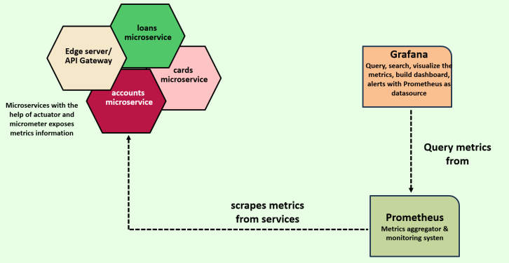

# Observability and Monitoring

## 1. Challenge #8: Observability and Monitoring in Microservices

So far, we've tackled seven key challenges. Now, it's time to dive into Challenge #8 — a topic that’s both critical and fascinating: **Observability and Monitoring** in a microservices architecture.

If these terms sound new to you, don’t worry. We’ll break them down step-by-step and explore how to effectively implement them in your system. But before we define what observability and monitoring mean, let’s understand why they are essential.

### The Problem: Debugging in a Distributed World

In a monolithic application, debugging is relatively straightforward — all the logs and issues reside within a single app. But with microservices, things get complicated fast. A single request might pass through 5, 10, or even 20 different services across various containers.

So here’s the big question:  
**How do you trace a request through multiple microservices and pinpoint exactly where it failed?**

Without a clear view of how your services interact, debugging becomes like finding a needle in a haystack.

### Centralized Logging: A Must-Have

With each service generating its own logs in separate containers, manually accessing and scanning each one isn’t realistic. That’s why we need a **centralized logging system** — a place where all logs can be collected, indexed, searched, and analyzed from one dashboard. It helps us:

- Trace request paths
- Quickly identify root causes
- Correlate events across services

### Monitoring Performance: Know Where the Bottleneck Is

Performance monitoring is just as crucial. If a request slows down, how do you know which microservice is causing the delay?

You need visibility into **how long each service takes** to process a request. Only then can you identify bottlenecks and optimize your system.

### Tracking Metrics and Service Health

We also need to monitor real-time metrics like:

- CPU usage  
- Memory and JVM stats  
- Request rates  
- Error rates  

Manually checking each container or actuator endpoint isn’t scalable. Instead, we need a centralized monitoring tool to visualize health metrics and trends across all services.

### Alerts and Notifications: Staying Proactive

Lastly, what if something goes wrong at 2 AM? Your team can’t be staring at dashboards 24/7.

That’s where **automated alerts** and **real-time notifications** come into play. They help you catch issues as soon as they arise — before they impact users.

### Summary

Observability and monitoring might sound technical, but they’re essential tools for running reliable microservices at scale. In the upcoming lessons, we’ll explore powerful tools and strategies to bring observability into your system, step by step.

Get ready — it’s going to be an exciting deep dive!

---

## 2. Deep Dive: Understanding Observability and Monitoring in Microservices

In this section, let’s take a closer look at **observability** and **monitoring** — two foundational concepts that can make or break your microservices architecture.

We’ll start by understanding what observability means, explore its core pillars, then move on to monitoring — how it's different, how it complements observability, and why both are essential for modern, distributed systems.

### What is Observability?

**Observability** is the ability to understand what’s happening inside a system just by looking at its external outputs. In the context of microservices, it means using the data produced by your system — such as **metrics**, **logs**, and **traces** — to understand the internal workings, performance, and behavior of your services.

Imagine trying to figure out why a request failed or why a service is performing slowly. With observability in place, you can follow the clues left behind in your system's outputs to diagnose and fix issues efficiently.

#### The Three Pillars of Observability

1. **Metrics**:- These are numerical values that measure aspects of your system’s health and performance — like CPU usage, memory consumption, request counts, or response times. Metrics help you spot trends, set thresholds, and monitor resource usage.
2. **Logs**:- Logs are detailed records of events that happen within your application. Developers use log statements to capture key activities, errors, and messages throughout the system. Logs are vital for debugging and understanding what led to a specific issue, especially in production.
3. **Traces**:- Traces represent the full journey of a request as it flows through multiple services in your system. They help you visualize and measure each hop, showing you which microservice (or method) took how long. This is key for identifying performance bottlenecks and pinpointing where a request slowed down or failed.

By combining data from all three pillars, observability provides a holistic view of your system — making it easier to debug, improve performance, and maintain overall system health.

### What is Monitoring?

While observability focuses on understanding the system, **monitoring** is about **actively watching it**.

Monitoring involves collecting telemetry data (metrics, logs, traces) and setting up **dashboards**, **alerts**, and **notifications** based on known thresholds or failure states.

For example:

- If a microservice’s CPU usage exceeds 80%, an alert is triggered.
- If error rates spike in a specific service, a notification is sent to the team.

Monitoring is essential for **real-time awareness**, especially in production. It helps your operations and DevOps teams act quickly when something goes wrong.

### Why Do We Need Both?

You might be wondering — aren’t observability and monitoring the same?

They’re related, but not identical. Think of them as two sides of the same coin:

| **Aspect**        | **Monitoring**                                  | **Observability**                                        |
|-------------------|--------------------------------------------------|-----------------------------------------------------------|
| **Purpose**       | Identify and respond to known problems           | Understand internal system state and behavior             |
| **Approach**      | Reactive – responds to issues as they occur      | Proactive – uncovers hidden issues before they escalate   |
| **Data Used**     | Metrics, logs, traces                            | Metrics, logs, traces — and deeper analysis               |
| **Goal**          | Alerting and incident response                   | Root cause analysis and performance insight               |

To simplify even more:

- **Monitoring** helps you **detect** problems.
- **Observability** helps you **understand** and **solve** them.

### The Iceberg Analogy

Think of monitoring as the **tip of the iceberg** — it shows you visible symptoms like high CPU usage, error spikes, or downtime. Observability, on the other hand, is everything **below the surface** — the unseen system behaviors and interactions that explain *why* those symptoms are happening.

For example:

- Monitoring can tell you *something’s wrong* with a service.
- Observability helps you find out *what’s causing it* — like a hidden `NullPointerException` or a performance lag in a downstream service.

### Putting It All Together

In a large microservices ecosystem, where hundreds of services run across containers and VMs, it’s impossible to manually track every component. That’s why observability and monitoring are critical:

- They help you **catch problems early**.
- They enable **faster debugging** and **more efficient performance tuning**.
- They provide **reliability, scalability, and peace of mind**.

So if you want to build robust, production-ready microservices, observability and monitoring aren’t optional — they’re **essential**.

---

## 3. Implementing Log Aggregation in Microservices

Earlier, we discussed the **three pillars of observability and monitoring** — **logs, metrics, and traces**. To harness the power of these pillars, your microservices must generate this data consistently and meaningfully.

In this section, we’ll focus on **logs**, why they matter, and how to implement **centralized log aggregation** in a microservice environment.

### What Are Logs?

**Logs** are structured or unstructured records of events that occur within a software application over time. Each log entry typically includes:

- A **timestamp** of when the event occurred,
- A message describing **what happened**,
- And additional **contextual data**, such as the user, tenant, or thread involved.

Logs are essential for:

- **Troubleshooting** and **debugging** production issues,
- **Auditing** behavior across services,
- And reconstructing events to understand what led to a problem.

Most logging systems support **severity levels**, such as:

- `TRACE` – fine-grained info (least critical)
- `DEBUG` – debug-level information for developers
- `INFO` – general information about application events
- `WARN` – something unexpected, but not breaking
- `ERROR` – something has gone wrong
- `FATAL` – very severe errors (rarely used in modern logging)

These levels allow you to filter logs based on the environment:

- In **development and test environments**, you can enable `DEBUG` and `INFO` logs to gain insight during development.
- In **production**, it’s best to log only important events like `ERROR` and `WARN` to avoid performance overhead and log noise.

### Logging in Monolithic vs. Microservices Architectures

In a **monolithic application**, all logs typically reside in one place — a single file or server — making it simple to trace events across the application.

But with **microservices**, it’s a different story:

- Each service runs independently and generates its own logs.
- Services may be running in **different containers**, **hosts**, or **cloud regions**.
- Logs are scattered across multiple places, making it hard to track an issue that spans several services.

### The Solution: Centralized Log Aggregation

To solve this complexity, we use **centralized logging** — a method where all logs from all services are sent to a **single centralized location**.

#### Benefits of Centralized Logging:

- **Single source of truth** for all logs
- Easier and faster **debugging and root cause analysis**
- Enables **searching**, **filtering**, and **visualization** across logs from multiple services
- Improves **operational efficiency** for both developers and DevOps teams

Without centralized logging, developers would have to SSH into multiple servers or containers to fetch logs — a time-consuming and error-prone process.

### How Is Log Aggregation Done?

Now you might be wondering:  
> “Do I have to write code in each microservice to forward the logs?”

While that is one approach, **embedding log aggregation logic directly into your services is not recommended**. Here’s why:

- It adds **non-business complexity** to your codebase
- It **distracts developers** from solving core customer problems
- It **violates separation of concerns**

Instead, the industry prefers using **dedicated tools** that can collect and forward logs **without touching your application code**.

Popular solutions include:

- **EFK Stack** (Elasticsearch, Fluentd, Kibana)
- **Graylog**
- **Loki + Grafana**
- **Splunk**
- **Datadog Logs**

These tools support collecting logs via file readers, Docker logs, Kubernetes sidecars, or agent-based solutions.

---

## 4. Implementing Centralized Logging with Grafana, Loki, and Promtail

In a distributed microservices architecture, managing logs becomes increasingly complex. Each service generates its own logs, often running in isolated containers or environments. Unlike monolithic applications—where all logs reside in a single place—microservices require a centralized solution to make logs accessible and useful.

That’s where the **Grafana ecosystem** comes in.

Grafana, widely known for its powerful dashboards and visualizations, also offers a suite of open-source tools designed specifically for observability. Among them are:

- **Grafana Loki** – a log aggregation system
- **Promtail** – a lightweight log collector and forwarder
- **Grafana (UI)** – to visualize, search, and analyze the logs

Together, these tools provide a robust, scalable, and developer-friendly way to implement centralized logging.

### Why Not Just Code It Yourself?

While it's technically possible for developers to write custom logging logic to stream logs to a centralized location, this approach comes with major downsides:

- It clutters your business logic with infrastructure concerns.
- It’s error-prone and hard to maintain.
- It doesn't scale well.

Instead, using dedicated tools like Loki and Promtail allows developers to focus on delivering features while the infrastructure handles log aggregation seamlessly in the background.

### The Grafana Logging Stack: How It Works

Here's a breakdown of how Grafana, Loki, and Promtail work together:

1. **Microservices generate logs** (typically written to standard output).
2. **Promtail**, running as a lightweight agent on the host or Docker network, reads these logs.
3. Promtail **forwards logs to Grafana Loki**, which stores them in a centralized location.
4. **Grafana** provides a powerful interface to query, filter, and visualize logs across all services.

This architecture enables teams to:

- View logs from all microservices in one place.
- Search logs using labels or text queries.
- Troubleshoot issues faster without jumping between containers or hosts.

### Benefits of Using Grafana Loki and Promtail

- **No code changes required** in your microservices.
- **Scalable** and **fault-tolerant** architecture.
- **Open-source** and actively maintained.
- Supports **label-based queries**, making it easy to filter logs by service, environment, or severity.
- Seamlessly integrates with **Grafana dashboards**, so logs can be visualized alongside metrics and alerts.


### 👉 **PROMTAIL IS REPLACED BY ALLOY**

From Grafana Loki version 3.0 onwards, Promtail, which is responsible for scraping log lines, has been replaced with a new product called **Alloy**. Even though I will discuss Promtail in the next few lectures, Alloy will function similarly. Since these are internal components of Grafana Loki, this change will not have a significant impact. We just need to use the config files related to Alloy in place of Promtail. See more:- <https://grafana.com/docs/loki/latest/get-started/quick-start/>

Absolutely! Here's a polished and structured version of that content, written as an **H2 blog section** with better clarity, tone, and formatting—perfect for blog readers looking to understand centralized logging architecture using Grafana's ecosystem:

### How Centralized Logging Works with Grafana, Loki, and Promtail

We introduced **Grafana**, **Loki**, and **Promtail**—a powerful trio for implementing centralized logging without making any changes to your microservices. Let's walk through how these tools work together and explore the recommended architecture from the official Grafana documentation.

If you're wondering _“How do we implement log aggregation without modifying our microservices?”_ — this is exactly the answer.

### The Log Aggregation Flow: An Overview


The Grafana team provides a clean, modular architecture that enables seamless log collection, storage, and querying. Let’s break it down step-by-step using a simple example.

1. **An Application Generates Logs**  
   Imagine a sample app (e.g., `Flag`) that continuously emits logs and runs inside a container.

2. **Promtail Collects the Logs**  
   In the same Docker/Kubernetes network, **Promtail** runs as a lightweight log agent. Its job is to read new logs from containers and collect them for aggregation.

3. **Logs Are Sent via Gateway**  
   Promtail doesn't send logs directly to Loki. Instead, it communicates through a **Gateway** (acting like an API router). This gateway examines incoming requests and routes them accordingly.

4. **Loki Write Component Stores the Logs**  
   Logs from Promtail are routed by the gateway to the **Loki Write Component**, which writes them to a durable backend (e.g., **MinIO**, a scalable object store).

5. **Logs are Stored Centrally**  
   Now your logs live in a central location, completely outside the microservice itself.

6. **Developers Access Logs via Grafana**  
   When a developer queries logs from Grafana’s UI:
   - The request goes to the **Gateway**.
   - The Gateway routes it to the **Loki Read Component**.
   - Loki reads the logs from MinIO and sends them back to Grafana, where they’re displayed in a powerful, searchable UI.

### The Beauty of This Architecture

This architecture is designed to scale, perform, and—most importantly—**not interfere with your application code**. Key components like the Gateway, Loki’s read/write services, and Promtail are all standalone and containerized, meaning:

- **No code changes** are needed inside your microservices.
- You treat logs as **event streams**—a key principle from the [12-Factor App methodology](https://12factor.net/logs) (also expanded in 15-factor approaches).
- Developers can stay focused on business logic, not infrastructure concerns.

### A Note on Deployment

This entire setup is easily deployable using tools you likely already use:

- **Docker**
- **Docker Compose**
- **Kubernetes**

This flexibility makes it easy to integrate into your development, staging, or production environments.

Grafana provides official [YAML configuration files and documentation](https://grafana.com/docs/loki/latest/get-started/) to get you started quickly. You can adapt these to your own stack by simply replacing the sample app (`Flag`) with your own microservices.

---

## 5. Implementing Log Aggregation with Grafana, Loki, and Promtail

In this section, we’ll implement **log aggregation** using **Grafana**, **Loki**, and **Promtail**. This setup will allow us to collect, store, and visualize logs from our microservices in a centralized way.

### Preparing the Workspace

Update the `pom.xml` files of each microservice: change the Docker image tag from `s10` to `s11`.

### Increasing Response Timeout in Gateway

Now let’s tweak the configuration of our **Gateway Server**. Open the `application.yml` file inside the gateway project. By default, the response timeout is set to **2 seconds**, which may not be sufficient as we spin up more containers locally.

To ensure smooth local testing, increase this timeout value to **10 seconds**:

```yaml
response-timeout: 10s
```

This change helps the gateway wait longer for responses from services, reducing timeout errors in low-memory environments. You can adjust this value based on your system’s performance.

### Setting Up Grafana, Loki, and Promtail

Now, let’s dive into setting up our logging stack. Head over to the [official Grafana Loki documentation](https://grafana.com/docs/loki/latest/setup/install/docker/#install-with-docker-compose) to understand the prerequisites.

#### Prerequisites

Ensure you have **Docker** and **Docker Compose** installed — we already took care of this in the previous section, so we’re good to go.

Instead of creating a new folder like `evaluate-loki`, we’ll integrate everything into our existing `docker-compose` folder within the workspace.

#### Required Files

The documentation provides three configuration files:

1. `docker-compose.yaml`
2. `loki-config.yaml`
3. `promtail-local-config.yaml`

These files can be downloaded from the URLs provided in the docs. Open each one in a separate tab, review the contents, and save them to your `docker-compose` folder.

Let’s briefly go over what each of these files does.

---

**More sections (e.g., explaining the `docker-compose.yaml`, `promtail-local-config.yaml`, and `loki-config.yaml` in detail) can be added as H3 or H4 sub-sections next if you'd like me to continue. Would you like me to do that?**




---

## 6.

---

## 7.

---

## 8.

---

## 9.

---

## 10.

---

