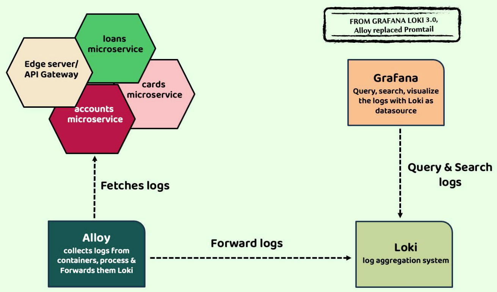
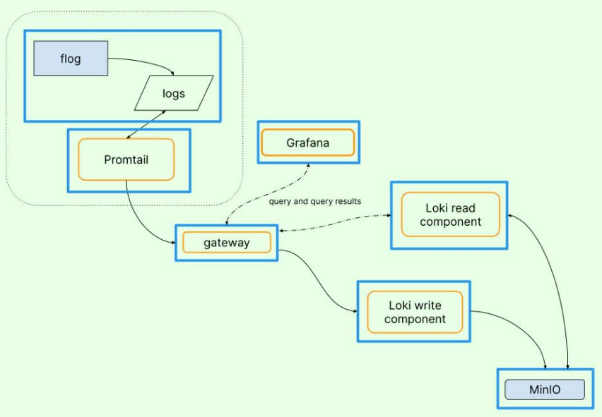

# Observability and Monitoring

## 1. Challenge #8: Observability and Monitoring in Microservices

So far, we've tackled seven key challenges. Now, it's time to dive into Challenge #8 — a topic that’s both critical and fascinating: **Observability and Monitoring** in a microservices architecture.

If these terms sound new to you, don’t worry. We’ll break them down step-by-step and explore how to effectively implement them in your system. But before we define what observability and monitoring mean, let’s understand why they are essential.

### The Problem: Debugging in a Distributed World

In a monolithic application, debugging is relatively straightforward — all the logs and issues reside within a single app. But with microservices, things get complicated fast. A single request might pass through 5, 10, or even 20 different services across various containers.

So here’s the big question:  
**How do you trace a request through multiple microservices and pinpoint exactly where it failed?**

Without a clear view of how your services interact, debugging becomes like finding a needle in a haystack.

### Centralized Logging: A Must-Have

With each service generating its own logs in separate containers, manually accessing and scanning each one isn’t realistic. That’s why we need a **centralized logging system** — a place where all logs can be collected, indexed, searched, and analyzed from one dashboard. It helps us:

- Trace request paths
- Quickly identify root causes
- Correlate events across services

### Monitoring Performance: Know Where the Bottleneck Is

Performance monitoring is just as crucial. If a request slows down, how do you know which microservice is causing the delay?

You need visibility into **how long each service takes** to process a request. Only then can you identify bottlenecks and optimize your system.

### Tracking Metrics and Service Health

We also need to monitor real-time metrics like:

- CPU usage  
- Memory and JVM stats  
- Request rates  
- Error rates  

Manually checking each container or actuator endpoint isn’t scalable. Instead, we need a centralized monitoring tool to visualize health metrics and trends across all services.

### Alerts and Notifications: Staying Proactive

Lastly, what if something goes wrong at 2 AM? Your team can’t be staring at dashboards 24/7.

That’s where **automated alerts** and **real-time notifications** come into play. They help you catch issues as soon as they arise — before they impact users.

### Summary

Observability and monitoring might sound technical, but they’re essential tools for running reliable microservices at scale. In the upcoming lessons, we’ll explore powerful tools and strategies to bring observability into your system, step by step.

Get ready — it’s going to be an exciting deep dive!

---

## 2. Deep Dive: Understanding Observability and Monitoring in Microservices

In this section, let’s take a closer look at **observability** and **monitoring** — two foundational concepts that can make or break your microservices architecture.

We’ll start by understanding what observability means, explore its core pillars, then move on to monitoring — how it's different, how it complements observability, and why both are essential for modern, distributed systems.

### What is Observability?

**Observability** is the ability to understand what’s happening inside a system just by looking at its external outputs. In the context of microservices, it means using the data produced by your system — such as **metrics**, **logs**, and **traces** — to understand the internal workings, performance, and behavior of your services.

Imagine trying to figure out why a request failed or why a service is performing slowly. With observability in place, you can follow the clues left behind in your system's outputs to diagnose and fix issues efficiently.

#### The Three Pillars of Observability

1. **Metrics**:- These are numerical values that measure aspects of your system’s health and performance — like CPU usage, memory consumption, request counts, or response times. Metrics help you spot trends, set thresholds, and monitor resource usage.
2. **Logs**:- Logs are detailed records of events that happen within your application. Developers use log statements to capture key activities, errors, and messages throughout the system. Logs are vital for debugging and understanding what led to a specific issue, especially in production.
3. **Traces**:- Traces represent the full journey of a request as it flows through multiple services in your system. They help you visualize and measure each hop, showing you which microservice (or method) took how long. This is key for identifying performance bottlenecks and pinpointing where a request slowed down or failed.

By combining data from all three pillars, observability provides a holistic view of your system — making it easier to debug, improve performance, and maintain overall system health.

### What is Monitoring?

While observability focuses on understanding the system, **monitoring** is about **actively watching it**.

Monitoring involves collecting telemetry data (metrics, logs, traces) and setting up **dashboards**, **alerts**, and **notifications** based on known thresholds or failure states.

For example:

- If a microservice’s CPU usage exceeds 80%, an alert is triggered.
- If error rates spike in a specific service, a notification is sent to the team.

Monitoring is essential for **real-time awareness**, especially in production. It helps your operations and DevOps teams act quickly when something goes wrong.

### Why Do We Need Both?

You might be wondering — aren’t observability and monitoring the same?

They’re related, but not identical. Think of them as two sides of the same coin:

| **Aspect**        | **Monitoring**                                  | **Observability**                                        |
|-------------------|--------------------------------------------------|-----------------------------------------------------------|
| **Purpose**       | Identify and respond to known problems           | Understand internal system state and behavior             |
| **Approach**      | Reactive – responds to issues as they occur      | Proactive – uncovers hidden issues before they escalate   |
| **Data Used**     | Metrics, logs, traces                            | Metrics, logs, traces — and deeper analysis               |
| **Goal**          | Alerting and incident response                   | Root cause analysis and performance insight               |

To simplify even more:

- **Monitoring** helps you **detect** problems.
- **Observability** helps you **understand** and **solve** them.

### The Iceberg Analogy

Think of monitoring as the **tip of the iceberg** — it shows you visible symptoms like high CPU usage, error spikes, or downtime. Observability, on the other hand, is everything **below the surface** — the unseen system behaviors and interactions that explain *why* those symptoms are happening.

For example:

- Monitoring can tell you *something’s wrong* with a service.
- Observability helps you find out *what’s causing it* — like a hidden `NullPointerException` or a performance lag in a downstream service.

### Putting It All Together

In a large microservices ecosystem, where hundreds of services run across containers and VMs, it’s impossible to manually track every component. That’s why observability and monitoring are critical:

- They help you **catch problems early**.
- They enable **faster debugging** and **more efficient performance tuning**.
- They provide **reliability, scalability, and peace of mind**.

So if you want to build robust, production-ready microservices, observability and monitoring aren’t optional — they’re **essential**.

---

## 3. Implementing Log Aggregation in Microservices

Earlier, we discussed the **three pillars of observability and monitoring** — **logs, metrics, and traces**. To harness the power of these pillars, your microservices must generate this data consistently and meaningfully.

In this section, we’ll focus on **logs**, why they matter, and how to implement **centralized log aggregation** in a microservice environment.

### What Are Logs?

**Logs** are structured or unstructured records of events that occur within a software application over time. Each log entry typically includes:

- A **timestamp** of when the event occurred,
- A message describing **what happened**,
- And additional **contextual data**, such as the user, tenant, or thread involved.

Logs are essential for:

- **Troubleshooting** and **debugging** production issues,
- **Auditing** behavior across services,
- And reconstructing events to understand what led to a problem.

Most logging systems support **severity levels**, such as:

- `TRACE` – fine-grained info (least critical)
- `DEBUG` – debug-level information for developers
- `INFO` – general information about application events
- `WARN` – something unexpected, but not breaking
- `ERROR` – something has gone wrong
- `FATAL` – very severe errors (rarely used in modern logging)

These levels allow you to filter logs based on the environment:

- In **development and test environments**, you can enable `DEBUG` and `INFO` logs to gain insight during development.
- In **production**, it’s best to log only important events like `ERROR` and `WARN` to avoid performance overhead and log noise.

### Logging in Monolithic vs. Microservices Architectures

In a **monolithic application**, all logs typically reside in one place — a single file or server — making it simple to trace events across the application.

But with **microservices**, it’s a different story:

- Each service runs independently and generates its own logs.
- Services may be running in **different containers**, **hosts**, or **cloud regions**.
- Logs are scattered across multiple places, making it hard to track an issue that spans several services.

### The Solution: Centralized Log Aggregation

To solve this complexity, we use **centralized logging** — a method where all logs from all services are sent to a **single centralized location**.

#### Benefits of Centralized Logging:

- **Single source of truth** for all logs
- Easier and faster **debugging and root cause analysis**
- Enables **searching**, **filtering**, and **visualization** across logs from multiple services
- Improves **operational efficiency** for both developers and DevOps teams

Without centralized logging, developers would have to SSH into multiple servers or containers to fetch logs — a time-consuming and error-prone process.

### How Is Log Aggregation Done?

Now you might be wondering:  
> “Do I have to write code in each microservice to forward the logs?”

While that is one approach, **embedding log aggregation logic directly into your services is not recommended**. Here’s why:

- It adds **non-business complexity** to your codebase
- It **distracts developers** from solving core customer problems
- It **violates separation of concerns**

Instead, the industry prefers using **dedicated tools** that can collect and forward logs **without touching your application code**.

Popular solutions include:

- **EFK Stack** (Elasticsearch, Fluentd, Kibana)
- **Graylog**
- **Loki + Grafana**
- **Splunk**
- **Datadog Logs**

These tools support collecting logs via file readers, Docker logs, Kubernetes sidecars, or agent-based solutions.

---

## 4. Implementing Centralized Logging with Grafana, Loki, and Promtail

In a distributed microservices architecture, managing logs becomes increasingly complex. Each service generates its own logs, often running in isolated containers or environments. Unlike monolithic applications—where all logs reside in a single place—microservices require a centralized solution to make logs accessible and useful.

That’s where the **Grafana ecosystem** comes in.

Grafana, widely known for its powerful dashboards and visualizations, also offers a suite of open-source tools designed specifically for observability. Among them are:

- **Grafana Loki** – a log aggregation system
- **Promtail** – a lightweight log collector and forwarder
- **Grafana (UI)** – to visualize, search, and analyze the logs

Together, these tools provide a robust, scalable, and developer-friendly way to implement centralized logging.

### Why Not Just Code It Yourself?

While it's technically possible for developers to write custom logging logic to stream logs to a centralized location, this approach comes with major downsides:

- It clutters your business logic with infrastructure concerns.
- It’s error-prone and hard to maintain.
- It doesn't scale well.

Instead, using dedicated tools like Loki and Promtail allows developers to focus on delivering features while the infrastructure handles log aggregation seamlessly in the background.

### The Grafana Logging Stack: How It Works

Here's a breakdown of how Grafana, Loki, and Promtail work together:

1. **Microservices generate logs** (typically written to standard output).
2. **Promtail**, running as a lightweight agent on the host or Docker network, reads these logs.
3. Promtail **forwards logs to Grafana Loki**, which stores them in a centralized location.
4. **Grafana** provides a powerful interface to query, filter, and visualize logs across all services.

This architecture enables teams to:

- View logs from all microservices in one place.
- Search logs using labels or text queries.
- Troubleshoot issues faster without jumping between containers or hosts.

### Benefits of Using Grafana Loki and Promtail

- **No code changes required** in your microservices.
- **Scalable** and **fault-tolerant** architecture.
- **Open-source** and actively maintained.
- Supports **label-based queries**, making it easy to filter logs by service, environment, or severity.
- Seamlessly integrates with **Grafana dashboards**, so logs can be visualized alongside metrics and alerts.



### 👉 **PROMTAIL IS REPLACED BY ALLOY**

From Grafana Loki version 3.0 onwards, Promtail, which is responsible for scraping log lines, has been replaced with a new product called **Alloy**. Even though I will discuss Promtail in the next few lectures, Alloy will function similarly. Since these are internal components of Grafana Loki, this change will not have a significant impact. We just need to use the config files related to Alloy in place of Promtail. See more:- <https://grafana.com/docs/loki/latest/get-started/quick-start/>

Absolutely! Here's a polished and structured version of that content, written as an **H2 blog section** with better clarity, tone, and formatting—perfect for blog readers looking to understand centralized logging architecture using Grafana's ecosystem:

### How Centralized Logging Works with Grafana, Loki, and Promtail

We introduced **Grafana**, **Loki**, and **Promtail**—a powerful trio for implementing centralized logging without making any changes to your microservices. Let's walk through how these tools work together and explore the recommended architecture from the official Grafana documentation.

If you're wondering _“How do we implement log aggregation without modifying our microservices?”_ — this is exactly the answer.

### The Log Aggregation Flow: An Overview



The Grafana team provides a clean, modular architecture that enables seamless log collection, storage, and querying. Let’s break it down step-by-step using a simple example.

1. **An Application Generates Logs**  
   Imagine a sample app (e.g., `Flag`) that continuously emits logs and runs inside a container.

2. **Promtail Collects the Logs**  
   In the same Docker/Kubernetes network, **Promtail** runs as a lightweight log agent. Its job is to read new logs from containers and collect them for aggregation.

3. **Logs Are Sent via Gateway**  
   Promtail doesn't send logs directly to Loki. Instead, it communicates through a **Gateway** (acting like an API router). This gateway examines incoming requests and routes them accordingly.

4. **Loki Write Component Stores the Logs**  
   Logs from Promtail are routed by the gateway to the **Loki Write Component**, which writes them to a durable backend (e.g., **MinIO**, a scalable object store).

5. **Logs are Stored Centrally**  
   Now your logs live in a central location, completely outside the microservice itself.

6. **Developers Access Logs via Grafana**  
   When a developer queries logs from Grafana’s UI:
   - The request goes to the **Gateway**.
   - The Gateway routes it to the **Loki Read Component**.
   - Loki reads the logs from MinIO and sends them back to Grafana, where they’re displayed in a powerful, searchable UI.

### The Beauty of This Architecture

This architecture is designed to scale, perform, and—most importantly—**not interfere with your application code**. Key components like the Gateway, Loki’s read/write services, and Promtail are all standalone and containerized, meaning:

- **No code changes** are needed inside your microservices.
- You treat logs as **event streams**—a key principle from the [12-Factor App methodology](https://12factor.net/logs) (also expanded in 15-factor approaches).
- Developers can stay focused on business logic, not infrastructure concerns.

### A Note on Deployment

This entire setup is easily deployable using tools you likely already use:

- **Docker**
- **Docker Compose**
- **Kubernetes**

This flexibility makes it easy to integrate into your development, staging, or production environments.

Grafana provides official [YAML configuration files and documentation](https://grafana.com/docs/loki/latest/get-started/) to get you started quickly. You can adapt these to your own stack by simply replacing the sample app (`Flag`) with your own microservices.

---

## 5. Implementing Log Aggregation with Grafana, Loki, and Promtail

In this section, we’ll implement **log aggregation** using **Grafana**, **Loki**, and **Promtail**. This setup will allow us to collect, store, and visualize logs from our microservices in a centralized way.

### Preparing the Workspace

Update the `pom.xml` files of each microservice: change the Docker image tag from `s10` to `s11`.

### Increasing Response Timeout in Gateway

Now let’s tweak the configuration of our **Gateway Server**. Open the `application.yml` file inside the gateway project. By default, the response timeout is set to **2 seconds**, which may not be sufficient as we spin up more containers locally.

To ensure smooth local testing, increase this timeout value to **10 seconds**:

```yaml
response-timeout: 10s
```

This change helps the gateway wait longer for responses from services, reducing timeout errors in low-memory environments. You can adjust this value based on your system’s performance.

### Setting Up Grafana, Loki, and Promtail

Now, let’s dive into setting up our logging stack. Head over to the [official Grafana Loki documentation](https://grafana.com/docs/loki/latest/setup/install/docker/#install-with-docker-compose) to understand the prerequisites.

#### Prerequisites

Ensure you have **Docker** and **Docker Compose** installed — we already took care of this in the previous section, so we’re good to go.

We’ll integrate everything into our existing `docker-compose` folder within the workspace. Create a new folder named `observability` inside docker-compose directory. Folder structure:

```bash
.
├── docker-compose/
│   └── observability/
│       ├── alloy/
│          ├── alloy-local-config.yaml
│       ├── grafana/
│          ├── datasource.yaml
│       ├── loki/
│          ├── loki-config.yaml
```

Before moving forward, build the latest image for all the microservices with tag s11.

```bash
mvn compile jib:dockerBuild
```

Push the images to the docker hub:-

```bash
docker push vikas9dev/<image-name>:s10
```

#### Required Files

In `alloy-local-config.yaml`:-

```yaml
discovery.docker "flog_scrape" {
	host             = "unix:///var/run/docker.sock"
	refresh_interval = "5s"
}

discovery.relabel "flog_scrape" {
	targets = []

	rule {
		source_labels = ["__meta_docker_container_name"]
		regex         = "/(.*)"
		target_label  = "container"
	}
}

loki.source.docker "flog_scrape" {
	host             = "unix:///var/run/docker.sock"
	targets          = discovery.docker.flog_scrape.targets
	forward_to       = [loki.write.default.receiver]
	relabel_rules    = discovery.relabel.flog_scrape.rules
	refresh_interval = "5s"
}

loki.write "default" {
	endpoint {
		url       = "http://gateway:3100/loki/api/v1/push"
		tenant_id = "tenant1"
	}
	external_labels = {}
}
```

In `datasource.yaml` for Grafana:-

```yaml
apiVersion: 1

deleteDatasources:
  - name: Loki

datasources:
  - name: Loki
    type: loki
    uid: loki
    access: proxy
    orgId: 1
    editable: true
    url: http://gateway:3100
    jsonData:
      httpHeaderName1: "X-Scope-OrgID"
      derivedFields:
        - datasourceUid: tempo
          matcherRegex: "\\[.+,(.+),.+\\]"
          name: TraceID
          url: '$${__value.raw}'
    secureJsonData:
      httpHeaderValue1: "tenant1"
```

In `loki-config.yaml` for Loki:-

```yaml
---
server:
  http_listen_address: 0.0.0.0
  http_listen_port: 3100

memberlist:
  join_members: ["read", "write", "backend"]
  dead_node_reclaim_time: 30s
  gossip_to_dead_nodes_time: 15s
  left_ingesters_timeout: 30s
  bind_addr: ['0.0.0.0']
  bind_port: 7946
  gossip_interval: 2s

schema_config:
  configs:
    - from: 2023-01-01
      store: tsdb
      object_store: s3
      schema: v13
      index:
        prefix: index_
        period: 24h
common:
  path_prefix: /loki
  replication_factor: 1
  compactor_address: http://backend:3100
  storage:
    s3:
      endpoint: minio:9000
      insecure: true
      bucketnames: loki-data
      access_key_id: loki
      secret_access_key: supersecret
      s3forcepathstyle: true
  ring:
    kvstore:
      store: memberlist
ruler:
  storage:
    s3:
      bucketnames: loki-ruler

compactor:
  working_directory: /tmp/compactor
```

Then update the `docker-compose.yml` file with the following:

```yaml
services:

  read:
    image: grafana/loki:3.1.2
    command: "-config.file=/etc/loki/config.yaml -target=read"
    ports:
      - 3101:3100
      - 7946
      - 9095
    volumes:
      - ../observability/loki/loki-config.yaml:/etc/loki/config.yaml
    depends_on:
      - minio
    healthcheck:
      test: [ "CMD-SHELL", "wget --no-verbose --tries=1 --spider http://localhost:3100/ready || exit 1" ]
      interval: 10s
      timeout: 5s
      retries: 5
    networks: &loki-dns
      PeopleBank:
        aliases:
          - loki

  write:
    image: grafana/loki:3.1.2
    command: "-config.file=/etc/loki/config.yaml -target=write"
    ports:
      - 3102:3100
      - 7946
      - 9095
    volumes:
      - ../observability/loki/loki-config.yaml:/etc/loki/config.yaml
    healthcheck:
      test: [ "CMD-SHELL", "wget --no-verbose --tries=1 --spider http://localhost:3100/ready || exit 1" ]
      interval: 10s
      timeout: 5s
      retries: 5
    depends_on:
      - minio
    networks:
      <<: *loki-dns

  alloy:
    image: grafana/alloy:v1.5.1
    volumes:
      - ../observability/alloy/alloy-local-config.yaml:/etc/alloy/config.alloy:ro
      - /var/run/docker.sock:/var/run/docker.sock
    command: run --server.http.listen-addr=0.0.0.0:12345 --storage.path=/var/lib/alloy/data /etc/alloy/config.alloy
    ports:
      - 12345:12345
    depends_on:
      - gateway
    extends:
      file: common-config.yml
      service: network-deploy-service

  minio:
    image: minio/minio:RELEASE.2024-12-18T13-15-44Z
    entrypoint:
      - sh
      - -euc
      - |
        mkdir -p /data/loki-data && \
        mkdir -p /data/loki-ruler && \
        minio server /data
    environment:
      - MINIO_ROOT_USER=loki
      - MINIO_ROOT_PASSWORD=supersecret
      - MINIO_PROMETHEUS_AUTH_TYPE=public
      - MINIO_UPDATE=off
    ports:
      - 9000
    volumes:
      - ./.data/minio:/data
    healthcheck:
      test: [ "CMD", "curl", "-f", "http://localhost:9000/minio/health/live" ]
      interval: 15s
      timeout: 20s
      retries: 5
    extends:
      file: common-config.yml
      service: network-deploy-service

  grafana:
    image: grafana/grafana:11.4.0
    environment:
      - GF_PATHS_PROVISIONING=/etc/grafana/provisioning
      - GF_AUTH_ANONYMOUS_ENABLED=true
      - GF_AUTH_ANONYMOUS_ORG_ROLE=Admin
    depends_on:
      - gateway
    entrypoint:
      - sh
      - -euc
      - |
        /run.sh
    ports:
      - "3000:3000"
    volumes:
      - ../observability/grafana/datasource.yml:/etc/grafana/provisioning/datasources/datasource.yml
    healthcheck:
      test: [ "CMD-SHELL", "wget --no-verbose --tries=1 --spider http://localhost:3000/api/health || exit 1" ]
      interval: 10s
      timeout: 5s
      retries: 5
    extends:
      file: common-config.yml
      service: network-deploy-service

  backend:
    image: grafana/loki:3.1.2
    volumes:
      - ../observability/loki/loki-config.yaml:/etc/loki/config.yaml
    ports:
      - "3100"
      - "7946"
    command: "-config.file=/etc/loki/config.yaml -target=backend -legacy-read-mode=false"
    depends_on:
      - gateway
    extends:
      file: common-config.yml
      service: network-deploy-service

  gateway:
    image: nginx:1.27.3
    depends_on:
      - read
      - write
    entrypoint:
      - sh
      - -euc
      - |
        cat <<EOF > /etc/nginx/nginx.conf
        user  nginx;
        worker_processes  5;  ## Default: 1

        events {
          worker_connections   1000;
        }

        http {
          resolver 127.0.0.11;

          server {
            listen             3100;

            location = / {
              return 200 'OK';
              auth_basic off;
            }

            location = /api/prom/push {
              proxy_pass       http://write:3100\$$request_uri;
            }

            location = /api/prom/tail {
              proxy_pass       http://read:3100\$$request_uri;
              proxy_set_header Upgrade \$$http_upgrade;
              proxy_set_header Connection "upgrade";
            }

            location ~ /api/prom/.* {
              proxy_pass       http://read:3100\$$request_uri;
            }

            location = /loki/api/v1/push {
              proxy_pass       http://write:3100\$$request_uri;
            }

            location = /loki/api/v1/tail {
              proxy_pass       http://read:3100\$$request_uri;
              proxy_set_header Upgrade \$$http_upgrade;
              proxy_set_header Connection "upgrade";
            }

            location ~ /loki/api/.* {
              proxy_pass       http://read:3100\$$request_uri;
            }
          }
        }
        EOF
        /docker-entrypoint.sh nginx -g "daemon off;"
    ports:
      - "3100:3100"
    healthcheck:
      test: [ "CMD", "service", "nginx", "status" ]
      interval: 10s
      timeout: 5s
      retries: 5
    extends:
      file: common-config.yml
      service: network-deploy-service

  configserver:
    image: "vikas9dev/configserver:s11"
    container_name: configserver-ms
    ports:
      - "8071:8071"
    healthcheck:
      test: "curl --fail --silent localhost:8071/actuator/health/readiness | grep UP || exit 1"
      interval: 10s
      timeout: 5s
      retries: 10
      start_period: 10s
    extends:
      file: common-config.yml
      service: microservice-base-config

  eurekaserver:
    image: "vikas9dev/eurekaserver:s11"
    container_name: eurekaserver-ms
    ports:
      - "8070:8070"
    healthcheck:
      test: "curl --fail --silent localhost:8070/actuator/health/readiness | grep UP || exit 1"
      interval: 10s
      timeout: 5s
      retries: 10
      start_period: 10s
    extends:
      file: common-config.yml
      service: microservice-configserver-config
    environment:
      SPRING_APPLICATION_NAME: "eurekaserver"

  accounts:
    image: "vikas9dev/accounts:s11"
    container_name: accounts-ms
    ports:
      - "8080:8080"
    healthcheck:
      test: "curl --fail --silent localhost:8080/actuator/health/readiness | grep UP || exit 1"
      interval: 10s
      timeout: 5s
      retries: 10
      start_period: 10s
    depends_on:
      configserver:
        condition: service_healthy
    environment:
      SPRING_APPLICATION_NAME: "accounts"
    extends:
      file: common-config.yml
      service: microservice-eureka-config

  loans:
    image: "vikas9dev/loans:s11"
    container_name: loans-ms
    ports:
      - "8090:8090"
    healthcheck:
      test: "curl --fail --silent localhost:8090/actuator/health/readiness | grep UP || exit 1"
      interval: 10s
      timeout: 5s
      retries: 10
      start_period: 10s
    depends_on:
      configserver:
        condition: service_healthy
    environment:
      SPRING_APPLICATION_NAME: "loans"
    extends:
      file: common-config.yml
      service: microservice-eureka-config

  cards:
    image: "vikas9dev/cards:s11"
    container_name: cards-ms
    ports:
      - "9000:9000"
    healthcheck:
      test: "curl --fail --silent localhost:9000/actuator/health/readiness | grep UP || exit 1"
      interval: 10s
      timeout: 5s
      retries: 10
      start_period: 10s
    depends_on:
      configserver:
        condition: service_healthy
    environment:
      SPRING_APPLICATION_NAME: "cards"
    extends:
      file: common-config.yml
      service: microservice-eureka-config

  gatewayserver:
    image: "vikas9dev/gatewayserver:s11"
    container_name: gatewayserver-ms
    ports:
      - "8072:8072"
    depends_on:
      configserver:
        condition: service_healthy
      loans:
        condition: service_healthy
      accounts:
        condition: service_healthy
      cards:
        condition: service_healthy
    environment:
      SPRING_APPLICATION_NAME: "gatewayserver"
    extends:
      file: common-config.yml
      service: microservice-eureka-config

networks:
  PeopleBank:
    driver: bridge
```

Bring up the services using:- `docker compose up -d`

After starting the services, go to the [http://localhost:3000/](http://localhost:3000/) to view the Grafana dashboard, Home > Explore > Loki > Logs.

Inside the current directory where `docker-compose.yml` is located, one hidden folder ".data" will be created, which contains the loki files.

Bring down the services using:- `docker compose down`

This setup is ideal for **QA**, **Dev**, and **Production** environments, where multiple microservices are running and logs need to be tracked centrally. It significantly reduces the effort of manually checking logs inside individual containers.

However, for **local development**, you typically don’t need this entire setup. While working in an IDE like IntelliJ IDEA, you can view logs directly in the console, use breakpoints, and debug in real-time. The centralized logging stack would be overkill for simple local testing scenarios.

So, while Grafana + Loki + Promtail is a powerful solution for managing logs at scale, it’s best suited for environments beyond your local machine — where observability really matters.

---

## 6. 📊 Introduction to Metrics: The Second Pillar of Observability & Monitoring

So far, we've explored one of the key pillars of observability and monitoring—**logging**. While logs are incredibly valuable for understanding what happened during a specific event or within a particular method, they fall short when it comes to giving us a **holistic view of application health**.

That’s where **metrics** come in.

> ❓ *Can we monitor our applications using logs alone?*  
> Of course not.

Logs provide granular event data, but to understand the **overall health and performance** of a system—like CPU usage, memory consumption, heap usage, active threads, open connections, or error rates—we need to capture and analyze **metrics**.

### Why Metrics Matter

Metrics provide **quantitative insights** into your application. They’re lightweight, can be collected at regular intervals, and help track trends over time. These are crucial for building dashboards, setting alerts, and making informed decisions.

Some of the common metrics include:

- CPU and memory usage
- Thread count
- Heap and non-heap memory details
- Active connections
- Error rates and request durations

This kind of data is essential for **monitoring**, **alerting**, and **automated scaling** in production environments.

### 🔧 Components That Help Us Monitor Metrics

To build a robust metrics system in a Spring Boot-based microservices architecture, we rely on four key components: **Spring Boot Actuator, Micrometer, Prometheus, and Grafana**.

#### 1. **Spring Boot Actuator**

Spring Boot Actuator is the starting point. By including it in your microservices, it exposes various metrics at endpoints like: `/actuator/metrics`, `/actuator/health`, and `/actuator/info`.

From memory usage to request counts, it provides a rich set of insights into your app's internals.

But—navigating to each microservice's actuator endpoint manually, especially when you have dozens or hundreds of instances, is **highly inefficient**.

#### 2. **Micrometer**

That’s where **Micrometer** steps in. Think of Micrometer as the **SLF4J of metrics**—a **facade** that bridges between your application and various monitoring systems.

- SLF4J abstracts logging frameworks like Logback, Log4j, etc.
- Micrometer abstracts metric collection for systems like Prometheus, Datadog, CloudWatch, and more.

By adding a vendor-specific Micrometer dependency (like `micrometer-registry-prometheus`), your metrics get exposed in a format that the selected monitoring tool understands.

#### 3. **Prometheus**

Now that metrics are being exposed properly, we need a system to **collect and store** them. Enter **Prometheus**.

Prometheus scrapes metrics from your microservice instances and stores them in a central time-series database. This allows you to query, visualize, and alert on metrics data.

> Micrometer ➡️ Prometheus ➡️ Central Metrics Store

Prometheus acts like the **Loki of metrics**—just as Loki aggregates logs, Prometheus aggregates metrics.

#### 4. **Grafana**

While Prometheus provides a UI, it’s limited in flexibility. That’s why we integrate **Grafana**.

Grafana connects to Prometheus and helps:

- Build **rich dashboards**
- Set up **custom alerts and notifications**
- Monitor your system visually and in real time

> Just like how we used Grafana with Loki for logs, we use it with Prometheus for metrics.

### 🧩 Putting It All Together

Here’s how these tools work in harmony:

1. **Spring Boot Actuator** generates metrics
2. **Micrometer** transforms them into Prometheus-compatible format
3. **Prometheus** scrapes and stores them
4. **Grafana** visualizes them with dashboards and alerts

Together, they provide a powerful observability stack for your microservices.

---

## 7. ⚙️ Implementing Micrometer & Prometheus in Your Microservices

Now that we’ve covered the theory behind **metrics** and the tools that power observability, it's time to roll up our sleeves and **implement Micrometer with Prometheus** inside our Spring Boot microservices.

The good news? As developers, we don’t need to write any complex business logic. All it takes is adding a couple of dependencies and configurations, and we're ready to go.

### 🔧 Step 1: Add Micrometer-Prometheus Dependency

We'll start by updating the `pom.xml` file of the **Accounts** microservice. Just after the `spring-boot-starter-actuator` dependency, add the following:

```xml
<dependency>
    <groupId>io.micrometer</groupId>
    <artifactId>micrometer-registry-prometheus</artifactId>
</dependency>
```

This tells Micrometer to expose all actuator metrics in a format that **Prometheus** can understand.

> 💡 *Need to switch to a different monitoring system later?*  
> No problem. Just replace the Prometheus registry with the appropriate Micrometer registry for your tool of choice.

Repeat this step for all other microservices (`Loans`, `Cards`, etc.). You can copy and paste the same dependency into each `pom.xml`.

### ⚙️ Step 2: Configure Application Name in `application.yml`

Next, we’ll define a tag for the application name. In the `application.yml` file of the **Accounts** microservice, add the following under the `management` section:

```yaml
management:
  metrics:
    tags:
      application: ${spring.application.name}
```

This property ensures that all metrics are grouped under the appropriate microservice name—making it easy to filter and analyze metrics per service. Do the same for other services as well.

### 🛠️ Step 3: Build & Start Microservices

Now let’s do a **clean build** of all projects, and start the services in the following order:

1. **Config Server**
2. **Eureka Server**
3. **Accounts, Cards, and Loans microservices**
4. **Gateway Server**

Once everything is up and running, we're ready to test!

### 🌐 Step 4: Access Actuator Metrics

Let’s open a browser and hit the `/actuator/metrics` endpoint for each service to confirm metrics are being exposed.

Example for the **Accounts** service (running on port `8080`):

```url
http://localhost:8080/actuator/metrics
```

You’ll see a long list of available metrics:-

```json
{
  "names": [
    "application.ready.time",
    "application.started.time",
    "disk.free",
    "disk.total",
    "executor.active",
    "executor.completed",
    "executor.pool.core",
    "executor.pool.max",
    "executor.pool.size",
    "executor.queue.remaining",
    "executor.queued",
    "hikaricp.connections",
    "hikaricp.connections.acquire",
    "hikaricp.connections.active",
    "hikaricp.connections.creation",
    "hikaricp.connections.idle",
    "hikaricp.connections.max",
    "hikaricp.connections.min",
    "hikaricp.connections.pending",
    "hikaricp.connections.timeout",
    "hikaricp.connections.usage",
    "http.client.requests",
    "http.client.requests.active",
    "http.server.requests.active",
    "jdbc.connections.active",
    "jdbc.connections.idle",
    "jdbc.connections.max",
    "jdbc.connections.min",
    "jvm.buffer.count",
    "jvm.buffer.memory.used",
    "jvm.buffer.total.capacity",
    "jvm.classes.loaded",
    "jvm.classes.unloaded",
    "jvm.compilation.time",
    "jvm.gc.live.data.size",
    "jvm.gc.max.data.size",
    "jvm.gc.memory.allocated",
    "jvm.gc.memory.promoted",
    "jvm.gc.overhead",
    "jvm.gc.pause",
    "jvm.info",
    "jvm.memory.committed",
    "jvm.memory.max",
    "jvm.memory.usage.after.gc",
    "jvm.memory.used",
    "jvm.threads.daemon",
    "jvm.threads.live",
    "jvm.threads.peak",
    "jvm.threads.started",
    "jvm.threads.states",
    "logback.events",
    "process.cpu.time",
    "process.cpu.usage",
    "process.files.max",
    "process.files.open",
    "process.start.time",
    "process.uptime",
    "resilience4j.retry.calls",
    "system.cpu.count",
    "system.cpu.usage",
    "system.load.average.1m",
    "tomcat.sessions.active.current",
    "tomcat.sessions.active.max",
    "tomcat.sessions.alive.max",
    "tomcat.sessions.created",
    "tomcat.sessions.expired",
    "tomcat.sessions.rejected"
  ]
}
```

To dig into a specific one, such as CPU usage, you can use:

```url
http://localhost:8080/actuator/metrics/system.cpu.usage
```

Or for uptime:

```url
http://localhost:8080/actuator/metrics/process.uptime
```

Each request will return the latest value for that metric—refreshing will show changes over time.

Verify all these metrics for other services as well.

### 🛄 Step 5: Expose Prometheus-Friendly Metrics

Now let's access the special endpoint that Micrometer exposes for Prometheus:

```url
http://localhost:8080/actuator/prometheus
```

This endpoint returns all your metrics in a **Prometheus-compatible format**. Prometheus will regularly scrape this endpoint based on its configured interval (e.g., every 5s, 10s, or 1 min).

Repeat the same check for other services (e.g., `localhost:8090`, `9000`, etc.) and confirm that each one is exposing metrics at the `/actuator/prometheus` endpoint.

This confirms everything is wired correctly and ready for Prometheus to start scraping.

### ✅ Summary

At this point:

- **Spring Boot Actuator** is generating metrics for each microservice.
- **Micrometer** is converting actuator metrics into a Prometheus-friendly format.
- Each **microservice** is exposing those metrics via `/actuator/prometheus`.
- Prometheus can now collect, store, and analyze these metrics centrally.

This foundational setup allows us to move forward with integrating **Prometheus** and **Grafana** to visualize and alert on these metrics.

---

## 8. Setting Up Prometheus and Integrating with Grafana

Now that our microservices are exposing metrics in a format compatible with Prometheus, it's time to set up Prometheus itself and integrate it with Grafana. We’ll then run everything using Docker Compose and visualize some real-time data.

### 🔧 Step 1: Stop All Running Instances

Before we begin, stop all currently running microservices and supporting services on your local machine to avoid any conflicts.

### 📁 Step 2: Set Up Prometheus Configuration

Navigate to the `observability` folder inside your Docker Compose setup. Here, we’ve already configured Loki and Alloy. Now, let’s add Prometheus:

1. **Create a new folder**: Inside `observability`, create a new directory called `prometheus`.

2. **Add the configuration file**:  Inside this folder, add a new file named `prometheus.yml`.

Here’s a brief explanation of the config:

```yaml
global:
  scrape_interval:     5s # Set the scrape interval to every 5 seconds.
  evaluation_interval: 5s # Evaluate rules every 5 seconds.

scrape_configs:
  - job_name: 'accounts'
    metrics_path: '/actuator/prometheus'
    static_configs:
      - targets: [ 'accounts:8080' ]
  - job_name: 'loans'
    metrics_path: '/actuator/prometheus'
    static_configs:
      - targets: [ 'loans:8090' ]
  - job_name: 'cards'
    metrics_path: '/actuator/prometheus'
    static_configs:
      - targets: [ 'cards:9000' ]
  - job_name: 'gatewayserver'
    metrics_path: '/actuator/prometheus'
    static_configs:
      - targets: [ 'gatewayserver:8072' ]
  - job_name: 'eurekaserver'
    metrics_path: '/actuator/prometheus'
    static_configs:
      - targets: [ 'eurekaserver:8070' ]
  - job_name: 'configserver'
    metrics_path: '/actuator/prometheus'
    static_configs:
      - targets: [ 'configserver:8071' ]
```

This tells Prometheus to scrape metrics from each microservice every 5 seconds using their service name and Prometheus-compatible metrics endpoint.

### 🐳 Step 3: Add Prometheus to Docker Compose

Open your `docker-compose.yml` under the `default` profile and add the following service definition **above Grafana**:

```yaml
  prometheus:
    image: prom/prometheus:v2.43.0
    container_name: prometheus
    ports:
      - "9090:9090"
    volumes:
      - ./observability/prometheus/prometheus.yml:/etc/prometheus/prometheus.yml
    extends:
      file: common-config.yml
      service: network-deploy-service
```

This sets up the Prometheus container with the necessary config and puts it on the same network as the microservices.

### 📊 Step 4: Configure Grafana Data Source for Prometheus

Rather than clutter the Docker Compose with inline configurations, let’s externalize the data source setup:

1. **Create a `grafana` folder** inside `observability`.

2. **Add a new file named `datasource.yml`** inside that folder with the following content:

```yaml
apiVersion: 1

deleteDatasources:
  - name: Prometheus
  - name: Loki

datasources:
  - name: Prometheus
    type: prometheus
    uid: prometheus
    url: http://prometheus:9090
    access: proxy
    orgId: 1
    basicAuth: false
    isDefault: false
    version: 1
    editable: true
    jsonData:
      httpMethod: GET

  - name: Loki
    type: loki
    uid: loki
    access: proxy
    orgId: 1
    editable: true
    url: http://gateway:3100
    jsonData:
      httpHeaderName1: "X-Scope-OrgID"
      derivedFields:
        - datasourceUid: tempo
          matcherRegex: "\\[.+,(.+),.+\\]"
          name: TraceID
          url: '$${__value.raw}'
    secureJsonData:
      httpHeaderValue1: "tenant1"
```

3. **Update Grafana service in Docker Compose**: Make sure to mount this file in the Grafana container:

```yaml
  grafana:
    ...
    volumes:
      - ../observability/grafana/datasource.yml:/etc/grafana/provisioning/datasources/datasource.yml
```

### ✅ Conclusion

With these changes, you’ve successfully:

- Set up Prometheus to scrape metrics from your microservices.
- Integrated Prometheus with Grafana using a clean, externalized configuration.
- Prepared your observability stack to run via Docker Compose.

---

## 9. 🔍 Demo: Monitoring Microservices with Prometheus

In this section, let’s walk through the demo of using **Prometheus** to monitor our Spring Boot microservices.

Before starting the demo, it's important to ensure that our latest code changes—especially those related to **Micrometer** in `application.yml` and `pom.xml`—are reflected in our Docker environment. These changes exist only in the local workspace, so we need to **regenerate the Docker images** to include them.

I’ve already built updated Docker images for all the microservices using the tag `S11`. If you’re following along, make sure to rebuild your images before proceeding.

Once the images are up to date, we can start our environment using the `docker-compose` file. Here’s how:

```bash
docker compose up -d
```

This process may take a couple of minutes. After the containers are up and running, you can verify their status using **Docker Desktop**. Ensure that the new **Prometheus** container is also running—by default, it should be accessible on port `1990`.

### ✅ Validating Prometheus Setup

Let’s confirm Prometheus is working as expected:

1. **Actuator Endpoint Check**  
   Try accessing the Prometheus metrics endpoint of any microservice. For example:
   ```
   http://localhost:8080/actuator/prometheus
   ```
   You should see a successful response containing metrics data.

2. **Accessing Prometheus Dashboard**  
   Open the Prometheus web UI in your browser:
   ```
   http://localhost:9090
   ```
   Navigate to the `Targets` tab. Here, Prometheus lists all the registered microservices and their statuses. You should see six services: `accounts`, `cards`, `loans`, `configserver`, `eurekaserver`, and `gatewayserver`. All should show a status of **UP** if everything is configured correctly.

3. **Viewing Metrics as Graphs**  
   Head over to the `Graph` tab. In the query box, try entering a metric like:
   ```
   system_cpu_usage
   ```
   Click `Execute`, then switch to the **Graph** view to see visualizations.

   You can:
   - Hover over lines to highlight metrics for a specific microservice.
   - Zoom into the last 15 minutes for a clearer view.
   - Use the legend to focus on one service at a time.

   Want to see more metrics? Try:
   - `process_uptime_seconds` — Shows how long each microservice has been running.
   - `jvm_threads_live` — Live thread count.
   - `http_server_requests_seconds_count` — Number of HTTP requests.

   If you're unsure what metrics are available, click on the globe icon 🌐 (Metrics Explorer) to view a full list.

### 🔴 Simulating a Failure

Let’s simulate a failure scenario to see how Prometheus reacts:

1. In Docker Desktop, stop the **cards** microservice container.
2. Refresh the Prometheus `Targets` page.
3. The `cards` service should now show **DOWN**, marked in red. Prometheus will indicate an error like `no such host`.

To recover:

1. Restart the `cards` container.
2. Wait 10–15 seconds.
3. Refresh the `Targets` page again—you should see the service marked **UP**.

### 💡 Why Grafana?

While Prometheus provides basic metrics and graphing capabilities, it’s not designed for building complex dashboards. In production environments, organizations often pair **Prometheus** with **Grafana** for advanced visualization, alerts, and dashboards tailored to specific needs.

Good news—we’ve already integrated Prometheus as a data source into Grafana via the `datasource.yml` configuration. In the next section, we’ll explore Grafana and build custom dashboards to visualize our microservices’ health and performance in a much more flexible way.

---

## 10.

---

