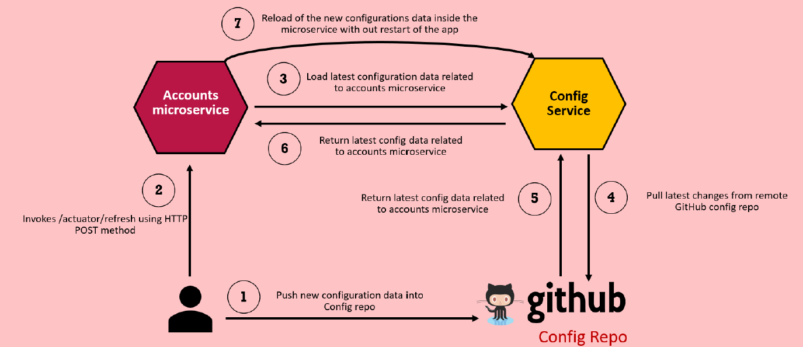

# Configurations Management in Microservices

In this section, we will discuss another Challenge, a crucial issue faced while building microservices or cloud-native applications—**Configuration Management**.

### Understanding the Challenge

One of the key principles of microservices is **separating configuration from business logic**. Unlike monolithic applications, where configurations are tightly coupled with the code, microservices require a different approach.

Here are some critical questions that arise when managing configurations in a microservices architecture:

- **How do we separate configurations from business logic?**

  - If we bundle configurations with the business logic, we must create separate Docker images for each environment. This is inefficient and goes against best practices.
  - The same Docker image should be reusable across all environments.

- **How do we inject configuration at runtime?**

  - Some sensitive configurations, such as credentials, cannot be hardcoded inside the business logic.
  - These must be injected securely at the time of service startup.

- **How do we manage configurations centrally?**
  - In monolithic applications, managing configurations manually may be feasible.
  - However, in microservices, where there could be **hundreds of services**, it becomes challenging to track configurations for each one.
  - A centralized configuration repository with version control is essential.

### Solutions for Configuration Management in Microservices

To tackle these challenges, multiple solutions are available within the **Spring Boot ecosystem**:

1. **Basic Approach:** Configuring Spring Boot with application properties and profiles.
2. **External Configuration Approach:** Storing configurations outside the microservice and injecting them at runtime.
3. **Spring Cloud Config Server:** A dedicated configuration server that manages all microservice configurations centrally.

Throughout this section, we will explore and implement these approaches in our **Accounts, Loans, and Cards** microservices.

### Traditional vs. Modern Configuration Management

**Traditional Applications (Monolithic Architecture)**

- Configurations are bundled with the source code.
- Any change in the configuration requires a rebuild and redeployment.
- There is no guarantee of consistency across environments.

**Microservices-Based Architecture**

- Configurations must be **externalized** from the business logic.
- The same **immutable artifact (Docker image)** is used across all environments.
- Configuration is injected dynamically based on the target environment (Dev, QA, Prod).

### Recommended Approach

Following the **12-Factor App methodology**, configurations that change between deployments (e.g., credentials, URLs) should be **stored separately** and injected at runtime.

The deployment process typically follows this workflow:

1. The **source code** is stored in a **GitHub repository**.
2. The application is **compiled and packaged** into a build (Docker image).
3. The **same build** is used across all environments (Dev, QA, Prod).
4. **Configuration is injected dynamically** at runtime, ensuring flexibility and security.

This approach ensures **consistency** across environments while keeping application artifacts **immutable**.

---

## 2. Basics of Configuration Management in Spring Boot

Since we are building our microservices using **Spring Boot**, it’s essential to understand how configuration management works within this framework. Spring Boot provides multiple ways to **externalize configurations**, ensuring that the same **immutable code artifact** can be reused across different environments without requiring a rebuild.

In this section, we will explore the **basic configuration approaches** available in Spring Boot before moving to advanced solutions like **Spring Cloud Config Server**.

---

### Why Externalize Configuration?

The **main challenge** in microservices configuration management is separating **business logic from configurations**.

- If **configuration is bundled with the code**, we need to **rebuild the application** for every environment change.
- The **recommended approach** is to keep the **same application build** across all environments and inject configurations dynamically.

Spring Boot allows us to achieve this by **externalizing configurations** using various approaches.

---

### Configuration Sources in Spring Boot

Spring Boot provides **multiple ways** to specify configuration properties:

1. **Property Files & YAML Files** (`application.properties` or `application.yml`)
2. **Environment Variables** (set at the OS level)
3. **Command-Line Arguments** (passed when starting the application)
4. **Java System Properties** (`-Dproperty=value` in JVM options)
5. **Servlet Config & Init Parameters** (for web applications)

By default, Spring Boot looks for **`application.properties`** or **`application.yml`** in the **classpath location**. However, we can override these properties at runtime using **environment variables or command-line arguments**.

---

### Spring Boot Configuration Priority Order

If the **same property** is defined in multiple places, **Spring Boot follows a priority order** when resolving its value:

| Priority        | Configuration Source                                        |
| --------------- | ----------------------------------------------------------- |
| **1** (Highest) | Command-Line Arguments (`--property=value`)                 |
| **2**           | Java System Properties (`-Dproperty=value`)                 |
| **3**           | OS Environment Variables                                    |
| **4**           | `application.properties` / `application.yml` (in classpath) |

**Lower priority sources** (e.g., `application.properties`) can be **overridden** by **higher-priority sources** (e.g., environment variables or command-line arguments).

---

### How to Read Configuration Properties in Spring Boot?

Once the configuration properties are defined, we need **ways to access them** inside our business logic. Here are three commonly used approaches:

#### 1. **Using `@Value` Annotation**

The simplest way to read a single property is by using the `@Value` annotation:

```java
@Value("${server.port}")
private String serverPort;
```

- `server.port` will be **injected** from the property file or environment variables.
- **Limitations**: Requires **hardcoding** property names and is not efficient for multiple properties.

---

#### 2. **Using `Environment` Interface**

For **dynamic configurations**, we can use the `Environment` interface provided by Spring Boot:

```java
@Autowired
private Environment environment; // Import from Spring Boot (not from Hibernate)

@GetMapping("/java-version")
public ResponseEntity<String> getJavaVersion() {
    return ResponseEntity.ok().body(env.getProperty("JAVA_HOME"));
}
```

Another Example:-

```java
@Autowired
private Environment environment;

public String getDatabaseUrl() {
    return environment.getProperty("spring.datasource.url");
}
```

- Useful when configurations come from **environment variables**.
- **More flexible** than `@Value`, but still involves **manual property retrieval**.

---

#### 3. **Using `@ConfigurationProperties`** (Recommended for Multiple Properties)

When working with **multiple related properties**, we should use `@ConfigurationProperties`:

1. **Define properties with a common prefix** in `application.yml`:

```yaml
accounts:
  message: "Accounts Microservice"
  contactDetails:
    name: "Accounts Microservice - Developer"
    email: "0V7ZD@example.com"
  onCallSupport:
    - (555) 555-5555
    - (555) 555-5556
```

2. **Create a Java class to bind properties:**

```java
@Component
@ConfigurationProperties(prefix = "accounts")
@Setter
@Getter
public class AccountsContactDto {
    private String message;
    private Map<String, String> contactDetails;
    private List<String> onCallSupport;
}
```

3. **Inject and use the properties:**

```java
@Autowired
private AccountsContactDto contactDto;

@GetMapping("/contact-info")
public ResponseEntity<AccountsContactDto> getContactDetails() {
    return ResponseEntity.ok().body(contactDto);
}
```

- **Benefits**:  
  ✅ Avoids hardcoding property names  
  ✅ Supports **multiple properties** binding  
  ✅ More **structured** and **scalable**

We can replace the AccountsContactDto class with a Java 17 record type if we prefer. Using Java 17 record instead of a simple class has several advantages, particularly when dealing with data-holding classes like DTOs (Data Transfer Objects).

- A record is implicitly final and cannot be extended.
- Its fields are final and cannot be modified after creation.
- This makes it thread-safe and prevents unintended modifications.

```java
@ConfigurationProperties(prefix = "accounts")
public record AccountsContactDto(String message, Map<String, String> contactDetails, List<String> onCallSupport) {
}
```

Ensure you have @EnableConfigurationProperties in your configuration class:

```java
@EnableConfigurationProperties(value = {AccountsContactDto.class})
public class AccountsController {
    @Autowired
    private AccountsContactDto contactDto;

    @GetMapping("/contact-info")
    public ResponseEntity<AccountsContactDto> getContactDetails() {
        return ResponseEntity.ok().body(contactDto);
    }
}
```

---

Spring Boot provides **various ways** to manage configurations. The **recommended approach** depends on **how many properties** you need to handle:

- ✅ Use `@Value` for **few** properties.
- ✅ Use `Environment` for **dynamic configurations**.
- ✅ Use `@ConfigurationProperties` for **large sets of properties**.

---

## 3. Managing Configurations with Spring Boot Profiles

In microservices development, different environments (such as **Development, QA, and Production**) often require **different configuration values**. For example, **database credentials** and **API endpoints** should vary between **local development, QA, and production** environments.

Spring Boot provides a powerful feature called **Profiles**, which allows us to define **environment-specific configurations** without modifying the application code.

---

### **Why Use Profiles?**

By default, Spring Boot loads properties from **`application.properties`** or **`application.yml`**. However, these properties **remain the same across all environments**.

✅ **Profiles allow us to:**

- Define **different configuration values** for different environments.
- **Avoid modifying the code** when switching environments.
- **Dynamically activate** the required profile at runtime.
- Control the **creation of Spring beans** based on the active profile.

---

### **How to Define Profiles in Spring Boot**

Spring Boot allows us to **group configurations** into separate profile-specific files:

| Environment         | Configuration File     |
| ------------------- | ---------------------- |
| **Default (Local)** | `application.yml`      |
| **QA**              | `application-qa.yml`   |
| **Production**      | `application-prod.yml` |

File Naming Convention: `application-{profile}.yml`. Use hyphens to separate the profile name instead of underscores because in later stage while working with spring cloud config server, it will be easier to manage the profiles.

#### **Example: Creating Profile-Specific YAML Files**

1️⃣ **Default Configurations (`application.yml`)**

```yaml
spring:
#  profiles:
#    active: qa
  config:
    import:
      optionals:
        - "application-${spring.profiles.active}.yml"

build:
  version: "3.0"
```

2️⃣ **QA Environment (`application-qa.yml`)**

```yaml
spring:
  config:
    active:
      on-profile: qa

build:
  version: "2.0"
```

3️⃣ **Production Environment (`application-prod.yml`)**

```yaml
spring:
  config:
    active:
      on-profile: prod

build:
  version: "1.0"
```

---

### **Activating a Profile**

We can **activate a profile** using different methods:

#### ✅ **Method 1: Inside `application.yml`**

Add the following property to activate a profile:

```yaml
spring:
  profiles:
    active: qa
```

---

### **Using Profiles to Control Bean Creation**

Profiles can also be used to **conditionally create beans** based on the environment.

```java
@Configuration
@Profile("prod")
public class ProdConfig {

    @Bean
    public DataSource dataSource() {
        return new HikariDataSource(); // Production database connection pool
    }
}
```

If the **`prod` profile** is **active**, Spring will only create this **`dataSource` bean**.

**Key Benefits of Using Profiles**

✅ **Seamless environment switching** → No need to modify the code.  
✅ **Prevents sensitive data leakage** → Environment variables can store credentials securely.  
✅ **Ensures application consistency** → The same **immutable build** can be used across environments.

**Limitations of Using Profiles**: Suppose if I want to change some properties inside a production environment, or suppose if I want to activate the production profile, then I need to change this value and then regenerate the Docker image. With that, we are not making our code base as immutable. That's why let's try to explore what are the various options that we have to change the property values dynamically during the startup through an external parameter.

---

## 4. Externalizing Configurations in Spring Boot

One of the core principles of microservices and cloud-native applications is **externalized configuration**. Instead of **hardcoding profile values** inside `application.yml`, we should activate and manage configurations dynamically based on the deployment environment.

Spring Boot provides multiple ways to achieve this without rebuilding or modifying the application package. Let’s explore these approaches.

**Why Externalize Configurations?**

If we **hardcode** profile values inside `application.yml`, we must **modify and rebuild** the application whenever we switch environments (e.g., from **Dev to QA to Prod**). This violates the **15-Factor Methodology**, which recommends **immutable artifacts** across deployments.

By **externalizing configurations**, we can:  
✅ Activate different profiles dynamically **without rebuilding the application**.  
✅ Manage **environment-specific settings** separately from the codebase.  
✅ Improve security by keeping **sensitive credentials out of the code**.  
✅ Ensure **portability** across multiple deployment platforms.

### **Approaches for Externalizing Configurations**

Spring Boot provides several methods to activate profiles and set external configurations dynamically.

#### **1️⃣ Command-Line Arguments (Highest Priority)**

Command-line arguments provide the **highest precedence** among all configuration sources in Spring Boot.

##### **Syntax:**

```bash
java -jar myapp.jar --spring.profiles.active=prod --server.port=8082
```
Example:-
```bash
java -jar target/accounts-0.0.1-SNAPSHOT.jar --build.version=5.9
```

##### **Key Points:**

✅ Overrides values set in `application.yml`.  
✅ Allows **dynamic profile selection** at runtime.  
✅ Supports multiple key-value pairs (separated by spaces).

#### **2️⃣ JVM System Properties (-D option)**

JVM system properties provide another way to **pass externalized configurations** at runtime.

##### **Syntax:**

```bash
java -Dspring.profiles.active=prod -Dserver.port=8082 -jar myapp.jar
```
Example:-
```bash
java -Dbuild.version=9.9 -jar target/accounts-0.0.1-SNAPSHOT.jar
```
##### **Key Points:**

✅ Has **lower precedence** than command-line arguments but **higher than application.yml**.  
✅ Allows configurations to be **injected into JVM runtime**.

**Precedence Rule:**  
If **both command-line arguments and JVM system properties** define the same property, **command-line arguments take priority**.

#### **3️⃣ Environment Variables (Universal Approach)**

Environment variables are **universally supported** across all programming languages and platforms, making them a widely used method for external configurations.

##### **Syntax:**

✅ **Windows (Command Prompt)**

```cmd
set SPRING_PROFILES_ACTIVE=prod
java -jar myapp.jar
```

✅ **Linux/macOS (Terminal) or if using GitBash in Windows**

```bash
export SPRING_PROFILES_ACTIVE=qa
java -jar myapp.jar
```

Example:-
```bash
export BUILD_VERSION=8.7
java -jar target/accounts-0.0.1-SNAPSHOT.jar
```

##### **Key Points:**

✅ **Widely supported across all platforms.**  
✅ **No dependency on Java or Spring Boot.**  
✅ Can be **retrieved programmatically** in Java using `System.getenv("SPRING_PROFILES_ACTIVE")`.

🚀 **Conversion Rules for Environment Variables:**  
When setting Spring Boot properties as environment variables:  
1️⃣ Convert **property keys to uppercase**.  
2️⃣ Replace **dots (.) with underscores (\_)**.

✅ **Example:**  
| Property in `application.yml` | Equivalent Environment Variable |
|----------------------------|----------------------------|
| `build.version=1.0.0` | `BUILD_VERSION=1.0.0` |
| `server.port=8080` | `SERVER_PORT=8080` |

### **Comparison of External Configuration Approaches**

| Approach                   | Priority       | Example Syntax                      |
| -------------------------- | -------------- | ----------------------------------- |
| **Command-Line Arguments** | 🔴 **Highest** | `--spring.profiles.active=prod`     |
| **JVM System Properties**  | 🟡 Medium      | `-Dspring.profiles.active=qa`       |
| **Environment Variables**  | 🟢 Lower       | `export SPRING_PROFILES_ACTIVE=dev` |
| **application.yml**        | ⚪ **Lowest**  | `spring.profiles.active=qa`         |

#### **Best Practices for Externalized Configurations**

✔ **Use command-line arguments** when deploying in **containerized environments (Docker, Kubernetes)**.  
✔ **Use environment variables** for cloud-native and **platform-independent configurations**.  
✔ **Use JVM system properties** when running in **traditional on-premise applications**.  
✔ **NEVER hardcode sensitive credentials** inside the codebase—use a **configuration management system** like Spring Cloud Config.

Spring Boot provides **flexible options** to externalize configurations, ensuring that applications remain **portable, scalable, and environment-agnostic**.

---

## 5. Limitations of Externalizing Configurations with Spring Boot

When working with Spring Boot to externalize configurations, there are several challenges that developers may encounter. Although Spring Boot offers various ways to manage configurations—such as using CLI arguments, JVM properties, and environment variables—these approaches have their drawbacks. Below are some of the key limitations:

### a. Manual Setup and Potential Errors
Externalizing configurations using CLI arguments, JVM properties, or environment variables can be effective, especially when you want to maintain the immutability of your application build. However, these methods often require manual intervention for setting up configurations, such as injecting values into CI/CD pipelines or starting the application with specific commands. This introduces the risk of human errors during deployment, and as the number of instances or microservices grows, maintaining consistency across all instances becomes increasingly challenging.

### b. Lack of Centralized Management for Configurations
As applications scale and you manage hundreds of microservices, you’ll likely encounter thousands of configuration properties that change frequently. Without proper versioning, auditing, and centralized management, maintaining these configurations becomes cumbersome. With Spring Boot profiles alone, configurations are typically stored within the source code, making them easily accessible to anyone with access to the code or Docker image. This approach lacks the ability to track changes or control who has access to sensitive configurations.

### c. Security Concerns with Sensitive Data
When externalizing configurations, particularly sensitive data like database credentials, it’s common to use environment variables. However, this presents a security issue because anyone with access to the production server—such as system administrators—can view these environment variables. This exposure of sensitive information can be a serious security risk, especially in large-scale applications where many individuals may have access to the server.

### d. Scalability Issues in Large Microservice Architectures
In a microservices architecture, it’s common to deploy multiple instances of each service. For instance, if you have three microservices, and each microservice has three instances, you end up managing nine instances in total. When scaling this architecture to hundreds of microservices, each with multiple instances, manually configuring each instance becomes unsustainable. The complexity of managing configurations across all instances grows exponentially, making the traditional methods impractical for large-scale applications.

### e. Lack of Encryption and Secure Storage for Secrets
When providing sensitive information—such as database passwords—to a Spring Boot container, the traditional methods like CLI arguments, environment variables, or profiles all require storing these secrets in plain text. These approaches lack encryption or secure storage mechanisms, putting your sensitive data at risk.

### f. Need for Application Restart to Change Configurations
One of the biggest drawbacks of using Spring Boot alone to manage configurations is that changes to configuration properties often require restarting the application or microservice. This is especially problematic in production environments, where a restart can lead to downtime. Ideally, microservices should be able to read the latest property values without needing to restart, but this is not possible with Spring Boot configurations alone.

**Conclusion**
Given these limitations, relying solely on Spring Boot for managing configurations in microservices architectures is not advisable for most applications. While it may work for smaller projects with limited complexity, larger applications with many microservices and frequent configuration changes require a more advanced solution. In the next section, we will explore how Spring Cloud Config Server can address these challenges and provide a more robust and scalable configuration management solution.

---

## 6. Managing Configurations in Microservices with Spring Cloud Config

In the previous section, we explored how configurations can be managed in microservices using Spring Boot. While Spring Boot provides several ways to externalize configurations, relying solely on it presents several limitations. In this section, we'll introduce a more robust and scalable solution: **Spring Cloud Config**.

Spring Cloud Config is a framework within the Spring ecosystem designed to handle configuration management in cloud-native systems, such as microservices. It enables centralized configuration management, making it an ideal solution for large-scale, distributed systems. Let’s dive into how Spring Cloud Config works and why it's a better approach for managing configurations in microservices.

### What is Spring Cloud Config?

Spring Cloud Config offers a centralized configuration server that allows you to store and manage configuration properties for your microservices in a secure and consistent way. Unlike traditional methods that require storing configurations within each microservice or its environment, Spring Cloud Config decouples configuration from the application code, centralizing it in a configuration server.

### Key Components of Spring Cloud Config

Spring Cloud Config revolves around two core components:

1. **Centralized Configuration Repository**: The first step in this approach is storing your configuration properties in a centralized repository. This can be a GitHub repository, a file system, or even a database—whichever suits your project needs. The important aspect is that all configurations are stored in one place, making it easier to manage and scale.

2. **Spring Cloud Config Server**: The centralized configuration server connects to the repository, loads configuration data, and provides it to the microservices when needed. This server manages the configuration properties for all microservices and environments, ensuring consistency and reducing errors.

### How Does Spring Cloud Config Work?

Here’s a step-by-step overview of how Spring Cloud Config operates:

- **Store Configuration Data**: All configuration properties are stored in a centralized repository (e.g., a GitHub repo or file system).
- **Configure the Config Server**: Set up a Spring Cloud Config server that connects to the repository to load configuration properties.
- **Microservices as Config Clients**: Each microservice, whether it’s the accounts service, loans service, or any other, acts as a **config client**. During startup, microservices connect to the config server and fetch their configuration data based on their active profiles.

This process decouples configuration management from your microservices, simplifying the process of managing configurations across various environments.

### Benefits of Spring Cloud Config

Using Spring Cloud Config offers several key advantages over traditional configuration management approaches:

- **Centralized Management**: All configurations are stored in one location, making it easy to manage and maintain.
- **Consistency Across Environments**: The centralized configuration server ensures that all microservices use consistent configuration properties across different environments (development, staging, production).
- **Scalability**: As your microservices architecture grows, the centralized config server can manage configurations for hundreds or thousands of services, eliminating manual configuration handling.
- **Security**: Sensitive configuration data, such as database credentials, can be securely stored and managed, reducing the risk of accidental exposure.

### Spring Cloud Ecosystem

Spring Cloud is not limited to just configuration management. It provides a suite of projects designed to solve common challenges in cloud-native applications and microservices architectures. Some of the most popular Spring Cloud projects include:

- **Spring Cloud Config**: For centralized configuration management
- **Service Registration and Discovery**: Tools like Eureka, Consul, and Zookeeper to register and discover services dynamically
- **Routing and Tracing**: For routing requests and tracing system interactions
- **Load Balancing**: Tools like Ribbon and Spring Cloud Load Balancer for distributing traffic across services
- **Security**: Spring Cloud Security for securing microservices
- **Distributed Tracing and Messaging**: For tracking requests across multiple services and handling messaging patterns

While this guide focuses on Spring Cloud Config, these other projects within the Spring Cloud ecosystem help address additional challenges like service discovery, load balancing, and security. By leveraging the full Spring Cloud suite, developers can build highly scalable, secure, and resilient microservices architectures.

---

## 7. Setting Up Spring Cloud Config Server for Microservices

In this section, we’ll set up a **Spring Cloud Config Server** to manage configurations for our microservices. Currently, the microservices (Accounts, Cards, and Loans) use Spring Boot for configuration management. We’ll now move to a more advanced, centralized configuration approach with **Spring Cloud Config**.

**Setting Up the Project**

1. **Create a New Folder**:  
   Create a new folder named `v2-spring-cloud-config` to house the updated version of the microservices using Spring Cloud Config, keeping both configurations for reference.

2. **Generate Config Server**:  
   Use [Spring Initializr](https://start.spring.io/) to generate a new project for the **Config Server** with the following settings:
  - **Group**: `com.knowprogram`
  - **Artifact**: `config-server`
  - **Dependencies**: Config Server, Actuator

  There are 2 dependencies related to Spring cloud config: `Config Server` and `Config Client`. The `Config Server` dependency is used to create a centralized configuration server. The `Config Client` dependency is used to fetch configurations from the server.

3. **Download and Open in IntelliJ**:  
   After downloading and extracting the ZIP file, open it in IntelliJ IDEA. You’ll have four projects now: **Accounts**, **Cards**, **Config Server**, and **Loans**.

### Config Server Setup

1. **Enable Config Server**:  
   In the main class of the `config-server` project, add the `@EnableConfigServer` annotation to enable the Config Server functionality.

   ```java
   @SpringBootApplication
   @EnableConfigServer
   public class ConfigServerApplication {
       public static void main(String[] args) {
           SpringApplication.run(ConfigServerApplication.class, args);
       }
   }
   ```

2. **Configure `application.yml`**:  
   Rename `application.properties` to `application.yml` and set the port to 8071:

   ```yaml
   server:
     port: 8071
   ```

## 8. Centralizing Configurations

The Config Server can read configurations from various sources:

1. **Classpath**: Store configuration files inside the classpath.
2. **File System**: Store configurations in a folder on the local system or server.
3. **GitHub**: Store configurations in a GitHub repository, allowing version control and collaboration.

We’ll cover all three approaches, starting with storing configurations on the classpath, then moving to the file system and GitHub.

---

### **8.a. Classpath Configuration**

#### Step 1: Set Up Config Server

1. **Define Application Name**:  
   Inside `application.yml` of the config server, define the `spring.application.name` property to set the name of the config server.

   ```yaml
   spring:
     application:
       name: configserver 
       # same name will be used in client applications
       # Name should not have hypens. 
       #Example: `config-server` is invalid.
   ```

#### Step 2: Organize Configuration Files

1. **Create Config Folder**:  
   Under the `resources` folder, create a new `config` folder where all the microservice configurations will reside.

2. **Move Microservice Configurations**:  
   Copy the configuration files for the **Accounts** microservice into the `config` folder (with different profiles: `prod`, `qa`, `default`). Rename these files to reflect the microservice name, such as `accounts.yml`, `accounts-prod.yml`, and `accounts-qa.yml`.

3. **Clean Up Unnecessary Properties**:  
   Remove unnecessary properties that are specific to Spring Boot (e.g., `server.port`, database configurations), leaving only microservice-specific properties.

4. **Repeat for Other Microservices**:  
   Similarly, create configuration files for **Cards** and **Loans** microservices, following the same naming convention.

```
resources/
└── application.yml
└── config/
    ├── accounts.yml
    ├── accounts-prod.yml
    ├── accounts-qa.yml
    ├── cards.yml
    ├── cards-prod.yml
    ├── cards-qa.yml
    ├── loans.yml
    ├── loans-prod.yml
    └── loans-qa.yml
```

#### Step 3: Update Config Server's `application.yml`

1. **Activate Native Profile**:  
   To use **classpath-based configurations**, set the active profile to **`native`**:

   ```yaml
   spring:
     profiles:
       active: native # to read from classpath or filesystem
   ```

2. **Configure Property Search Locations**:  
   Define the location of the configuration files inside the classpath.

   ```yaml
   spring:
     cloud:
       config:
         server:
           native:
             search-locations: classpath:/config
   ```

#### Step 4: Build and Start the Config Server

1. **Build and Run the Server**:  
   Once all configurations are in place, build the project and start the config server on port `8071`. You can check if it’s working by accessing specific profiles for each microservice, e.g., `localhost:8071/accounts/prod` for the `prod` profile of the **Accounts** microservice, `localhost:8071/accounts/qa` for the `qa` profile, `localhost:8071/accounts/default` for the default one.

2. **Validate Profiles**:  
   You should now be able to access different profiles for **Accounts**, **Cards**, and **Loans** microservices via the config server API.

Example response of `http://localhost:8071/cards/qa`:-
```
{
  "name": "cards",
  "profiles": [
    "qa"
  ],
  "label": null,
  "version": null,
  "state": null,
  "propertySources": [
    {
      "name": "classpath:/config/cards-qa.yml",
      "source": {
        "build.version": "2.0",
        "cards.message": "Welcome to PeopleBank cards related QA APIs ",
        "cards.contactDetails.name": "Rocco Jerry - QA Lead",
        "cards.contactDetails.email": "jerryl@peoplebank.com",
        "cards.onCallSupport[0]": "(310) 875-4367",
        "cards.onCallSupport[1]": "(201) 236-1267"
      }
    },
    {
      "name": "classpath:/config/cards.yml",
      "source": {
        "build.version": "3.0",
        "cards.message": "Welcome to PeopleBank cards related local APIs ",
        "cards.contactDetails.name": "Know Program Lech - Developer",
        "cards.contactDetails.email": "dragos@peoplebank.com",
        "cards.onCallSupport[0]": "(412) 419-3491",
        "cards.onCallSupport[1]": "(915) 382-1932"
      }
    }
  ]
}
```

Now let us see how we can use these properties inside accounts, loans, and cards microservices.

#### Step 5: Add Config Client Dependency

Modify the accounts microservice, pom.xml file to include the config-client dependency:-

```xml
<dependency>
	<groupId>org.springframework.cloud</groupId>
	<artifactId>spring-cloud-starter-config</artifactId>
</dependency>
```

Spring cloud version:-

```xml
<properties>
  <java.version>17</java.version>
  <spring-cloud.version>2024.0.1</spring-cloud.version>
</properties>
```

Dependency Management:-

```xml
<dependencyManagement>
  <dependencies>
    <dependency>
      <groupId>org.springframework.cloud</groupId>
      <artifactId>spring-cloud-dependencies</artifactId>
      <version>${spring-cloud.version}</version>
      <type>pom</type>
      <scope>import</scope>
    </dependency>
  </dependencies>
</dependencyManagement>
```
In accounts, application.yml file, add the config-server details:-

```yaml
spring:
  profiles:
    active: prod
  # config server details
  config:
    # config server url (same name and url)
    import: "optional:configserver:http://localhost:8071/"
```

Now, run the accounts microservice, it should work as expected.

---

### **8.b. File System Configuration**

**Storing Configurations in a File System for Spring Cloud Config Server**

In some projects, configurations are stored in a file system location. This approach enhances security by restricting access to only the config server application.  

To achieve this, copy the configurations in a local folder. In the **Spring Cloud Config Server**, update the `application.yml` file:  

- Change `spring.cloud.config.server.native.search-locations` from `classpath` to `file:///{path_to_config_folder}`.  
- For macOS/Linux: `file:///Users/program/Documents/config/`  
- For Windows: `file:///C:/config/`. 

Example in Windows:- `search-locations: file:///C:/workspace/microservices/doc/config`  

After this change, restart the config server and all microservices. Testing the microservices confirms that the configurations load successfully from the file system. The **Spring profile must be set to `native`** in the config server for this to work.

---

### **8.c.1. Storing Configuration Properties in a GitHub Repository**

Let's explore how to store all configuration properties inside a GitHub repository and use it as a source for our Spring Cloud Config Server. This is the most recommended approach due to its multiple advantages, such as security, versioning, and auditing. 

#### Why Use GitHub for Configuration Management?
Using GitHub to manage configuration properties offers several benefits:
- **Security:** You can restrict access to your repository.
- **Versioning & Auditing:** You can track historical changes to configurations.
- **Scalability:** Multiple microservices can pull configurations from a central repository.

#### Setting Up GitHub as a Config Source
To get started, follow these steps:

1. **Move Configuration Files to GitHub:**  
   Create a GitHub repository (e.g., `peoplebank-config`) and upload configuration files for microservices like `accounts`, `loans`, and `cards`.

2. **Modify the Config Server `application.yml`:**  
   Update the configuration to use GitHub as a backend:
   ```yaml
   spring:
     profiles:
       active: git
     cloud:
       config:
         server:
           git:
             uri: https://github.com/yourusername/peoplebank-config
             default-label: main
             timeout: 5
             clone-on-start: true
             force-pull: true
   ```
   - `active: git` enables the GitHub-based approach.
   - `uri` specifies the repository URL.
   - `default-label` sets the branch to pull from (branch name).
   - `timeout` ensures quick failure if GitHub is unreachable.
   - `clone-on-start` clones the repository during startup.
   - `force-pull` ensures the latest changes are always fetched.

3. **Start the Config Server and Microservices:**
   - Start the Spring Cloud Config Server.
   - Verify it connects to GitHub by checking the logs.
   - Access `http://localhost:8071/accounts/prod` to check if configurations are loaded from GitHub.
   - Start microservices (`accounts`, `loans`, `cards`) and validate they fetch properties from the config server.

#### Using a Private GitHub Repository
For private repositories, authentication is required. You can:
- Use **username and password** authentication.
- Configure **SSH-based access**.
- Follow the Spring Cloud Config documentation for additional security settings.

#### Alternative Backends
Spring Cloud Config supports multiple backends:
- **File System Backend:** Stores properties locally.
- **Vault & AWS Secret Manager:** Securely manage secrets.
- **JDBC Backend:** Store configurations in a database.

For more details, refer to the [Spring Cloud Config documentation](https://spring.io/projects/spring-cloud-config).

---

### 8.c.2. Encrypting Configuration Properties in Spring Cloud Config Server

Now that we have successfully stored our configuration properties in a GitHub repository, it's time to enhance security by encrypting sensitive data. By default, all properties in GitHub are stored in **plain text**, which poses a security risk. To protect sensitive details such as passwords, API keys, and database credentials, we can **encrypt configuration properties** using **Spring Cloud Config Server**.

#### Why Encrypt Configuration Properties?
- **Enhanced Security:** Prevent unauthorized access to sensitive information.
- **Safe Storage:** Even if someone gains access to the GitHub repo, they won't be able to read sensitive data.
- **Secure Communication:** Microservices can still receive decrypted values dynamically from the Config Server.

### Configuring Encryption in Spring Cloud Config Server

#### 1. Define an Encryption Key
To enable encryption, we need to define a **secret key** inside the `application.yml` of the Config Server.

```yaml
encrypt:
  key: aVeryComplexAndRandomSecretKey12345!
```
> **Note:** Choose a **strong secret key** to prevent brute-force attacks. You can generate random keys using online tools or CLI utilities.

#### 2. Restart the Config Server
After adding the encryption key, restart the Config Server to apply changes.

### Encrypting Sensitive Properties

#### 1. Use the `/encrypt` API
Spring Cloud Config Server exposes an **encryption API** to encode plaintext values. To encrypt a value:
- Send a **POST** request to:
  ```
  POST http://localhost:8071/encrypt
  ```
- In the request body, provide the plain text value you want to encrypt.

Example:
```
test-email@example.com
```

- The response will return an **encrypted value**, such as:
  ```
  c13c6758fd5a7c1230d9a7b26f1f8a74b9c5e...
  ```

#### 2. Store the Encrypted Value in GitHub
Once encrypted, update the **configuration file** inside the GitHub repository with the encrypted value:

```yaml
contactDetails:
  email: "{cipher}c13c6758fd5a7c1230d9a7b26f1f8a74b9c5e..."
```

> **Important:**  
- Always prefix **encrypted values** with `{cipher}` so that Spring Cloud Config Server knows they are encrypted.

#### 3. Restart the Config Server
Restart the Config Server to ensure it fetches the updated encrypted configuration.

### Decrypting Configuration Properties

#### 1. Verify Decryption Using `/decrypt` API
To verify decryption, send a **POST** request to:

```
POST http://localhost:8071/decrypt
```

- Provide the encrypted value in the request body.
- The response should return the original plain text value.

#### 2. Validate Config Server Decryption
- Start the **Config Server** and invoke:
  ```
  GET http://localhost:8071/accounts/prod
  ```
- The response should return **decrypted** property values.
- Start the **Accounts Microservice** and invoke:
  ```
  GET http://localhost:9000/accounts/contact-info
  ```
- The microservice should receive decrypted properties.

### Securing the Config Server in Production
In production environments:
- **Do not expose encryption APIs (`/encrypt` & `/decrypt`) publicly.**  
- **Deploy Config Server behind a firewall.**  
- **Use environment variables or CLI arguments** instead of hardcoding the encryption key in `application.yml`.  
- **Enable Spring Security** to restrict access to configuration endpoints.

---

## 9. Dynamically Refreshing Configuration Properties in Microservices  

In a microservices environment, managing configuration properties efficiently is crucial. While **Spring Cloud Config Server** allows us to centralize configurations, a common challenge arises when we need to update properties **at runtime without restarting** microservices. Restarting microservices manually can be impractical, especially in large-scale systems with **hundreds of microservices and multiple instances**.  

**The Need for Dynamic Configuration Refresh**

Imagine a scenario where you have a **feature flag** in your configuration that controls a specific business logic inside a microservice. If you need to update the flag value, you want the change to reflect **immediately** across all instances without restarting the services. Restarting services for configuration updates can:  
- Be **manual and time-consuming**  
- Affect **application availability and traffic**  
- Be **unscalable** in large environments  

### Enabling Runtime Configuration Refresh  

To dynamically refresh configurations, we leverage **Spring Boot Actuator** and its `/refresh` endpoint. This allows microservices to reload updated configurations **without restarting**.  

#### **Step 1: Add Actuator Dependency**  

Ensure that each microservice has the Spring Boot Actuator dependency in `pom.xml`:  

```xml
<dependency>
    <groupId>org.springframework.boot</groupId>
    <artifactId>spring-boot-starter-actuator</artifactId>
</dependency>
```  

#### **Step 2: Convert Record Classes to Mutable Classes**  

By default, Java **record classes** create immutable objects, preventing property updates at runtime. We need to replace **record classes** with regular Java classes using **Lombok** to allow property changes.  

Example update for `AccountsContactInfoDto`:  

```java
@Getter
@Setter
@Component
@ConfigurationProperties(prefix = "accounts")
public class AccountsContactInfoDto {
    private String message;
    private Map<String, String> contactDetails;
    private List<String> onCallSupport;
}
```  

Repeat this update for similar DTOs in other microservices like **Loans** and **Cards**.  

#### **Step 3: Enable Refresh Endpoint in `application.yml`**  

By default, Spring Boot does not expose the `/refresh` endpoint. Enable it by adding the following property inside each microservice’s `application.yml`:  

```yaml
management:
  endpoints:
    web:
      exposure:
        include: refresh
```
Alternatively, to expose **all** Actuator endpoints, use:  
```yaml
management:
  endpoints:
    web:
      exposure:
        include: "*"
```

#### **Step 4: Start Microservices and Validate Initial Configurations**  

1. Build and start the **Config Server**.  
2. Start microservices: **Accounts, Loans, and Cards**.  
3. Check that microservices are fetching configurations correctly from the Config Server.  

#### **Step 5: Update Configuration in GitHub**  

- Modify a property inside the **GitHub repository** (e.g., update `message` property in `accounts-prod.yml`).  
- Commit the changes directly to GitHub.  

#### **Step 6: Verify Config Server Fetches Latest Configurations**  

Check if the **Config Server** retrieves the updated configuration:  
```bash
GET http://localhost:8071/accounts/prod
```
The response should reflect the latest values from GitHub.  

#### **Step 7: Manually Refresh Microservices**  

By default, microservices do **not** automatically reload the new configuration. To force an update **without restarting**, we must invoke the **Actuator `/refresh` API** for each microservice.  

Use **Postman** or **cURL**:  

```bash
POST http://localhost:8080/actuator/refresh
```

Repeat this step for **all microservices** (Loans, Cards). Once done, test the microservices again:  
```bash
GET http://localhost:8080/accounts/contact-info
```
The updated value should now be visible.



### **Drawback of the Manual Refresh Approach**  

While the `/refresh` API helps avoid restarts, it presents a **scalability issue** in large systems:  

- If you have **100 microservices** with **5 instances each**, you must manually invoke `/refresh` on **500 instances**.  
- Automating the refresh process with **CI/CD scripts** or **Jenkins jobs** is possible but **not always ideal**.  

**What’s Next? Automating Configuration Refresh**  

Instead of manually invoking `/refresh` for each microservice, we need a **more efficient** approach. In the next section, we will explore how to **automatically refresh configurations across all microservices** using **Spring Cloud Bus** and **message brokers like RabbitMQ or Kafka**.  

By implementing **Spring Cloud Bus**, we can broadcast configuration changes to all microservices dynamically, eliminating the need to manually call the `/refresh` API. 

---
