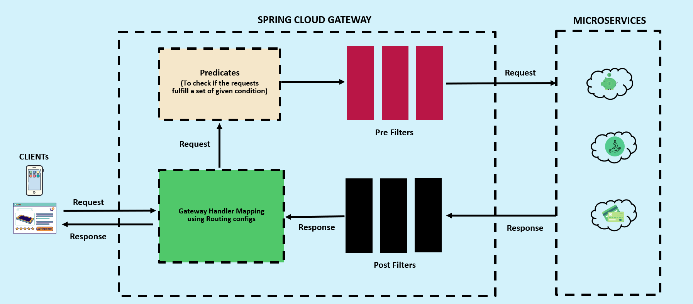
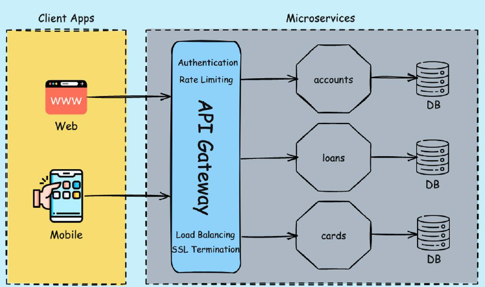
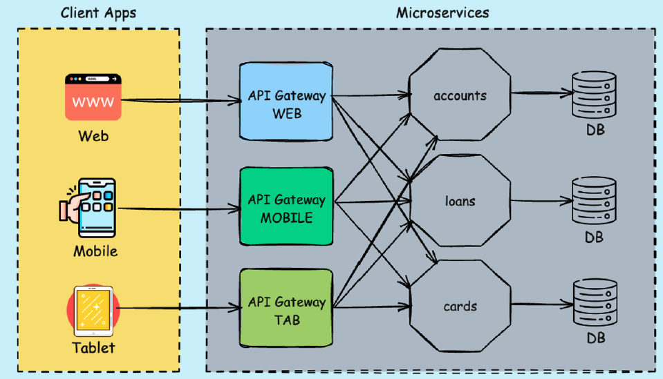
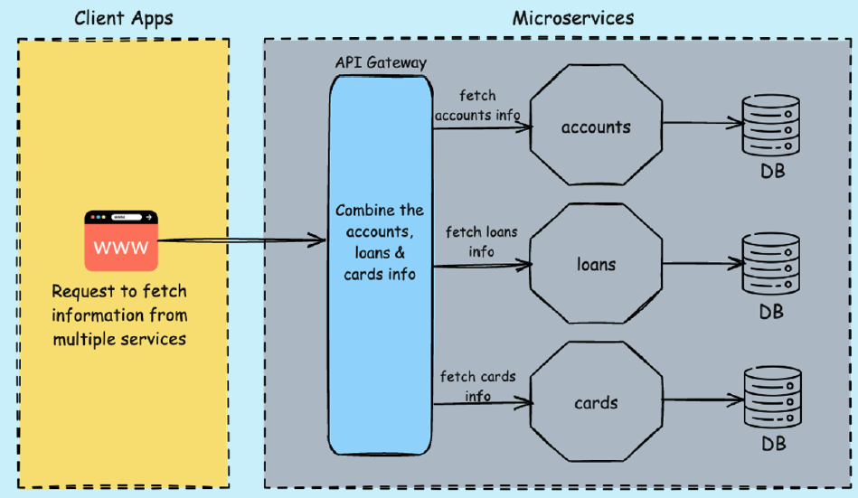

# API Gateway

## 1. Why Microservices Need a Gateway: Understanding the Role of an Edge Server / API Gateway

In the previous section, we discussed the internal communication challenges within a microservices architecture. Now, let’s shift our focus to **external communication**—specifically, how client applications interact with your microservices.

One of the **core principles** of building scalable and secure microservices is ensuring that **external clients never interact directly with internal services**. Instead, all incoming traffic should be routed through a **single entry point**—commonly known as an **API Gateway** or **Edge Server**.

This section introduces **Challenge #6** in microservices development:

> How do we efficiently manage external traffic while handling routing, security, logging, and other cross-cutting concerns?

### Why a Single Entry Point Matters

You might wonder, _"Why not let clients talk directly to microservices?"_ At first glance, that may seem fine. But as the system scales—maybe to 10, 50, or even 100+ services—it becomes unmanageable and error-prone. Each client would need to track individual service endpoints, port numbers, and potentially handle authentication separately for each service.

A **centralized gateway** solves this by acting as the sole entry point into your ecosystem. It simplifies client interaction and centralizes control over:

- **Authentication & Authorization**
- **Request Routing**
- **Rate Limiting**
- **Auditing & Logging**
- **Header Transformation**
- **Protocol Translation**
- **Caching**
- **Exception Handling & Circuit Breaking**

### But Can’t We Just Use a Common Library?

A common idea is to encapsulate these cross-cutting concerns into a shared library and include it across services. While that works in theory, in practice it creates **tight coupling** and **maintenance nightmares**. Updating the shared logic would require rigorous **regression testing** across all services. In large systems, that’s rarely practical or efficient.

### Enter the Edge Server (API Gateway)

A smarter solution is to introduce an **Edge Server**—a standalone component that handles all external communication. This server performs essential logic before routing requests to the appropriate microservice. It brings a **centralized enforcement layer** for policies and business rules.

Let’s revisit our microservices—say, **Accounts**, **Loans**, and **Cards**. Rather than exposing each of them to the outside world, we place an **API Gateway** in front of them. All client traffic passes through this gateway, which handles:

- Validating requests
- Applying IP whitelists/blacklists
- Performing authentication and authorization
- Enforcing rate limits and quotas
- Routing requests dynamically
- Modifying headers and payloads
- Forwarding requests only after all checks are complete

This architecture keeps your backend services **clean**, **focused**, and **secure**, while the gateway takes care of the heavy lifting.

### Bonus: Enhancing Resilience & Observability

The gateway can also handle **resilience patterns** such as:

- **Circuit Breakers** to prevent cascading failures
- **Retries** and **Timeouts** to manage transient faults
- **Quota enforcement** for API plans like Standard, Premium, or Enterprise
- **Logging and monitoring integration** with tools like **Grafana**
- **Caching** with systems like **Redis**

These capabilities are crucial for maintaining a production-grade system.

### So, Why Not Use Eureka for This?

A valid question! While **Eureka Server** plays a crucial role in **service discovery**, it is **not designed** to handle routing, security, or request processing. That’s exactly where the **API Gateway** comes in. You can (and often should) use both: Eureka for service registration/discovery, and API Gateway for managing the traffic.

### Is It Hard to Build an API Gateway?

Absolutely not. With frameworks like **Spring Boot** and **Spring Cloud**, building a robust and production-ready API Gateway is just as straightforward as creating any other Spring Boot service. You simply add a few dependencies, define some routes and filters, and you’re up and running.

---

Sure! Here's a polished and professional version of that lecture, rewritten as an H2 section of a blog:

---

## 2. Understanding Spring Cloud Gateway: The Edge Server for Your Microservices

Let’s explore how **Spring Cloud** helps us implement an **edge server** within a microservices architecture, using a powerful project called **Spring Cloud Gateway**.

Spring Cloud Gateway is a dedicated project under the Spring Cloud umbrella, designed specifically to handle external client requests and route them efficiently to the appropriate internal microservices. Acting as the **gatekeeper** of your microservices ecosystem, it ensures that no client directly interacts with the backend services, providing a centralized entry point to the system.

What makes Spring Cloud Gateway particularly effective is its foundation on the **Spring Reactive** framework. This non-blocking, asynchronous approach enables it to handle high volumes of traffic with minimal resource consumption—making it both **production-ready** and **highly scalable**. Since the gateway is exposed to all external traffic, performance and efficiency are critical, and the reactive model makes this possible.

Despite its robust capabilities, building a gateway using Spring Cloud Gateway is as straightforward as building any standard Spring Boot application. If you're already familiar with Spring Boot, you'll find it incredibly intuitive—requiring only a few configurations, dependencies, and a small amount of code to get started.

But Spring Cloud Gateway does much more than just routing requests. It enables powerful **cross-cutting functionalities**, including:

- **Dynamic Routing**: Directing requests based on attributes such as headers (e.g., API versioning).
- **Sticky Sessions**: Ensuring that a client is consistently routed to the same backend instance.
- **Security and Authentication**: Centralized enforcement of access policies.
- **Logging and Auditing**: Capturing request metadata at a single entry point.
- **Metrics and Monitoring**: Seamless integration for observability.

While other options like **Zuul** exist for implementing gateways in the Java ecosystem, **Spring Cloud Gateway** is generally preferred. It’s built on Spring WebFlux (reactor-based), offers better integration with service discovery tools like **Eureka**, and supports features like **Circuit Breakers**, **rate limiting**, **path rewriting**, **predicates**, and **filters**.

All these features make Spring Cloud Gateway a **centralized policy enforcement point** for your entire microservices architecture.

If you're curious to learn more, visit the [official Spring Cloud Gateway page](https://spring.io/projects/spring-cloud-gateway). It provides a concise overview of its features, including:

- Flexible routing based on any request attribute
- Custom predicates and filters for routes
- Seamless integration with other Spring Cloud components

---

## 3. Internal Architecture of Spring Cloud Gateway

Let’s explore how Spring Cloud Gateway processes requests in a microservices architecture.



### 1. **Receiving Client Requests**

Client requests originate from various sources such as:

- Mobile applications
- Web applications
- External REST APIs

These requests first hit the **Gateway Server**, which acts as the **edge server** in your microservices ecosystem.

### 2. **Gateway Handler Mapping**

The first key component involved is the **Gateway Handler Mapping**.

- It determines **which path was invoked** by the client.
- It identifies **which microservice** the request should be routed to.
- **Important:** This is not automatic or intelligent — routing decisions must be configured explicitly by developers.

> Developers define routing rules like:  
> “If a request comes to `/accounts/**`, route it to the Accounts microservice.”

### 3. **Predicates**

Once a route is matched, **predicates** come into play:

- A **predicate** is a condition that returns a `true` or `false`.
- If the predicate evaluates to `true`, the request proceeds.
- If `false`, the request is denied with an appropriate error.

**Examples of predicates:**

- Based on request headers
- Request method (GET, POST, etc.)
- Query parameters
- IP address

Predicates help enforce routing **conditions** before a request is allowed to continue.

### 4. **Pre-filters**

If predicates pass, **pre-filters** are executed **before** the request reaches the destination microservice.  
They can be used for:

- Logging
- Authentication/Authorization
- Request transformation
- Auditing
- Security checks

Multiple pre-filters can be configured as needed.

### 5. **Forwarding the Request**

After pre-filters run successfully, the request is forwarded to the **target microservice** (e.g., `loans`, `accounts`, or `cards`).

### 6. **Post-filters**

When the microservice sends back a response:

- **Post-filters** intercept it **before returning to the client**.
- You can perform:
  - Response modification
  - Logging
  - Validation
  - Response enhancement

### 7. **Sending Response Back**

The response, after going through post-filters, is routed back through the **Gateway Handler Mapping** and sent to the original client.

### Bonus: Built-in Filters & Documentation

Spring Cloud Gateway provides **predefined filters** for common scenarios. Examples include:

- `AddRequestHeaderGatewayFilter`
- `RetryGatewayFilter`
- `CircuitBreakerGatewayFilter`
- `ModifyRequestBodyGatewayFilter`
- `TokenRelayGatewayFilter`
- `AddResponseHeaderGatewayFilter`

You can find detailed documentation here:
🔗 [Spring Cloud Gateway Reference Docs](https://docs.spring.io/spring-cloud-gateway/reference/)

Useful built-in support includes:

- **Metrics collection**
- **TLS/SSL handshake**
- **GRPC conversion**
- **Caching and fallback mechanisms**

### Summary

Spring Cloud Gateway provides a flexible, powerful way to:

- Route and filter requests
- Apply cross-cutting concerns
- Handle security and traffic control centrally

In upcoming steps, you’ll learn how to configure:

- Routes
- Predicates
- Filters (pre and post)
- Use Spring Cloud’s built-in filters effectively

---

## 4. Creating an API Gateway with Spring Cloud Gateway

Let us build an **Edge Server (API Gateway)** using **Spring Cloud Gateway** to route requests to different microservices through **Eureka Service Discovery**.

### 📁 Project Setup and Structure

Generate a fresh Spring Boot project using [start.spring.io](https://start.spring.io) with the following configuration:

- **Group**: `com.knowprogram`
- **Artifact/Name**: `gatewayserver`
- **Java Version**: `17`
- **Dependencies**:
  - Spring Cloud Gateway
  - Eureka Discovery Client
  - Spring Cloud Config Client
  - Spring Boot Actuator
  - Spring Boot DevTools

Note:- The Spring Cloud Gateway dependency should be `spring-cloud-starter-gateway`, but not `spring-cloud-starter-gateway-mvc`. The `spring-cloud-starter-gateway-mvc` does not support Gateway actuator endpoints.

### 🧩 Import and Plugin Configuration

To prepare for Docker image builds, copy the `jib` plugin configuration from the `accounts` service `pom.xml` and update the Docker tag to `s9`. Repeat this tag update for all services (`cards`, `loans`, `configserver`, `eurekaserver`) in their respective `pom.xml` files.

### ⚙️ Configuring `application.yml` for the Gateway

```yaml
spring:
  application:
    name: gatewayserver
  config:
    import: "optional:configserver:http://localhost:8071/"

management:
  endpoints:
    web:
      exposure:
        include: "*"
  # add gateway endpoint
  endpoint:
    gateway:
      enabled: true
  info:
    env:
      enabled: true

info:
  app:
    name: gatewayserver
    version: 1.0.0
    description: PeopleBank Gateway Server Application
```

### 🔗 Configuring the Config Server

Create a new file `gatewayserver.yml` in your GitHub config repository with the following key configurations:

```yaml
server:
  port: 8072

eureka:
  instance:
    preferIpAddress: true
  client:
    fetchRegistry: true
    registerWithEureka: true
    serviceUrl:
      defaultZone: http://localhost:8070/eureka/
```

### 🌐 Enabling Dynamic Routing via Eureka

To enable Spring Cloud Gateway to dynamically route traffic based on service discovery, add the following to your `application.yml`:

```yaml
spring:
  cloud:
    gateway:
      discovery:
        locator:
          enabled: true
```

With this, the API Gateway will automatically map service names to routes. For example, a request to `/accounts/**` will be routed to the `accounts` service.

### 🚀 Running the Gateway Server

To run the Gateway Server, you need to start the correct order for launching your microservices:

1. **Config Server**
2. **Eureka Server**
3. **Accounts, Cards, and Loans** microservices (in any order)
4. **Gateway Server** (last)

Why this order? Simple: the Gateway Server uses Eureka to discover registered microservices. If you start it before everything else, Eureka won’t have the info it needs, and routing won’t work properly. That’s why the **Gateway should always be started last**.

In my setup, all services are already running. So let’s go ahead and start the Gateway Server in **debug mode** — it’ll run on port `8072`.

### 🔍 Verify in Eureka Dashboard

Once the Gateway starts, open the **[Eureka dashboard](http://localhost:8070/)**. You should see:

- `ACCOUNTS`, `CARDS`, `LOANS` microservices
- `GATEWAY SERVER` registered as well

Clicking on any of these shows metadata defined in `application.yml`.

### 🧪 Test Gateway Routing with Actuator

Next, go to:

```
http://localhost:8072/actuator/gateway/routes
```

This endpoint reveals the routing logic Spring Cloud Gateway uses. For example, any request with the path `/loans/**` will:

- Match a route predicate
- Forward the request to `LOANS` microservice using `lb://LOANS`
- Use **Spring Cloud LoadBalancer** to resolve the instance and port
- Apply a **rewrite path filter** to strip `/loans` before forwarding

This setup ensures clean routing and hides internal microservice URLs.

### 🔁 Demo: Routing in Action via Postman

Let’s test this with **Postman**. Since all microservice registered with Eureka having capital letter names, therefore use capital letter names in Postman as well.

- Create an Account using URL: `http://localhost:8072/ACCOUNTS/api/create`. Though the request hits the **Gateway**, it’s routed to the **Accounts** microservice transparently.
- Fetch Account Details using URL: `http://localhost:8072/ACCOUNTS/api/fetch?mobileNumber=...`.
- Try Loans Endpoint using URL: `http://localhost:8072/LOANS/api/fetch?mobileNumber=...`. If no loan exists for that number, you'll get a "not found" response — as expected.

### Accept service name with lowercase letters

In `gatewayserver`, inside `application.yml` add the following:

```yaml
spring:
  cloud:
    gateway:
      discovery:
        locator:
          # add the below property to accept service name only with lowercase letters
          lowerCaseServiceId: true
```

Now it will accept service name `http://localhost:8072/accounts/api/fetch?mobileNumber=...` only in lowercase. On using uppercase it will give 500 error.

### 🔐 Why Use a Gateway?

Right now, technically clients _can_ access microservices directly. But soon, we’ll **add security** to enforce routing only through the Gateway. This ensures:

- Centralized access control
- API throttling, logging, etc.
- No direct exposure of internal services

The Gateway Server acts as our **edge server**, and we've now successfully wired it into our microservices architecture.

---

## 5. Custom Routing in Gateway Using Java Configuration

By default, our **Gateway Server** is successfully forwarding external traffic to the appropriate microservices. This routing behavior is powered by the **Spring Cloud Gateway** and dynamically discovered service instances via the **Eureka Server**.

With the current setup, clients can access endpoints using lowercase paths that match the service names registered in Eureka — for example, `/loans`, `/accounts`, and `/cards`. While this default routing behavior works out-of-the-box, it might not always be ideal or client-friendly in real-world scenarios.

### ✨ A More Professional Approach to Routing

Imagine a situation where we want our API paths to be more descriptive and better organized — such as:

```
/peoplebank/accounts
/peoplebank/loans
/peoplebank/cards
```

This not only reflects a more professional structure for external clients, but also emphasizes that these services belong to a larger domain (in this case, PeopleBank). To implement this, we’ll need to define **custom routing logic** in our `GatewayServerApplication` class.

### 💡 Creating a Custom Route Configuration Bean

Spring Cloud Gateway allows us to define custom routes using Java configuration via a `RouteLocator` bean. Here's how we can set this up:

```java
@Bean
public RouteLocator peopleBankRoutes(RouteLocatorBuilder builder) {
    return builder.routes()
        .route("accounts_route", r -> r.path("/peoplebank/accounts/**")
            .filters(f -> f.rewritePath("/peoplebank/accounts/(?<segment>.*)", "/${segment}"))
            .uri("lb://ACCOUNTS"))
        .route("loans_route", r -> r.path("/peoplebank/loans/**")
            .filters(f -> f.rewritePath("/peoplebank/loans/(?<segment>.*)", "/${segment}"))
            .uri("lb://LOANS"))
        .route("cards_route", r -> r.path("/peoplebank/cards/**")
            .filters(f -> f.rewritePath("/peoplebank/cards/(?<segment>.*)", "/${segment}"))
            .uri("lb://CARDS"))
        .build();
}
```

**🔍 What's Happening Here?**

- Each route matches requests that start with `/peoplebank/{service}/**`.
- The `rewritePath` filter removes the `/peoplebank/{service}` prefix and forwards the remaining path to the target service.
- The URI uses `lb://` (load-balanced) format to delegate routing to the proper microservice via Eureka (note the **uppercase service names**, which must match those in Eureka).

### 🚫 Disabling Default Discovery-Based Routing

By default, Spring Cloud Gateway uses `DiscoveryClientRouteDefinitionLocator` to auto-generate routes based on registered services. While handy, this behavior may lead to duplicate routes and potential confusion — especially when mixed with custom routes.

To avoid this, we can disable default discovery-based routes in `application.yml`:

```yaml
spring:
  cloud:
    gateway:
      discovery:
        locator:
          enabled: false
```

Now, only the custom routes we’ve explicitly defined will be active, making your gateway's behavior **cleaner, more predictable, and professional**.

### 🧪 Testing the Custom Routes

After applying these changes and rebuilding the Gateway service:

- Send a POST request to:  
  `http://localhost:8072/peoplebank/accounts/api/create`
- The request will be forwarded to the **Accounts** microservice without any issues.
- Similarly, routes for **Loans** and **Cards** will also follow this custom structure.

Trying to access the older default routes like `/accounts/api/create` will now result in a 404 error — exactly as intended.

### 📘 Java Config vs. YAML

While Spring Cloud Gateway also supports defining routes via `application.yml`, Java configuration offers greater flexibility — especially for:

- Complex filters and predicates
- Conditional logic
- Reusability and clarity in large projects

Whenever possible, favor **Java-based routing configuration** for better control and maintainability.

---

## 6. Adding Custom Response Headers Using Filters in Spring Cloud Gateway

In the PeopleBank Gateway Server, we’ve already configured custom routes that inspect incoming request paths using **Path predicates**. When a request matches the specified pattern, the **rewritePath** filter modifies the path before forwarding it to the appropriate microservice. This works well, but in real-world applications, we often need to apply **multiple filters** per route.

To demonstrate how to add more filters, let’s enhance our existing route configuration by adding a new filter that includes a **custom response header**. This will help client applications understand not just that their request succeeded, but also when the response was generated—useful for monitoring and debugging.

### Finding and Using Gateway Filters

The Spring Cloud Gateway documentation is a great place to explore available filters. For example, the `AddResponseHeader` filter allows us to attach custom headers to every response passing through the Gateway.

Here's how you can add the filter programmatically using Java-based configuration (which we recommend for its flexibility and power):

```java
@Bean
public RouteLocator peopleBankRoutes(RouteLocatorBuilder builder) {
    return builder.routes()
        .route("accounts_route", r -> r.path("/peoplebank/accounts/**")
            .filters(f -> f
                .rewritePath("/peoplebank/accounts/(?<segment>.*)", "/${segment}")
                .addResponseHeader("X-Response-Time", LocalDateTime.now().toString())
            )
            .uri("lb://ACCOUNTS"))
        .route("loans_route", r -> r.path("/peoplebank/loans/**")
            .filters(f -> f
                .rewritePath("/peoplebank/loans/(?<segment>.*)", "/${segment}")
                .addResponseHeader("X-Response-Time", LocalDateTime.now().toString())
            )
            .uri("lb://LOANS"))
        .route("cards_route", r -> r.path("/peoplebank/cards/**")
            .filters(f -> f
                .rewritePath("/peoplebank/cards/(?<segment>.*)", "/${segment}")
                .addResponseHeader("X-Response-Time", LocalDateTime.now().toString())
            )
            .uri("lb://CARDS"))
        .build();
}
```

With this setup, every response from the Gateway will include an `X-Response-Time` header that records the exact time the response was generated. This makes it easy for client applications to measure round-trip request duration and helps with performance monitoring.

### Verifying in Postman

Once the Gateway is built and running, you can test it via Postman:

1. Send a request to any of the following endpoints:

   - `http://localhost:8007/peoplebank/accounts/...`
   - `http://localhost:8007/peoplebank/loans/...`
   - `http://localhost:8007/peoplebank/cards/...`

2. Check the response headers. You should now see a custom header:
   ```
   X-Response-Time: 2025-04-06T10:15:30.123
   ```

### Explore Other Gateway Filters

Spring Cloud Gateway offers a rich set of filters like:

- `AddRequestHeader`
- `AddRequestParameter`
- `ModifyRequestBody`
- `CircuitBreaker`
- `RedirectTo`
- `Retry`
- `RequestRateLimiter`

You can find them all in the [Gateway Filter Factories section](https://docs.spring.io/spring-cloud-gateway/reference/) of the official documentation. If none of the built-in filters meet our requirements, we can even create **custom filters** to implement our own logic.

---

## 7. Implementing Custom Filters in Spring Cloud Gateway

In real-world applications, predefined filters provided by Spring Cloud Gateway may not always fulfill specific business needs. That’s where **custom filters** come in. Let’s walk through how to create and use custom filters within the Gateway server, using a common business scenario.

### 🎯 Business Requirement

We want to **generate a unique correlation ID** (also called a trace ID) for every incoming request to the Gateway. This ID should:

- Be generated only once at the Gateway entry point.
- Be forwarded to all downstream microservices (e.g., Accounts, Loans, Cards).
- Be added to the response headers before sending back to the client.

This allows for easy tracking and debugging of requests across services. If a client raises an issue, developers can trace the entire request flow using this ID from logs.

### 🛠️ Custom Filter Design

To achieve this, we’ll define **three key components** inside a new package:  
`com.peoplebank.gatewayserver.filters`.

#### 1. `RequestTraceFilter`

- **Purpose**: Generates a new correlation ID (UUID) for each new incoming request.
- **Details**:
  - Annotated with `@Component` and `@Order(1)` to ensure early execution.
  - Implements the `GlobalFilter` interface.
  - Checks if the correlation ID already exists to avoid regenerating it (e.g., due to redirects).
  - Uses a utility method to insert the ID into the request headers.
  - Logs debug messages for both existing and newly created correlation IDs.

```java
package com.peoplebank.gatewayserver.filters;

import org.slf4j.Logger;
import org.slf4j.LoggerFactory;
import org.springframework.beans.factory.annotation.Autowired;
import org.springframework.cloud.gateway.filter.GatewayFilterChain;
import org.springframework.cloud.gateway.filter.GlobalFilter;
import org.springframework.core.annotation.Order;
import org.springframework.http.HttpHeaders;
import org.springframework.stereotype.Component;
import org.springframework.web.server.ServerWebExchange;
import reactor.core.publisher.Mono;

import java.util.UUID;

@Order(1)
@Component
public class RequestTraceFilter implements GlobalFilter {

    private static final Logger logger = LoggerFactory.getLogger(RequestTraceFilter.class);

    @Autowired
    FilterUtility filterUtility;

    @Override
    public Mono<Void> filter(ServerWebExchange exchange, GatewayFilterChain chain) {
        HttpHeaders requestHeaders = exchange.getRequest().getHeaders();
        if(isCorrelationIdPresent(requestHeaders)){
            logger.info("CorrelationId already present in RequestTraceFilter: {}", filterUtility.getCorrelationId(requestHeaders));
        } else {
            String correlationId = generateCorrelationId();
            exchange = filterUtility.setCorrelationId(exchange, correlationId);
            logger.info("CorrelationId generated in RequestTraceFilter: {}", correlationId);
        }
        return chain.filter(exchange);
    }

    private boolean isCorrelationIdPresent(HttpHeaders httpHeaders){
        return (filterUtility.getCorrelationId(httpHeaders) != null);
    }

    private String generateCorrelationId(){
        return UUID.randomUUID().toString();
    }

}
```

#### 2. `ResponseTraceFilter`

- **Purpose**: Adds the correlation ID to the **response headers** before sending it to the client.
- **Details**:
  - Declared using a `@Configuration` class that returns a `@Bean` of type `GlobalFilter`.
  - Executes as a **post-filter**, using the `then()` method after the microservice response is returned.
  - Retrieves the correlation ID from the request headers and adds it to the response.
  - Logs debug info indicating the header has been added.

```java
package com.peoplebank.gatewayserver.filters;

import org.slf4j.Logger;
import org.slf4j.LoggerFactory;
import org.springframework.beans.factory.annotation.Autowired;
import org.springframework.cloud.gateway.filter.GlobalFilter;
import org.springframework.context.annotation.Bean;
import org.springframework.context.annotation.Configuration;
import org.springframework.http.HttpHeaders;
import reactor.core.publisher.Mono;

@Configuration
public class ResponseTraceFilter {

    private static final Logger logger = LoggerFactory.getLogger(ResponseTraceFilter.class);

    @Autowired
    FilterUtility filterUtility;

    @Bean
    public GlobalFilter postGlobalFilter() {
        return ((exchange, chain) -> {
           return chain.filter(exchange).then(Mono.fromRunnable(() -> {
               HttpHeaders requestHeaders = exchange.getRequest().getHeaders();
               String correlationId = filterUtility.getCorrelationId(requestHeaders);
               logger.info("CorrelationId added in ResponseTraceFilter: {}", correlationId);
               exchange.getResponse().getHeaders().add(FilterUtility.CORRELATION_ID, correlationId);
           })) ;
        });
    }
}
```

#### 3. `FilterUtility`

- **Purpose**: Common utility class for both filters.
- **Functions**:
  - `isCorrelationIdPresent()`: Checks if the request has the correlation header.
  - `getCorrelationId()`: Fetches the correlation ID from the request.
  - `setCorrelationId()`: Injects the correlation ID into the request.

```java
package com.peoplebank.gatewayserver.filters;

import org.springframework.stereotype.Component;
import org.springframework.http.HttpHeaders;
import org.springframework.web.server.ServerWebExchange;

import java.util.List;

@Component
public class FilterUtility {

    public static final String CORRELATION_ID = "peoplebank-correlation-id";

    public String getCorrelationId(HttpHeaders requestHeaders){
        if(requestHeaders.get(CORRELATION_ID) != null){
            List<String> requestHeaderList = requestHeaders.get(CORRELATION_ID);
            if (requestHeaderList != null && !requestHeaderList.isEmpty()) {
                return requestHeaderList.stream().findFirst().orElse(null);
            }
        }
        return null;
    }

    public ServerWebExchange setRequestHeader(ServerWebExchange exchange, String name, String value) {
        return exchange.mutate().request(exchange.getRequest().mutate().header(name, value).build()).build();
    }

    public ServerWebExchange setCorrelationId(ServerWebExchange exchange, String correlationId){
        return setRequestHeader(exchange, CORRELATION_ID, correlationId);
    }
}
```

All correlation headers use the consistent name:  
`peoplebank-correlation-id`

### 🧪 Activating Debug Logs

To see the debug messages from our filters in the logs, enable debug level logging by updating `application.yml` in the Gateway server:

```yaml
logging:
  level:
    com.peoplebank.gatewayserver: debug
```

With this setup:

- Every request is tagged with a unique correlation ID.
- All microservices receive and can log this ID.
- The client gets the same ID in the response for reference.
- Developers can trace a request’s full lifecycle using logs from all services.

In the next step, we’ll modify each individual microservice to extract and log this correlation ID. This helps maintain consistency and enhances observability across the entire microservices ecosystem.

### Enhancing Microservices with Correlation ID Logging via Gateway Server

Let us enhance our microservices to accept and log a custom **correlation ID** forwarded by our **Spring Cloud Gateway Server**. This correlation ID allows us to trace requests across services—an essential capability in distributed systems.

#### Step 1: Modify the `accounts` Microservice

We'll begin with the `accounts` microservice. Specifically, we’ll modify the `fetchCustomerDetails()` API inside the `CustomerController`, as this endpoint internally calls both the `loans` and `cards` services. Instead of modifying every controller, we’ll focus on just this endpoint for demonstration purposes. If desired, similar changes can be made to other APIs too.

In `CustomerController`:

1. Add a new method parameter using the `@RequestHeader` annotation:

   ```java
   public CustomerDetails fetchCustomerDetails(@RequestHeader("peoplebank-correlation-id") String correlationId, @RequestParam String mobileNumber)
   ```

2. Log the correlation ID using SLF4J:

   ```java
   private static final Logger logger = LoggerFactory.getLogger(CustomerController.class);
   logger.debug("peoplebank-correlation-id found: {}", correlationId);
   ```

3. Update the service layer to pass the correlation ID:

   - Modify the `fetchCustomerDetails()` method in `ICustomerService` to accept the correlation ID.
   - Update its implementation in `CustomerServiceImpl`.
   - While calling the Feign clients for loans and cards, pass the correlation ID as the first argument.

4. Update the Feign client interfaces for `loans` and `cards`:
   ```java
   @RequestHeader("peoplebank-correlation-id") String correlationId
   ```

#### Step 2: Update `loans` and `cards` Microservices

In both `LoansController` and `CardsController`:

1. Modify the `fetch` endpoints to accept the correlation ID as a `@RequestHeader`.
   ```java
   @RequestHeader("peoplebank-correlation-id") String correlationId
   ```
2. Add logging similar to `accounts`:

   ```java
   logger.debug("peoplebank-correlation-id found: {}", correlationId);
   ```

3. Ensure the logger is initialized at the top of the class.

#### Step 3: Configure Logging in `application.yml`

To see the debug logs for our correlation ID, update each microservice's `application.yml`:

**For Accounts:**

```yaml
logging:
  level:
    com.knowprogram.accounts: debug
```

**For Loans:**

```yaml
logging:
  level:
    com.knowprogram.loans: debug
```

**For Cards:**

```yaml
logging:
  level:
    com.knowprogram.cards: debug
```

### Step 4: Restart Services and Test

1. Perform a clean build of all services.
2. Restart them in the order: `accounts`, `loans`, `cards`, and then `gateway`.
3. Use Postman to test the flow:
   - First, populate data in all three services using the respective `create` APIs via the Gateway.
   - Then, invoke the `fetchCustomerDetails` endpoint.
   - Check the response and log outputs.

### Step 5: Validate the Logs

In the console logs of `gateway`, `accounts`, `loans`, and `cards`, search for the correlation ID. You should see logs like:

```
peoplebank-correlation-id found: 0e7f1147-dc25-41c8-8cc4-0d4c3a306742
```

This confirms that the header was successfully propagated and logged across all services.

---

## 8. API Gateway Design Patterns in Microservices

We’ve already implemented an entry point or edge server using **Spring Cloud Gateway** in our microservices setup. This forms the basis of several important **design patterns** in the industry related to API Gateways. Understanding these patterns is essential, especially for interviews focused on microservices.

### 1. **API Gateway Pattern**

The **API Gateway Pattern** refers to a component that acts as a single **entry point** into your microservices architecture. It manages:

- Request routing
- Authentication and authorization
- Communication between clients and services

In our setup, **Spring Cloud Gateway** acts as this central entry point. Client applications (web, mobile, etc.) send requests to the API Gateway, which handles cross-cutting concerns before forwarding them to the appropriate microservices.

### 2. **Gateway Routing Pattern**

If your API Gateway is capable of routing requests based on **URL paths, headers, or query parameters**, then it follows the **Gateway Routing Pattern**.

Since Spring Cloud Gateway can route traffic based on URL values, we've also implemented this pattern in our system.

### 3. **Gateway Offloading Pattern**



This pattern focuses on **offloading cross-cutting concerns** from individual microservices to the API Gateway. These concerns may include:

- Security (e.g., authentication, authorization)
- Caching
- Rate limiting
- Logging and monitoring
- SSL termination

The purpose is to keep microservices focused on business logic while the gateway handles generic concerns. Again, our current gateway setup already supports parts of this pattern and will expand further with upcoming features like security.

### 4. **Backends for Frontends (BFF) Pattern**



The **BFF pattern** involves creating **multiple API Gateways**, each tailored for a specific type of client (e.g., web, mobile, tablet).

Why separate gateways?

- **Web clients** can handle richer content (e.g., images, detailed transaction history).
- **Mobile or tablet clients** may need **compressed or summarized** responses due to screen size and bandwidth limitations.

Each gateway acts as a filter/adapter that tailors the response format based on client needs, while backend microservices remain unchanged.

### 5. **Gateway Aggregation (or Composition) Pattern**



Often, a client needs data from **multiple microservices** (e.g., account, loan, and card summaries).

There are two common ways to achieve this:

- **Client-side aggregation:** The client calls each service separately (not optimal due to multiple requests).
- **Service-side aggregation:** One service (like `accounts`) calls the others and composes the response.

A better approach is to let the **API Gateway** handle this aggregation. The gateway:

1. Receives the request (e.g., `/fetchSummary`)
2. Calls `accounts`, `loans`, and `cards` services
3. Combines their responses
4. Returns the aggregated result to the client

This is known as the **Gateway Aggregation Pattern**, and it's especially useful for optimizing performance and simplifying client logic.

### Summary

Here are the five API Gateway patterns we’ve discussed:

1. **API Gateway Pattern** – A central entry point for microservices
2. **Gateway Routing Pattern** – Routing based on request attributes
3. **Gateway Offloading Pattern** – Offloading cross-cutting concerns to the gateway
4. **Backends for Frontends (BFF)** – Different gateways for different client types
5. **Gateway Aggregation Pattern** – Gateway composes data from multiple services

Understanding these patterns is crucial for real-world applications and interviews. Make sure to revisit the slides and examples to solidify your understanding.

---

## 9. Using Docker

Enable the readiness and liveness in all microservice:-

```yaml
management:
  health:
    readiness-state:
      enabled: true
    liveness-state:
      enabled: true
  endpoint:
    health:
      probes:
        enabled: true
```

Make sure that tag name in each microservices is updated to `s9`.

```xml
<plugin>
	<groupId>com.google.cloud.tools</groupId>
	<artifactId>jib-maven-plugin</artifactId>
	<version>3.4.5</version>
	<configuration>
		<to>
			<image>vikas9dev/${project.artifactId}:s9</image>
		</to>
	</configuration>
</plugin>
```

Build the docker image for each microservices:-

```sh
mvn compile jib:dockerBuild
```

Push the docker images to docker hub:-

```sh
docker push vikas9dev/accounts:s9
docker push vikas9dev/cards:s9
docker push vikas9dev/loans:s9
docker push vikas9dev/eurekaserver:s9
docker push vikas9dev/configserver:s9
docker push vikas9dev/gatewayserver:s9
```
