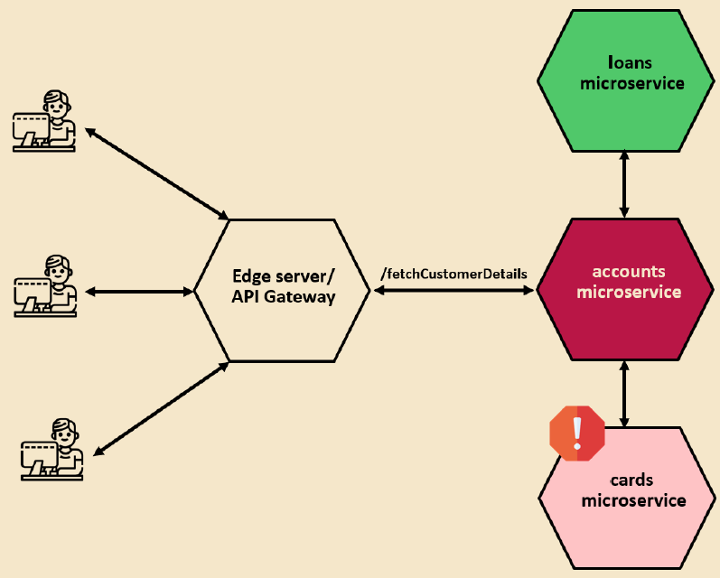
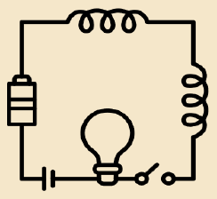
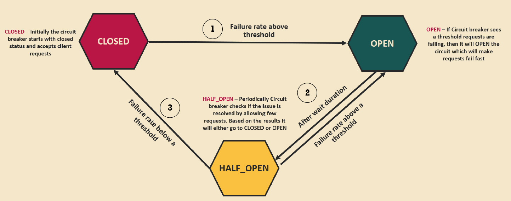

# Making Microservice Resilient

## 1. Embracing the Challenge: Building Resilient Microservices

In this section, we’re diving into one of the most crucial aspects of building robust, production-ready microservices: **resiliency**.

### What Does “Resilient” Mean?

Resiliency is the ability to withstand difficulties and bounce back stronger—just like humanity did after facing a global challenge like COVID-19. Similarly, in the world of software, especially in microservices architecture, our services should be capable of surviving tough times—like slow responses, network glitches, or partial failures—without crashing the entire system.

Microservices work together as a distributed system. When one of them slows down or fails, it shouldn’t bring down the whole application with it. That’s the essence of building **resilient microservices**.

### Key Challenges in Microservice Resiliency

Let’s explore some important questions we need to ask ourselves when designing resilient systems:

#### 1. **How Do We Prevent Cascading Failures?**

Imagine your client application sends a request that hits multiple services—say, `accounts`, `loans`, and `cards`. If one of them (e.g., `cards`) is down or responding slowly, it can cause the `accounts` service to wait indefinitely. This waiting consumes system resources like threads and memory, which eventually causes other dependent services and even your gateway to get overloaded. This ripple effect is called a **cascading failure**, and it can take down your entire system.



#### 2. **How Do We Handle Failures Gracefully?**

Instead of returning an error when one service fails, why not return **partial data**?

For example, if the `cards` service is unavailable, we should still return account and loan details to the client. This approach is called a **fallback mechanism**. It could mean returning cached data, default values, or even trying an alternative source. The goal? Never fail the entire request if you can still provide some useful data.

#### 3. **Can We Make Our Services Self-Healing?**

Temporary network hiccups or service slowdowns are common. In such cases, rather than waiting forever or giving up immediately, we can implement **timeouts** and **retries**.

For example:

- Retry a request 2–3 times before failing.
- Set a timeout so we don't keep waiting forever.
- Allow services a chance to recover from momentary issues without flooding the system with repeated requests.

By configuring these mechanisms properly, your services can recover on their own without human intervention—hence, **self-healing**.

### The Solution: Resilience Patterns with Resilience4j

To overcome these challenges, the Java ecosystem offers a solution: **Resilience4j**.

This lightweight fault-tolerance library was designed as a modern alternative to Netflix’s now-deprecated **Hystrix** library. Built with functional programming in mind (but still usable in traditional setups), Resilience4j provides a wide range of **resiliency patterns**, including:

- **Circuit Breaker**:- Used to stop making requests when a service invoked is failing.
- **Retry**:- Alternative paths to failing requests.
- **Fallback**:- Used to make retries when a service has temporarily failed.
- **Rate Limiter**:- Used to limit the number of calls that a service receives in a time.
- **Bulkhead**:- Used to limit the number of concurrent requests to a service to avoid overloading.
- **Time Limiter**
- **Cache**

These patterns help microservices handle failures gracefully and recover efficiently, without overwhelming your system.

Resilience4j also integrates seamlessly with popular frameworks like **Spring Boot** (2.x and 3.x), **Spring Cloud**, and **Micronaut**.

You can explore more about Resilience4j on its [official documentation site](https://resilience4j.readme.io/).

---

## 2. Circuit Breaker Pattern in Microservices

**Circuit Breaker Pattern** is a powerful tool in our resiliency toolkit that helps prevent cascading failures in a microservices architecture.

Before we jump into how this works in software, let’s start with something familiar: **the electrical circuit breaker** we all use at home or in the office.

### 🏠 What Does a Circuit Breaker Do?

In an electrical system, a **circuit breaker** is a safety device that protects the wiring and appliances from overload or short circuits. If it detects a fault—like excessive current—it **“trips”** or **opens the circuit** to stop the flow of electricity. This prevents potential damage or fire hazards.



Think about it: if a bulb is connected to a faulty circuit, and there’s no breaker in place, the surge could destroy it. But with a breaker, the faulty circuit is immediately disconnected, keeping the bulb safe.

### ⚙️ How Does This Relate to Microservices?

Now, bring this same idea into the world of software.

In a microservices ecosystem, services often rely on each other via remote calls. But what happens when one of those services becomes slow or unresponsive? Maybe due to:

- A spike in traffic
- Network latency
- Temporary downtime
- Resource exhaustion

These issues are usually **transient**—they recover after a short time. But during that period, if all requests keep flowing toward the unhealthy service, it creates a ripple effect, dragging down the entire system.

That’s where the **Circuit Breaker Pattern** comes in.

### 🛑 What Does a Circuit Breaker Do in Software?

Just like in electrical systems, a **software circuit breaker** monitors traffic—in this case, **remote calls to a service** (like our Cards microservice).

If it detects a high failure rate or slow responses over a configured threshold, it **“trips”**—blocking further calls to the faulty service temporarily.

Instead of letting other microservices (like Accounts or the API Gateway) wait unnecessarily for a slow response, the circuit breaker **fails fast**. This means the failure is returned immediately, preventing resources like threads, memory, and CPU from being consumed unnecessarily.

This approach ensures the failure in one service doesn’t cascade and take down others—**a classic ripple effect is avoided**.

### 🔄 How Does Recovery Work?

A circuit breaker doesn’t stay open forever.

After a cooling-off period (say 30 or 90 seconds), it allows **some trial requests** to pass through to see if the service has recovered. If those calls succeed, the breaker **closes** again, allowing traffic to resume normally.

If the service is still unhealthy, the breaker stays open a little longer, checking again periodically.

### ✅ Key Benefits of the Circuit Breaker Pattern

1. **Fail Fast:** No more waiting 10+ seconds for a response that may never come. Fail the call instantly and move on.
2. **Graceful Degradation:** Combine the breaker with a **fallback** strategy—like cached data or default values—to still serve partial responses.
3. **Self-Healing Architecture:** Give your service time to recover by reducing pressure. Once it’s healthy, traffic resumes automatically.

### How Circuit Breaker Pattern Controls Traffic to a Microservice

By default, the circuit breaker doesn’t monitor all your microservices — you need to **explicitly configure** it for each one where you want fault tolerance. Once configured, it manages traffic using **three key states**: **Closed**, **Open**, and **Half-Open**.



#### 1. Closed State

When the application starts, the circuit breaker is initially in the **closed** state. This means it allows **all requests** to flow through to the microservice.

Just like a closed electrical circuit lets current pass through, the closed state here allows full traffic. During this phase, the circuit breaker **monitors the success and failure rate** of the requests. If it notices a significant number of failures—say, more than a configured threshold like **50%**—it transitions to the **open** state.

#### 2. Open State

Once the circuit breaker is **open**, it **blocks all incoming traffic** to the microservice. Any request is immediately failed, and a fallback or error response is returned to the caller.

This prevents cascading failures and ripple effects across other services that depend on the failing one. The open state acts as a **cooling period**, giving the troubled microservice time to recover.

But the open state isn’t permanent. After a configured delay (e.g., **90 seconds**), the circuit breaker transitions to a **half-open** state to test if recovery is possible.

#### 3. Half-Open State

In the **half-open** state, the circuit breaker allows only a **small number of requests** (e.g., 10 or 20) to pass through as a test.

- If **more than 50%** of those requests still fail, the circuit breaker reverts back to the open state and waits another 90 seconds.
- If the **majority succeed**, it assumes the microservice is healthy again and transitions back to the **closed** state, fully restoring traffic flow.

This cycle repeats until the service is stable.

#### Easy to Implement with Resilience4j and Spring Boot

Although it might sound complex, implementing this pattern is surprisingly easy using libraries like **Resilience4j** along with **Spring Boot**. These tools make it simple to configure thresholds, timeouts, and fallback behaviors for your microservices.

---

## 3. Implementing the Circuit Breaker Pattern in Microservices

### Step 1: Add Resilience4j to the Gateway Server

We’ll begin implementing the circuit breaker pattern in the **Gateway Server**, which acts as the edge server for our microservices. This is a common practice in real-world applications, as it provides a single point to manage service reliability.

Open the `pom.xml` of the Gateway Server and add the following dependency:

```xml
<dependency>
  <groupId>org.springframework.cloud</groupId>
  <artifactId>spring-cloud-starter-circuitbreaker-reactor-resilience4j</artifactId>
</dependency>
```

This dependency allows us to use circuit breaker filters with the Spring Cloud Gateway, which follows the reactive model. Reload Maven to sync the changes.

### Step 2: Configure Circuit Breaker in Gateway Routes

Open the Gateway Server’s main Spring Boot class where routing is configured. We'll add a new circuit breaker filter for the `/accounts` path:

```java
.route("account-service", r -> r.path("/peoplebank/accounts/**")
  .filters(f -> f
    .rewritePath("/peoplebank/accounts/(?<segment>.*)", "/${segment}")
    .circuitBreaker(config -> config
      .setName("accountCircuitBreaker")
    )
  )
  .uri("lb://ACCOUNTS"))
```

Here, `"accountCircuitBreaker"` is the name we assign to this circuit breaker instance.

### Step 3: Add Circuit Breaker Configuration to `application.yml`

Now, we’ll configure circuit breaker properties inside `application.yml`:

```yaml
resilience4j.circuitbreaker:
  configs:
    default:
      slidingWindowSize: 10
      permittedNumberOfCallsInHalfOpenState: 2
      failureRateThreshold: 50
      waitDurationInOpenState: 10000
```

These properties control the behavior of the circuit breaker:

- **`slidingWindowSize: 10`**: Monitors the last 10 calls before deciding on state change.
- **`permittedNumberOfCallsInHalfOpenState: 2`**: Allows 2 test calls during half-open state.
- **`failureRateThreshold: 50`**: Circuit will open if 50% of calls fail.
- **`waitDurationInOpenState: 10000`**: Stays in open state for 10 seconds before trying half-open.

You can customize these settings per circuit breaker by replacing `default` with the name, e.g., `accountCircuitBreaker`.

### Step 4: Start the Microservices

Start the microservices in this order:

1. **Config Server**
2. **Eureka Server**
3. **Accounts Microservice**
4. **Gateway Server**

(We’ll keep `cards` and `loans` services off for now, focusing only on `accounts`.)

Once the services are running, validate them:

- Check **Eureka Dashboard** to confirm registration.
- Open `http://localhost:8072/actuator/circuitbreakers` to view circuit breaker statuses.

At this point, the status for `accountCircuitBreaker` should be `CLOSED`.

```json
{
  "circuitBreakers": {}
}
```

### Step 5: Trigger the Circuit Breaker

In Postman, call:

```
GET http://localhost:8072/easybank/accounts/api/contact-info
```

This returns the contact information successfully. Now, if we try to access the `http://localhost:8072/actuator/circuitbreakers` endpoint again, we’ll see the following response:

```json
{
  "circuitBreakers": {
    "accountCircuitBreaker": {
      "failureRate": "-1.0%",
      "slowCallRate": "-1.0%",
      "failureRateThreshold": "50.0%",
      "slowCallRateThreshold": "100.0%",
      "bufferedCalls": 1,
      "failedCalls": 0,
      "slowCalls": 0,
      "slowFailedCalls": 0,
      "notPermittedCalls": 0,
      "state": "CLOSED"
    }
  }
}
```

To simulate failure, set a breakpoint inside the `contactInfo()` method of the `AccountsController` and don’t release it. This creates a delayed response, leading to timeouts (504 Gateway Timeout).

After several failed attempts, the circuit breaker will transition:

- From `CLOSED` → `OPEN` once the failure threshold is breached.
- From `OPEN` → `HALF_OPEN` after `waitDurationInOpenState`.
- Based on test calls during half-open, it will either go back to `OPEN` or reset to `CLOSED`.

You can monitor this behavior using:

- `http://localhost:8072/actuator/circuitbreakers`
- `http://localhost:8072/actuator/circuitbreakerevents?name=accountCircuitBreaker`

In closed state, the `GET http://localhost:8072/easybank/accounts/api/contact-info` returns 503 (Service Unavailable).

### Step 6: Reset the Circuit Breaker

Remove the breakpoint and start sending successful requests again. Eventually, the circuit breaker will transition:

- From `HALF_OPEN` → `CLOSED`, once the calls succeed.

This confirms that the circuit breaker is now healthy and allows traffic again.

With this setup, you’ve successfully implemented a circuit breaker at the Gateway Server. It helps protect your system by failing fast and conserving resources when a downstream service is struggling or unresponsive.

In the next section, we’ll explore how to apply the circuit breaker pattern **within individual microservices** like the `accounts` service itself. Stay tuned!

---

## 4. Implementing a Fallback Mechanism for the Circuit Breaker in the Gateway Server

Up to this point, we have successfully implemented a **Circuit Breaker pattern** within our Gateway server. However, it currently lacks a **fallback mechanism**.

Without a fallback, whenever a service is down or unresponsive, the client receives low-level runtime exception details such as `Service Unavailable` or `Gateway Timeout`. In real-world applications, this is not a user-friendly or acceptable approach. Clients, especially UI applications, should not be exposed to such technical exceptions. Instead, they should receive a meaningful, business-level response that makes sense in the context of your application.

### Why We Need a Fallback

A **fallback mechanism** allows us to handle failures gracefully. When a dependent service fails, we can return a predefined response, log the error, notify support teams, or even provide cached/default data. This enhances user experience and system resilience.

### Creating a Fallback Controller

To implement a fallback in our **Gateway server** (built using **Spring Cloud Gateway** and **Spring WebFlux**), we start by creating a new controller class. Inside the `gateway` module:

1. **Create a new package** named `controller`.
2. Inside this package, create a class named `FallbackController`.
3. Annotate the class with `@RestController` to expose REST APIs.

Here’s a simple fallback endpoint:

```java
@RestController
@RequestMapping("/fallback")
public class FallbackController {
    @GetMapping("/contactSupport")
    public Mono<String> contactSupport() {
        return Mono.just("An error occurred. Please try again later or contact the support team.");
    }
}
```

This endpoint returns a business-friendly message wrapped in a `Mono<String>` (as required by Spring WebFlux).

### Integrating the Fallback with the Circuit Breaker

Now that we have a fallback API, the next step is to **wire it into the circuit breaker configuration** in our Gateway server.

In the route configuration (likely inside `application.yml` or Java config), you’ll find the circuit breaker setup. Add the fallback URI using the `setFallbackUri()` method:

```java
.route("accounts_route", r -> r
	.path("/peoplebank/accounts/**")
	.filters(f -> f
		.rewritePath("/peoplebank/accounts/(?<segment>.*)", "/${segment}")
	    .addResponseHeader("X-Response-Time", LocalDateTime.now().toString())
		.circuitBreaker(config -> config
			.setName("accountCircuitBreaker")
		    .setFallbackUri("forward:/contactSupport")
		)
	)
	.uri("lb://ACCOUNTS")
)
```

This tells the Gateway: _if the downstream service call fails, forward the request to the fallback controller’s `/contactSupport` endpoint_.

### Testing the Fallback

To test the fallback:

1. Restart the Gateway server and ensure all services are running.
2. Use Postman or curl to send a request to a valid route. You should receive a normal, happy response.
3. Simulate a failure by stopping the downstream service or introducing a delay.
4. Send the request again. This time, you should see the fallback message:
   > _"An error occurred. Please try again later or contact the support team."_

This confirms the fallback is working as expected. When the downstream service is available again, the fallback will not be triggered.

---

## 5. Implementing Circuit Breaker Pattern in the Accounts Microservice

In this section, we’ll implement the **Circuit Breaker** pattern within the **Accounts microservice** to enhance its resilience and fault tolerance.

As you may recall, the `fetchCustomerDetails` REST API in the Accounts microservice internally calls the **Cards** and **Loans** microservices using **Feign clients**. However, if any of these dependent services become unresponsive—either due to latency, downtime, or network issues—it can have a **ripple effect**, eventually impacting the Accounts microservice and the Gateway server as well.

To address this, we’ll introduce the Circuit Breaker pattern using **Spring Cloud Circuit Breaker with Resilience4j**. This will ensure that service failures don't cascade and degrade the entire system.

### Enabling Circuit Breaker Support for Feign Clients

Feign clients can be easily integrated with Circuit Breaker when using Spring Cloud. Here’s how you can do it:

1. **Add the dependency**  
   In your `accounts` microservice’s `pom.xml`, add the following dependency:-
   ```xml
   <dependency>
     <groupId>org.springframework.cloud</groupId>
     <artifactId>spring-cloud-starter-circuitbreaker-resilience4j</artifactId>
   </dependency>
   ```

2. **Enable Circuit Breaker in application.yml**  
   In your `application.yml`, enable circuit breaker for Feign by adding:
   ```yaml
   spring:
     cloud:
       openfeign:
         circuitbreaker:
           enabled: true
   ```

3. **Reload Maven** to apply the changes and perform a fresh build.

### Implementing Fallbacks for Feign Clients

To handle failures gracefully, we’ll define fallback logic for both the **LoansFeignClient** and **CardsFeignClient**.

#### Step 1: Create Fallback Classes

Inside the same package where your Feign clients reside (e.g., `com.yourapp.accounts.client`), create two classes:

- `LoansFallback.java`
- `CardsFallback.java`

Each class should implement its respective Feign client interface and override the methods to return safe fallback responses. For example:

```java
@Component
public class LoansFallback implements LoansFeignClient {
    @Override
    public List<LoansDto> getLoanDetails(String correlationId, CustomerDto customerDto) {
        return null; // Or return a cached/default response
    }
}
```

Do the same for `CardsFallback`, implementing `CardsFeignClient`.

#### Step 2: Configure Feign Clients to Use Fallbacks

Update each Feign client interface to register the fallback class:

```java
@FeignClient(name = "loans", fallback = LoansFallback.class)
public interface LoansFeignClient {
    ...
}
```

```java
@FeignClient(name = "cards", fallback = CardsFallback.class)
public interface CardsFeignClient {
    ...
}
```

### Adding Null Checks in Service Layer

Since fallback responses might be `null`, add null checks in your service layer (`CustomerServiceImpl`) before accessing any nested properties:

```java
ResponseEntity<LoansDto> loansDtoResponseEntity = loansFeignClient.fetchLoanDetails(correlationId, mobileNumber);
if (loansDtoResponseEntity != null && loansDtoResponseEntity.getBody() != null) {
  customerAllDetailsDto.setLoansDto(loansDtoResponseEntity.getBody());
}

ResponseEntity<CardsDto> cardsDtoResponseEntity = cardsFeignClient.fetchCardDetails(correlationId, mobileNumber);
if (cardsDtoResponseEntity != null && cardsDtoResponseEntity.getBody() != null) {
  customerAllDetailsDto.setCardsDto(cardsDtoResponseEntity.getBody());
}
```

This ensures that partial data can still be returned if only some of the dependent services are available, improving the robustness of your application.

With these changes, your Accounts microservice is now resilient to failures in the Loans and Cards services. 

### Run the Microservices

Start microservices in the following order: `configserver`, `eurekaserver`, `accounts`, `cards`, `loans`, and then `gatewayserver`.

Create records through `accounts`, `cards`, and `loans` microservices. Then fetch the customer details using:- `fetchCustomerDetails`. 

Now if you go to `http://localhost:8080/actuator/circuitbreakers` (or `http://localhost:8072/peoplebank/accounts/actuator/circuitbreakers`), you can see the 2 circuit breakers:-

```json
{
    "circuitBreakers": {
        "CardsFeignClientfetchCardDetailsStringString": {
            "failureRate": "-1.0%",
            "slowCallRate": "-1.0%",
            "failureRateThreshold": "50.0%",
            "slowCallRateThreshold": "100.0%",
            "bufferedCalls": 1,
            "failedCalls": 0,
            "slowCalls": 0,
            "slowFailedCalls": 0,
            "notPermittedCalls": 0,
            "state": "CLOSED"
        },
        "LoansFeignClientfetchLoanDetailsStringString": {
            "failureRate": "-1.0%",
            "slowCallRate": "-1.0%",
            "failureRateThreshold": "50.0%",
            "slowCallRateThreshold": "100.0%",
            "bufferedCalls": 1,
            "failedCalls": 0,
            "slowCalls": 0,
            "slowFailedCalls": 0,
            "notPermittedCalls": 0,
            "state": "CLOSED"
        }
    }
}
```

Similarly, we can see the events at:- `{{peoplebank-accounts}}/actuator/circuitbreakerevents`.

To demonstrate the negative scenario, stop the loans microservices. Call the `fetchCustomerDetails`, and look at the circuit breaker events. 

Later also stop the cards microservice and call the `fetchCustomerDetails` multiple times, and look at the circuit breaker events.

---

## 6. Handling Slow Microservice Responses with Timeout Configuration in Spring Cloud Gateway

Let’s explore a **real-world scenario** that many developers face—**slow responses from microservices**—and how to tackle it using **timeout configurations in Spring Cloud Gateway**.

To demonstrate the issue, let’s consider a simple REST API in the `LoansController` called `/contact-info`. When we invoke this endpoint via Postman, everything works fine—the service responds promptly. However, in production environments, services might occasionally respond **very slowly** due to high load, downstream dependencies, or network issues. These delays can **severely impact system performance** if not handled properly.

To simulate this, we intentionally introduce a **breakpoint** in the API method (run the loans microservice in debug mode) and observe how the client (Postman) keeps **waiting indefinitely** for a response. During this time:

- A thread on the **Gateway Server** waits for a response from the Loans microservice.
- A thread on the **Loans microservice** is held up as well.

This leads to **resource blocking**, which can degrade the performance of the entire application. In real-world systems, **waiting indefinitely is not acceptable**. To handle this, we need to introduce **timeout configurations**.

### Understanding Gateway Timeouts

Now, let’s contrast this with the `AccountsController`. When we apply a similar breakpoint and trigger the request via Postman, we immediately receive a friendly error message like:

> *"An error occurred. Please try again later or contact support."*

Why does this happen? It's because we have a **Circuit Breaker filter configured in the Gateway** for the accounts route. 

```java
.circuitBreaker(config -> config
	.setName("accountCircuitBreaker")
	.setFallbackUri("forward:/contactSupport")
)
```

By default, the Circuit Breaker in Spring Cloud Gateway comes with a **timeout of 1 second**. If the downstream service doesn’t respond within this time, the gateway falls back immediately—saving precious resources.

However, not every microservice may be using a Circuit Breaker. For those services, we need to define **global timeout configurations** in the Gateway itself.

### Configuring Global Timeouts in Spring Cloud Gateway

Spring Cloud Gateway allows us to configure **connection** and **response** timeouts globally. You can find these settings in the [official documentation](https://docs.spring.io/spring-cloud-gateway/docs/current/reference/html/#http-timeouts-configuration). Here’s a quick overview:

```yaml
spring:
  cloud:
    gateway:
      httpclient:
        connect-timeout: 1000        # Mac time to establish connection (in ms)
        response-timeout: 2s         # Max time to wait for a response
```

- **connect-timeout**: Max time to get a connection from the target microservice.
- **response-timeout**: Max time to wait for a full response after the connection is made.

By adding this configuration to `application.yml` of the Gateway server, these settings will apply to **all microservices** behind the gateway.

### Testing the Timeout

Restart the gateway server after modifying the configuration. Once this configuration is in place, trigger the same `contact-info` API again (`http://localhost:8072/peoplebank/cards/api/contact-info`). With the breakpoint still active, you'll notice that this time Postman receives a **Gateway Timeout (504)** response **within 2 seconds**. This confirms that our configuration is working perfectly.

```json
{
    "timestamp": "2025-04-08T01:57:49.179+00:00",
    "path": "/peoplebank/loans/api/contact-info",
    "status": 504,
    "error": "Gateway Timeout",
    "requestId": "90e74688-1",
    "message": "Response took longer than timeout: PT2S",
    "trace": "org.springframework.cloud.gateway.support.TimeoutException: Response took longer than timeout: PT2S\r\n"
}
```

> 🔥 Pro Tip: These timeout settings are global, but they can be **overridden per route** using either application.yml or Java DSL route definitions. You can even **disable timeouts for specific routes** by setting `response-timeout: -1`.

### Summary

By configuring timeouts properly:

- You prevent threads from being blocked unnecessarily.
- You improve the resilience and responsiveness of your system.
- You can handle slow services gracefully—either by retrying or using fallback mechanisms.

Spring Cloud Gateway offers a robust set of features to **control, route, and protect your microservices**. As a developer, understanding and configuring these options correctly will help you build **scalable and fault-tolerant** applications.

---

## 7. Introducing the Retry Pattern: A Key Resiliency Strategy for Microservices

Let’s explore a powerful resiliency pattern known as the **Retry Pattern** - a technique that can significantly improve the reliability of your microservices, especially in the face of temporary failures.

### What Is the Retry Pattern?

The Retry Pattern allows a service to **automatically reattempt a failed operation** a predefined number of times. This is especially useful in scenarios like **intermittent network failures**, where a subsequent attempt might succeed even if the initial request fails.

### When and How to Use It

To effectively implement the Retry Pattern, you should carefully decide:
- **How many retry attempts** should be made (e.g., 3, 5, or 10 times).
- **Which conditions** should trigger a retry—such as specific exceptions, HTTP status codes, or error messages.

The number of retries and the triggering criteria should align with your **business logic** and system behavior.

### Incorporating Backoff Strategies

Retrying too aggressively can overwhelm the system. That’s where **backoff strategies** come in.

A common approach is **exponential backoff**, where the delay between retries gradually increases. For example:
- Retry 1: Wait 2 seconds
- Retry 2: Wait 4 seconds
- Retry 3: Wait 8 seconds

This increasing delay gives the system or network enough time to recover and reduces the chance of cascading failures.

### Combining Retry with Other Patterns

The Retry Pattern is often used in conjunction with the **Circuit Breaker Pattern**. This combination ensures that:
- A service retries a few times.
- If all retries fail, the circuit breaker opens to prevent further strain on the failing service.

This layered defense strategy helps improve overall system resilience.

### Use Retry Only for Idempotent Operations

It’s crucial to apply the Retry Pattern **only to idempotent operations**—those that produce the same result no matter how many times they're executed.

For example:
- Safe: `GET /accounts` (retrieving data)
- Risky: `POST /accounts` or `PUT /accounts/123` (creating or updating data)

Applying retry logic to non-idempotent operations (like Create, Update) can lead to **unintended side effects** like duplicate records or inconsistent data.

---

## 8. Implementing the Retry Pattern in Spring Cloud Gateway

Let’s walk through how to implement the **Retry Pattern** using **Spring Cloud Gateway**, enabling resiliency at the gateway level for downstream services—specifically the **loans microservice** in our case.

### Step 1: Add Retry Filter to the Gateway Configuration

We’ve previously enabled the **Circuit Breaker Pattern** for the `accounts` microservice. This time, we'll apply the Retry Pattern to the `loans` microservice.

To begin, modify the route configuration in your gateway application. Right after the `addResponseHeader()` filter, add a new filter for retry using a lambda expression that gives you access to fine-grained configurations:

```java
.retry(config -> config
    .setRetries(3)
    .setMethods(HttpMethod.GET)
    .setBackoff(Duration.ofMillis(100), Duration.ofMillis(1000), 2, true)
)
```

Here’s a quick breakdown of the configurations:

- **`setRetries(3)`**: Retries the request up to 3 times.
- **`setMethods(HttpMethod.GET)`**: Applies retry logic only to `GET` requests to avoid unintended side effects.
- **`setBackoff(...)`**:
  - **Initial backoff**: 100ms
  - **Max backoff**: 1000ms. The maximum delay between retries is 1 second (1000 milliseconds). Even if exponential backoff exceeds this, it’ll be capped at 1000 ms.
  - **Factor**: 2 (each retry waits twice as long as the previous). Each retry delay is multiplied by this factor (exponential growth). So retry delay becomes: 1st retry: 100ms * 1 = 100ms, 2nd retry: 100ms * 2 = 200ms, 3rd retry: 200ms * 2 = 400ms, and so on.
  - **Based on previous delay**: `true`. This tells the system to apply the factor to the previous delay, not the initial one.

This setup ensures a retry with **exponential backoff**, helping avoid overwhelming the downstream service during transient failures.

### Step 2: Add Logging for Retry Verification

To verify the retry behavior, we’ll add a simple log statement inside the `LoansController`:

```java
@GetMapping("/contact-info")
public ResponseEntity<String> getContactInfo() {
    logger.debug("Invoked loans contact-info API");
    return ResponseEntity.ok("Contact info");
}
```

This log helps us track how many times the endpoint is hit—useful for confirming that retries are occurring.

### Step 3: Simulate Failures for Testing

To observe retries in action:

- **Option 1**: Introduce a **manual breakpoint** inside the `contact-info` method and hit the endpoint via Postman. This will simulate a timeout scenario and you’ll see multiple log entries as the Gateway retries.
- **Option 2**: Throw a `RuntimeException` inside the method to simulate a failure:

```java
throw new RuntimeException("Simulated failure");
```

When triggered, this causes the gateway to retry the request (up to 3 times). You'll see the log message "Invoked loans contact-info API" printed multiple times—once for each retry attempt.

### Step 4: Observe the Results

With retries configured and a failure simulated:

- The **total response time** increases due to retries.
- **Log statements** confirm the number of times the service was called.
- The system gracefully handles temporary failures without immediate user impact.

```log
c.k.loans.controller.LoansController     : Invoked loans contact-info API
.m.m.a.ExceptionHandlerExceptionResolver : Resolved [java.lang.RuntimeException: Exception in contact-info API]
c.k.loans.controller.LoansController     : Invoked loans contact-info API
.m.m.a.ExceptionHandlerExceptionResolver : Resolved [java.lang.RuntimeException: Exception in contact-info API]
c.k.loans.controller.LoansController     : Invoked loans contact-info API
.m.m.a.ExceptionHandlerExceptionResolver : Resolved [java.lang.RuntimeException: Exception in contact-info API]
c.k.loans.controller.LoansController     : Invoked loans contact-info API
.m.m.a.ExceptionHandlerExceptionResolver : Resolved [java.lang.RuntimeException: Exception in contact-info API]
```

### Step 5: Clean Up (Optional)

Once you've verified the behavior:

- Remove any intentional exceptions or breakpoints.
- Roll back test code that’s not meant for production (e.g., `throw new RuntimeException`).

---

## 9. 🛠 Implementing Retry Pattern Inside a Microservice Using Resilience4j

So far, we’ve implemented the retry pattern at the **API Gateway** level. While this works well for many use cases, there are scenarios where you might want to handle retries **within the microservice itself** — for example, if you want more granular control or need a **fallback mechanism**, which Gateway-based retries don't support out-of-the-box.

In this example, we’ll implement the **retry pattern** directly inside the `AccountsController` of our `accounts` microservice. To demonstrate this, we'll use the `getBuildInfo()` endpoint, which returns the current build version of the environment.

### Disable the gatewayserver Fallback

In the gateway server, for accounts microservice we have added the circuit breaker configuration, in that disable the fallback url:-

```java
.circuitBreaker(config -> config
	.setName("accountCircuitBreaker")
  // Comment the below line
	// .setFallbackUri("forward:/contactSupport")
)
```
Restart the gatewayserver.

### 🔁 Adding the `@Retry` Annotation

To implement the retry pattern, we'll annotate the `getBuildInfo()` method with Resilience4j’s `@Retry`. Here’s what we need to specify:

- `name`: A unique identifier for the retry configuration. We’ll use the method name: `getBuildInfo`.
- `fallbackMethod`: The method to invoke if all retry attempts fail. We'll name it `getBuildInfoFallback`.

```java
@Retry(name = "getBuildInfo", fallbackMethod = "getBuildInfoFallback")
public ResponseEntity<String> getBuildVersion() {
    logger.debug("getBuildInfo method invoked");
    throw new NullPointerException(); // Simulate failure
}
```

Next, we define the fallback method with the **exact same signature** as the original method, **plus** an additional `Throwable` parameter:

```java
public ResponseEntity<String> getBuildInfoFallback(Throwable t) {
    logger.debug("getBuildInfoFallback method invoked");
    return ResponseEntity.ok().body("1.0.9"); // Fallback Version
}
```

> ✅ **Important:** If your original method takes two parameters, your fallback method must take three: the original two plus the `Throwable`.

### ⚙ Configuring Retry in `application.yml`

Now that the annotations are in place, let’s configure the retry logic in `application.yml`:

```yaml
resilience4j.retry:
  instances:
    getBuildInfo:
      maxAttempts: 3
      waitDuration: 100
      enableExponentialBackoff: true
      exponentialBackoffMultiplier: 2
```

This configuration means:
- Retry **3 times** after the initial failure (total 4 attempts).
- Start with a **100ms delay**, doubling each time (100ms → 200ms → 400ms).
- If all retries fail, the fallback method is triggered.

### 🧪 Testing the Retry Logic

To see this in action: restart the accounts microservice. 

Open Postman, and make a GET request to the `/accounts/buildinfo` endpoint. You'll see the log message "getBuildInfoFallback method invoked" printed after 3 retries.

```
Invoked accounts build-info API
Invoked accounts build-info API
Invoked accounts build-info API
Invoked fallback accounts build-info API
```

### 🧠 Gateway vs Microservice Retry

Here’s a key difference to note:
- **Gateway Retry:** Counts the original request + 3 retries = 4 total.
- **Service-level Retry (Resilience4j):** Only 3 attempts total (including the original). 

This means **Resilience4j's `max-attempts` includes the initial request**, which often trips up developers.

### 📚 Reference: Where Do These Configs Come From?

All these properties are defined in the [official Resilience4j documentation](https://resilience4j.readme.io/). You can configure multiple retry instances (e.g., `backendA`, `backendB`) with unique properties per use case.

### Overriding Gateway Default Values

The gateway server has default timeout duration of 1 second. For accounts Microservice, in `application.yml` if we increase the `waitDuration: 500` then the retry took longer than the circuit breaker's default time limit, so the circuit breaker fallback will be triggered instead.

To overcome this issue, add the following configuration in gateway server:-

```java
@Bean
public Customizer<ReactiveResilience4JCircuitBreakerFactory> defaultCustomizer() {
    return factory -> factory.configureDefault(id -> 
        new Resilience4JConfigBuilder(id)
            .circuitBreakerConfig(CircuitBreakerConfig.ofDefaults())
            .timeLimiterConfig(TimeLimiterConfig.custom()
                .timeoutDuration(Duration.ofSeconds(5))
                .build())
            .build()
    );
}
```

Note:- The import is `org.springframework.cloud.client.circuitbreaker.Customizer` (Not `java.beans.Customizer`).

This method **customizes the default configuration** of all circuit breakers created by the `ReactiveResilience4JCircuitBreakerFactory`, which is what Spring Cloud Gateway uses under the hood when you configure a circuit breaker in your `application.yml`.

🔍 Breakdown:
- **`factory.configureDefault(...)`**: This sets the default config for all circuit breakers.
- **`Resilience4JConfigBuilder(id)`**: Builds a config using the unique name (usually auto-generated or set in `application.yml`).
- **`CircuitBreakerConfig.ofDefaults()`**: Uses the default circuit breaker config (you could customize this).
- **`TimeLimiterConfig.custom().timeoutDuration(...)`**: Sets how long the circuit breaker will wait for a response before timing out. In this case, it's 5 seconds.

A couple of things to be aware of**:
1. **Global Scope**: This sets the default config for all circuit breakers unless you override it per instance (in `application.yml`).
2. **Timeout Duration Alignment**: Make sure your `timeoutDuration` is **longer than the total time your retry attempts may take**. For example:
   - If retries have `waitDuration: 100ms` and 3 attempts with exponential backoff, it might take up to `100 + 200 + 400 = 700ms` or more. So 5 seconds is safe here.

---

## 10. Handling Specific Exceptions in the Retry Pattern with Resilience4j

In this section, let’s explore how to fine-tune the **retry pattern** using **Resilience4j**, specifically by handling certain types of exceptions differently.

By default, if a retry mechanism is applied to a method (like `getBuildInfo()` in our example), it will attempt retries for *any* kind of exception. However, this might not always be desirable. Consider this scenario:

> **Business requirement:** If a `NullPointerException` occurs, do not attempt retries.

The reasoning is simple — if the input data always leads to a `NullPointerException`, retrying won’t help. Let’s see how to configure this.

### ✍️ Ignoring Specific Exceptions

To implement this, navigate to the `application.yml` file of the **Accounts microservice** where the retry pattern is applied. Under the retry configuration section, add the following:

```yaml
resilience4j.retry:
  instances:
    getBuildInfo:
      maxAttempts: 3
      waitDuration: 500
      enableExponentialBackoff: true
      exponentialBackoffMultiplier: 2
      # Add below config
      ignoreExceptions:
        - java.lang.NullPointerException
```

Make sure to provide the **fully qualified class name** of the exception. You can list multiple exceptions using the YAML list (`-`) syntax.

Once this is done:
- Rebuild the project.
- Restart the **AccountsApplication**. (not the **GatewayServer**).
- Test the endpoint via Postman.

You’ll notice that if a `NullPointerException` is thrown, **no retries will occur** — the fallback method will be invoked immediately. You can confirm this behavior by checking the application logs: there should be only one attempt, followed by the fallback log.

### 🎯 Retrying Only for Specific Exceptions

You can also configure the system to **retry only for certain exceptions**. Instead of `ignoreExceptions`, use `retryExceptions` like this:

```yaml
resilience4j.retry:
  instances:
    getBuildInfo:
      maxAttempts: 3
      waitDuration: 500
      enableExponentialBackoff: true
      exponentialBackoffMultiplier: 2
      # add below
      retryExceptions:
        - java.util.concurrent.TimeoutException
```

Here’s what to keep in mind:
- You don’t need to specify `ignoreExceptions` if you’re using `retry-exceptions`.
- Only the exceptions listed in `retryExceptions` will trigger retries; others will be ignored automatically.

Now, update your controller to throw `TimeoutException` instead of `NullPointerException` and ensure the method signature includes `throws TimeoutException` (because of checked exception).

Rebuild, rerun, and test again. In the logs, you should now see **multiple retry attempts** before the fallback kicks in — confirming that the retry was executed only for `TimeoutException`.

### 🧩 Retry Pattern in Gateway Server

A similar configuration can be done in the **Gateway Server**, although it doesn’t support `ignoreExceptions`. Instead, you can:

- Use methods like `setExceptions()` to specify which exceptions should trigger retries.
- Configure retries based on HTTP status codes, like `500` or `503`.

Example snippet:

```java
.retry(config -> config
	.setRetries(3)
	.setExceptions(NullPointerException.class, TimeoutException.class)
	.setMethods(HttpMethod.GET)
	.setBackoff(Duration.ofMillis(100), Duration.ofMillis(1000), 2, true)
)
```

This lets you control retry behavior at the API gateway level using HTTP semantics.

### 🐞 Fixing Header Duplication on Retry in Gateway Server

Note:- HAVE TO VERIFY THIS, BECAUSE I WAS NOT GETTING MULTIPLE ENTRY OF `peoplebank-correlation-id` in response.

While testing retries in the Gateway Server, you might notice that headers like `peoplebank-correlation-id` appear **multiple times** in the response. This happens because the **response filter** runs for each retry attempt, re-adding the same header.

Here’s a quick fix for your `ResponseTraceFilter`:

```java
if (!exchange.getResponse().getHeaders().containsKey(FilterUtility.CORRELATION_ID)) {
  logger.info("CorrelationId added in ResponseTraceFilter: {}", correlationId);
  exchange.getResponse().getHeaders().add(FilterUtility.CORRELATION_ID, correlationId);
}
```

This ensures the header is added **only once**, even during retries.

### Cleanup
Comment out all the exceptions thrown in the AccountController and LoansController.

---

## 11. Rate Limiter Pattern

Have you ever played one of those balloon shooting games at a local fair or exhibition? I have vivid childhood memories of visiting these fairs with my dad, where I’d eagerly line up to try my luck at popping balloons. It was simple but thrilling — aim, shoot, and hope you hit the mark.

But there was always one rule: **limited chances**. Whether you paid for three tries or five, once your shots were done, that was it — game over. Why did the game owner impose such a limit? Because unlimited shots would mean unlimited losses for him. The limitation wasn’t just a rule — it was a way to **protect resources and ensure fairness**.

This childhood memory is surprisingly relevant to a critical pattern we use in modern software systems, especially in microservices architecture: the **Rate Limiter Pattern**.

### What is the Rate Limiter Pattern?

In the world of microservices, APIs are often exposed to client applications or other services. If these APIs receive too many requests — whether due to a bug, misuse, or even a malicious attack — they can become overwhelmed, leading to degraded performance, service unavailability, or worse, a complete system crash.

This is where the **Rate Limiter Pattern** comes in. Just like the balloon game limits your number of shots, the rate limiter pattern restricts the number of requests a client can make to an API in a given time frame. This ensures that:

- System resources are protected.
- All users have **fair and consistent access**.
- The risk of abuse or **Denial of Service (DoS) attacks** is minimized.

For example, if your service can handle 10,000 requests per second, but it suddenly receives a million requests, there’s a good chance someone is trying to break your system. A rate limiter can detect and stop this behavior in its tracks.

### How It Works

When a request exceeds the configured limit, the service responds with a **429 HTTP status code – Too Many Requests**. This informs the client that they must wait before sending more requests.

You can apply rate limiting strategies in various ways, such as:

- Per IP address  
- Per user session  
- Per API key or tenant  
- Based on user subscription tier (e.g., basic vs. premium users)

This allows you to create **customized experiences** for different users while still protecting your backend systems.

### Why It Matters

Implementing the rate limiter pattern helps ensure:

- **System stability**  
- **Reliable performance**  
- **Protection against overload or abuse**  
- **Controlled access to services**

Ultimately, it creates a healthy environment where users can consume services responsibly, just like every player at the balloon booth gets a fair shot.

---

## 12. Implementing Rate Limiting in Spring Cloud Gateway

Spring Cloud Gateway provides a filter factory called `RequestRateLimiterGatewayFilterFactory`, which allows us to control the rate of incoming requests. This filter determines whether a request should be allowed or rejected based on a defined policy. If the rate limit is exceeded, the Gateway returns an HTTP **429 (Too Many Requests)** response.

### Key Concept: KeyResolver

To effectively apply rate limiting, Spring Cloud Gateway requires a **KeyResolver**—this determines how to uniquely identify the requester. Depending on your business needs, you can rate-limit based on:

- User identity
- Session
- IP address
- Hostname, etc.

A default implementation, `PrincipalNameKeyResolver`, uses the authenticated user’s name—ideal when Spring Security is in place. If no key is resolved, requests are denied by default (though this behavior is configurable).

### Redis-Based Rate Limiting

Spring Cloud Gateway’s rate limiter leverages **Redis**, a fast, in-memory key-value store. The rate limiting algorithm is based on the **token bucket** strategy and is inspired by the work done by the Stripe engineering team.

In Stripe's blog - [Scaling your API with rate limiters](https://stripe.com/blog/rate-limiters), they outline real-world use cases that rate limiting addresses, such as:

- Preventing one user from overwhelming the system
- Handling misbehaving scripts or malicious attacks
- Prioritizing high-value traffic over low-priority or analytic requests
- Gracefully degrading services during internal failures

If you're interested in these scenarios, the Stripe blog is a recommended read.

### Understanding the Token Bucket Algorithm

To configure rate limiting, three key properties are used:

1. **redis-rate-limiter.replenishRate** – How many tokens to add to the bucket per second. For example, `100` means 100 requests per second are allowed.
2. **redis-rate-limiter.burstCapacity** – The maximum number of tokens the bucket can hold. This prevents the bucket from endlessly accumulating tokens during idle periods.
3. **redis-rate-limiter.requestedTokens** – How many tokens each request consumes. Default is `1`, but you can increase it if certain requests are more resource-intensive.

### Example Use Cases

- **Steady Rate:**  
  Set `replenishRate: 100` and `burstCapacity: 100` to allow 100 consistent requests per second.

- **Allowing Bursts:**  
  Set `replenishRate: 100` and `burstCapacity: 200` to allow occasional bursts up to 200 requests.

- **One Request Per Minute:**  
  - `replenishRate: 1` (1 token/sec)
  - `burstCapacity: 60`
  - `requestedTokens: 60`  
  This allows one request every 60 seconds.

⚠️ **Caution:** Setting `burstCapacity` to `0` will block **all** requests.

Sample Configuration
```yaml
spring:
  cloud:
    gateway:
      routes:
        - id: requestratelimiter_route
          uri: https://api.example.com
          filters:
            - name: RequestRateLimiter
              args:
                redis-rate-limiter:
                  replenishRate: 10
                  burstCapacity: 20
                  requestedTokens: 1
```

### Configuration

The rate limiter can be configured in your `application.yml`, but you can also define it programmatically using Java-based configuration. Additionally, you can create custom `KeyResolver` beans to tailor the rate limiting logic to your needs (e.g., extracting a `user` query parameter from the request).

---

## 13. Implementing Rate Limiting in Spring Cloud Gateway with Redis

Now that we’ve explored the concept, it's time to implement the **RateLimiter pattern** in our **Gateway Server** using **Spring Cloud Gateway** and **Redis**.

### Step 1: Add Redis Dependency

Start by adding the Redis dependency to your `pom.xml`:

```xml
<dependency>
    <groupId>org.springframework.boot</groupId>
    <artifactId>spring-boot-starter-data-redis-reactive</artifactId>
</dependency>
```

After adding this, refresh your Maven project to load the new dependencies.

### Step 2: Configure the Gateway Server

In your `GatewayServerApplication`, define two essential beans:

```java
@Bean
KeyResolver userKeyResolver() {
    return exchange -> Mono.just(
        exchange.getRequest()
                .getHeaders()
                .getFirst("user") != null ?
                exchange.getRequest().getHeaders().getFirst("user") : "anonymous"
    );
}

@Bean
RedisRateLimiter redisRateLimiter() {
    return new RedisRateLimiter(1, 1, 1); // replenishRate, burstCapacity, requestedTokens
}
```

- **KeyResolver**: Extracts the user from the request header to uniquely identify the requestor. If the header is missing, it defaults to `"anonymous"`.
- **RedisRateLimiter**: Limits each user to one request per second.

### Step 3: Apply the RateLimiter to a Route

Now apply the rate limiter to one of your routes, for example, the **cards** microservice:

```java
.route("cards_route", r -> r.path("/peoplebank/cards/**")
    .filters(f -> f.requestRateLimiter(config -> config
                      .setRateLimiter(redisRateLimiter())
                      .setKeyResolver(userKeyResolver())
                  ))
    .uri("lb://CARDS"))
```

### Step 4: Start Redis with Docker

Make sure Redis is running. If not, you can start a Redis container using Docker:

```bash
docker run -d -p 6379:6379 --name rediscontainer redis
```

This launches a Redis server on the default port `6379`.

### Step 5: Configure Redis in `application.yml`

In `application.yml`, add Redis configuration under the `spring` section:

```yaml
spring:
  data:
    redis:
      connect-timeout: 2s
      host: localhost
      port: 6379
      timeout: 1s
```

### Step 6: Run and Test

Start your **Config Server**, **Eureka Server**, **CardsApplication**, and **GatewayServerApplication**. You can now test your RateLimiter setup.

To simulate multiple requests, use **Apache Benchmark (ab)**. For Windows, download [Apache Benchmark](https://www.apachelounge.com/download/) and extract the zip file. Update the httpd.conf file with installation directory. In CMD/terminal go inside the `\Apache24\bin` folder and to start Apache in the command prompt type:- 

```bash  
httpd.exe
```
Also see:- [Apache Benchmark Install Ubuntu](https://bobcares.com/blog/apache-benchmark-install-ubuntu/)

Now try to send 10 requests with a concurrency level of 2:
```bash
ab -n 10 -c 2 -v 3 -H "user: testuser" http://localhost:8072/peoplebank/cards/api/contact-info
```

This sends 10 requests with a concurrency level of 2. With the current configuration, only **1 request per second** per user is allowed. You'll see that the first request gets a `200 OK`, and the remaining are blocked with a `429 Too Many Requests`.

Sample Response:-

```log
This is ApacheBench, Version 2.3 <$Revision: 1923142 $>
Copyright 1996 Adam Twiss, Zeus Technology Ltd, http://www.zeustech.net/
Licensed to The Apache Software Foundation, http://www.apache.org/

Benchmarking localhost (be patient)...INFO: GET header ==
---
GET /peoplebank/cards/api/contact-info HTTP/1.0
user: testuser
Host: localhost:8072
User-Agent: ApacheBench/2.3
Accept: */*

---
LOG: header received:
HTTP/1.1 200 OK
transfer-encoding: chunked
X-RateLimit-Remaining: 0
X-RateLimit-Requested-Tokens: 1
X-RateLimit-Burst-Capacity: 1
X-RateLimit-Replenish-Rate: 1
Content-Type: application/json
Date: Wed, 09 Apr 2025 02:48:09 GMT
peoplebank-correlation-id: 6f379536-4d6f-4411-95f0-687dd99a7325
X-Response-Time: 2025-04-09T07:55:31.225967100
connection: close

LOG: Response code = 200
LOG: header received:
HTTP/1.0 429 Too Many Requests
X-RateLimit-Remaining: 0
X-RateLimit-Requested-Tokens: 1
X-RateLimit-Burst-Capacity: 1
X-RateLimit-Replenish-Rate: 1
content-length: 0

WARNING: Response code not 2xx (429)
LOG: header received:
HTTP/1.0 429 Too Many Requests
X-RateLimit-Remaining: 0
X-RateLimit-Requested-Tokens: 1
X-RateLimit-Burst-Capacity: 1
X-RateLimit-Replenish-Rate: 1
content-length: 0

........[REPEATED]

WARNING: Response code not 2xx (429)
..done


Server Software:
Server Hostname:        localhost
Server Port:            8072

Document Path:          /peoplebank/cards/api/contact-info
Document Length:        214 bytes

Concurrency Level:      2
Time taken for tests:   0.093 seconds
Complete requests:      10
Failed requests:        9
   (Connect: 0, Receive: 0, Length: 9, Exceptions: 0)
Non-2xx responses:      9
Total transferred:      2149 bytes
HTML transferred:       214 bytes
Requests per second:    107.36 [#/sec] (mean)
Time per request:       18.629 [ms] (mean)
Time per request:       9.315 [ms] (mean, across all concurrent requests)
Transfer rate:          22.53 [Kbytes/sec] received

Connection Times (ms)
              min  mean[+/-sd] median   max
Connect:        0    1   0.5      1       2
Processing:     9   14   5.9     12      28
Waiting:        9   14   5.5     12      26
Total:         10   15   5.9     13      29

Percentage of the requests served within a certain time (ms)
  50%     13
  66%     14
  75%     18
  80%     19
  90%     29
  95%     29
  98%     29
  99%     29
 100%     29 (longest request)
```

### Conclusion

With just a few configurations and the power of Redis, we’ve successfully implemented a **token bucket-based Rate Limiting** strategy in Spring Cloud Gateway. This helps prevent abuse and ensures fair usage of your APIs. You can further fine-tune this setup using custom logic in the `KeyResolver` or adjust thresholds depending on your use case.

---

## 14. Applying Rate Limiting in a Spring Boot Microservice Using Resilience4j

Previously, we implemented the **RateLimiter pattern** at the API Gateway level using Spring Cloud Gateway and Redis. In this section, we’ll explore how to apply the same pattern directly within a **Spring Boot microservice**, using **Resilience4j**—a lightweight fault tolerance library.

### Step 1: Annotate the Method with `@RateLimiter`

We want to restrict how often a specific API can be called. Let’s say we want to limit the execution of a method called `getJavaVersion()` in the `AccountsController` of accounts microservice.

Start by adding the `@RateLimiter` annotation to the method:

```java
@RateLimiter(name = "getJavaVersion")
@GetMapping("/java-version")
public ResponseEntity<String> getJavaVersion() {
  return ResponseEntity.ok().body(env.getProperty("JAVA_HOME"));
}
```

This annotation tells Resilience4j to apply rate limiting using a configuration named `getJavaVersion`.

### Step 2: Define RateLimiter Properties in `application.yml`

Now configure the rate limiting parameters in your `application.yml` file:

```yaml
resilience4j.ratelimiter:
  configs:
    default:
      timeoutDuration: 1000
      limitRefreshPeriod: 5000
      limitForPeriod: 1
```

#### Explanation:
- `limitRefreshPeriod`: Time interval for replenishing the request quota. (Every 5 seconds).
- `limitForPeriod`: Maximum number of permitted requests in the defined interval. (1 request every 5 seconds)
- `timeoutDuration`: Maximum time a request should wait to acquire permission before failing. (1 second)

This configuration is helpful when your system has a hard cap on the number of requests it can handle (e.g., 10,000 req/sec), or when you want to restrict certain low-priority endpoints.

### Step 3: Run the Application and Test

Once you've saved the changes, build and restart your **AccountsApplication**. There's no need to run Redis or any external service—Resilience4j handles everything internally.

You can now test the API using Postman or your browser:

- The first request will succeed.
- Repeated requests within the refresh period will eventually result in a `500 Internal Server Error` due to rate limiting.

```json
{
    "apiPath": "uri=/api/java-version",
    "errorCode": "INTERNAL_SERVER_ERROR",
    "errorMessage": "RateLimiter 'getJavaVersion' does not permit further calls",
    "errorTime": "2025-04-09T08:48:12.6794816"
}
```

Behind the scenes, this error is thrown by the Resilience4j RateLimiter, and it's being captured by your global exception handler.

### Step 4: Add a Fallback Method

To improve the user experience, define a fallback method that handles failed requests gracefully:

```java
@GetMapping("/java-version")
@RateLimiter(name = "getJavaVersion", fallbackMethod = "getJavaVersionFallback")
public ResponseEntity<String> getJavaVersion() {
  return ResponseEntity.ok().body(env.getProperty("JAVA_HOME"));
}

public ResponseEntity<String> getJavaVersionFallback(Throwable throwable) {
  return ResponseEntity.ok().body("Java 17");
}
```

- The fallback method must have the same signature as the original method, with an extra `Throwable` parameter.
- In this example, if the original method is rate-limited, the fallback returns a default value `"Java 17"`.

You can replace this with custom logic like cached responses or helpful error messages such as _"Please try again later"_ depending on your use case.

### Step 5: Restart and Verify

Once the fallback is implemented:
1. Rebuild the project.
2. Restart both `AccountsApplication` and `GatewayserverApplication` (to register services correctly with Eureka).
3. Call the API multiple times rapidly.

You’ll notice that the fallback response will kick in once the rate limit is exceeded.

### Conclusion

With this approach, we’ve implemented **method-level rate limiting** inside a Spring Boot microservice using **Resilience4j**, without needing a gateway or external Redis server. 

This technique is ideal when:
- You want fine-grained control over specific endpoints.
- You want to apply rate limiting independent of user identity or IP.
- You're not using an API Gateway or want redundancy in your resilience strategies.

Now you know **two powerful ways** to apply rate limiting:
- At the **gateway level** (Spring Cloud Gateway + Redis)
- Within the **microservice itself** (Resilience4j + annotations)

Choose the right approach based on your architecture and business requirements.

---

## 15. Understanding the Bulkhead Pattern in Microservices

In this section, let’s dive into a powerful resilience pattern used in distributed systems — **the Bulkhead Pattern**.

### What Is the Bulkhead Pattern?

The Bulkhead pattern is all about **improving system stability and resilience** by isolating different components or services from one another. The name and concept are inspired by **bulkheads in ships**—those sturdy, watertight walls that divide a ship into compartments.

If you've ever seen an image of a ship cutaway, you'll notice it’s sectioned into multiple compartments. The reason? If one compartment gets flooded, the bulkheads prevent the water from spreading throughout the entire vessel, keeping the ship afloat longer and protecting other sections.

Remember the movie *Titanic*? Even after the iceberg hit, the ship didn’t sink instantly. It took time. That delay was, in part, due to the ship's bulkhead structure, which initially held back the water from rushing into all compartments at once.

In software systems, the same principle applies. The Bulkhead pattern helps us **contain failures** or **limit the impact of high load** in one part of the system so it doesn't bring down everything else. For example, if a certain microservice or REST API is overloaded, the Bulkhead pattern ensures other services can continue functioning smoothly.

### Why Use the Bulkhead Pattern?

Let’s say you have a microservice called `accounts`, which exposes two REST APIs:

- `myAccount`: A simple endpoint that doesn’t depend on any other service.
- `myCustomerDetails`: A complex endpoint that pulls data from other services like `loans` and `cards`.

Without the Bulkhead pattern, if `myCustomerDetails` starts getting hammered with requests, it can hog all the threads or resources available in the container. That means `myAccount`, which might be critical, could also become unresponsive—simply because it couldn't get enough system resources.

Now enter the Bulkhead pattern.

By assigning **dedicated thread pools or resource limits** to each API, we ensure that `myCustomerDetails` can never consume everything. Even if it's under heavy load, `myAccount` continues to serve users because it has its own reserved share of resources. This kind of **resource isolation** is at the heart of the Bulkhead pattern.

### How Do You Implement It?

Unfortunately, **Spring Cloud Gateway** doesn’t support the Bulkhead pattern out of the box. However, you can implement it using the **Resilience4j** library, which offers fine-grained control.

Resilience4j provides a `@Bulkhead` annotation you can use at the method level. You can configure it with two types:

- **Semaphore-based Bulkheads**: Limit the number of concurrent calls.
- **Thread Pool-based Bulkheads**: Assign dedicated thread pools to isolate operations.

Here are a few key configuration properties you can define:

- `maxConcurrentCalls`: Maximum allowed concurrent executions.
- `maxWaitDuration`: Time to wait before rejecting a request when the bulkhead is full.
- `coreThreadPoolSize`, `maxThreadPoolSize`, and `queueCapacity`: Used for thread-pool bulkheads.

These configurations help you allocate specific resources to specific endpoints or components, ensuring **graceful degradation** instead of total failure.

### Why No Demo?

I’m not walking through a live demo of this pattern here because **you’d need performance testing tools** like LoadRunner or JMeter to simulate real thread exhaustion and visualize the impact. That setup can be a bit heavy, especially without a proper performance testing environment.

But now that you understand the concept, you’ll be well-prepared to explore it further with your QA or performance engineering team.

---

## 16. Understanding the Execution Order of Resilience4j Patterns

Throughout this course, we’ve explored several **resiliency patterns** provided by the powerful Resilience4j library—each designed to make our microservices more robust and fault-tolerant. So far, we’ve implemented these patterns **individually**, applying them to different microservices and scenarios.

But what happens when your business logic becomes more complex?

There are situations where you might need to **combine multiple resilience patterns**—like using a Circuit Breaker with a Retry, or applying both a Bulkhead and a TimeLimiter to the same method or endpoint. In those cases, a common question arises:

> **What is the order in which Resilience4j executes these patterns?**

### Default Execution Order in Resilience4j

To understand this, let’s refer to the official Resilience4j documentation. If you navigate to the "Getting Started" section (for Spring Boot 2 or 3), and scroll down a bit, you’ll find a helpful explanation of how **aspects are ordered by default**.

Here’s the **default execution order** that Resilience4j follows:

1. **Bulkhead**
2. **TimeLimiter**
3. **RateLimiter**
4. **CircuitBreaker**
5. **Retry** (executed last)

This means that if you annotate a method with multiple patterns, Resilience4j will apply the Bulkhead first and Retry last, unless explicitly configured otherwise.

### Customizing the Execution Order

In most cases, this default order will work just fine. However, if you’re working with **complex business requirements**, you might want to tweak this order to better suit your needs.

Luckily, Resilience4j makes it very simple to customize the aspect ordering through your `application.yml` file. You can assign **priority values** to each pattern using configuration properties.

For example:

```yaml
resilience4j.retry.instances.myService.aspect-order: 600
resilience4j.circuitbreaker.instances.myService.aspect-order: 500
```

In this setup, `Retry` is given a **higher order value**, so it will be applied **before** the `CircuitBreaker`. The framework uses these values to determine the sequence—**higher values get executed first**.

This gives you fine-grained control over how resilience is layered into your operations.

### A Word of Caution

While it’s tempting to throw in all the resilience patterns for “maximum protection,” this can easily lead to **overengineering**. Layering too many patterns without thorough testing can introduce unintended side effects—especially in production environments.

So here’s my advice:

- **Use only the patterns that your use case truly needs.**
- **Test thoroughly in staging with realistic traffic.**
- **Collaborate with your QA or performance team before rolling out to production.**

Proper use of these patterns can make your system resilient—but careless stacking might just do the opposite.

---

## 17. Using Docker

Update the tag in each Microservices with "s10", and create the docker images:-

```bash
mvn compile jib:dockerBuild
```

Push the images to the docker hub:-
```bash
docker push vikas9dev/<image-name>:s10
```

---
